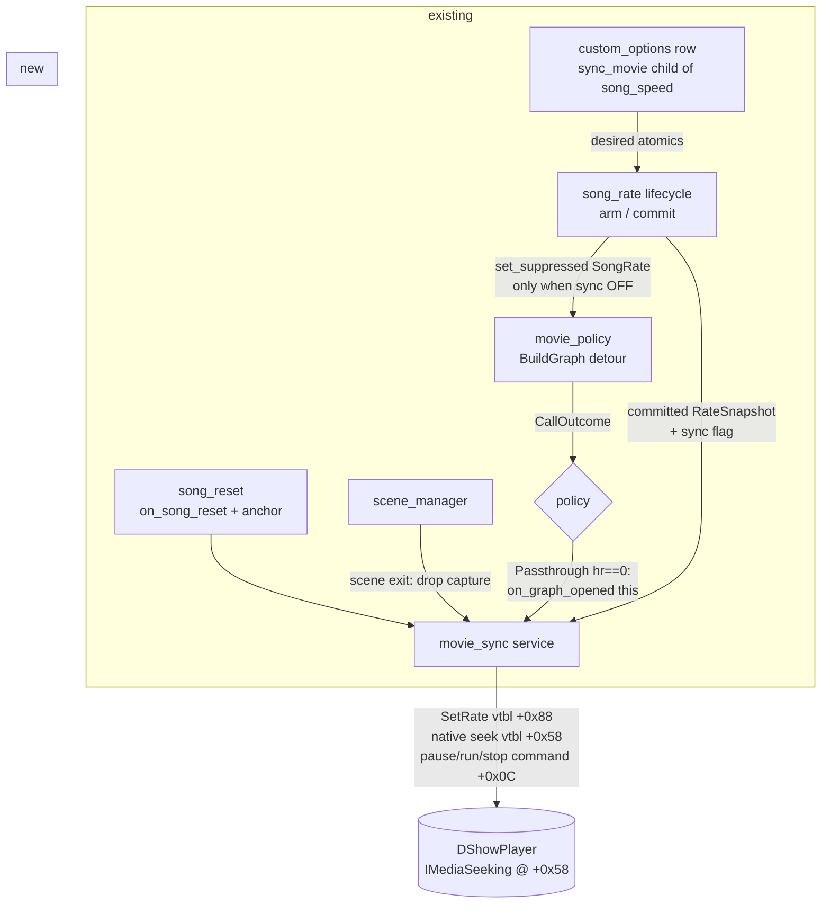
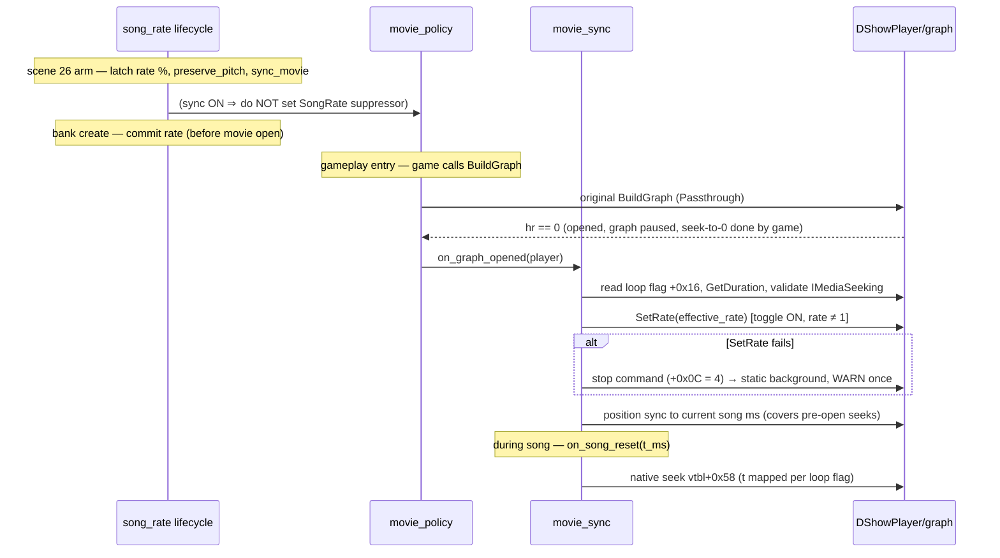

# Detailed Design: Background Movie Sync

Status: Approved 2026-08-20

## Overview

DDR World plays `.wmv` background movies through a DirectShow filter graph
owned by a game-internal `DShowPlayer` object. Nothing in the stock game — or
in this DLL today — keeps that movie aligned with the song once the song's
timeline is altered:

- **Song Playback Speed** (rate ≠ 100 %) currently *suppresses* the movie
  outright (the graph is never built), because the DirectShow clock cannot
  follow the XACT rate.
- **Training Mode** (SONG START > 0, FF/RW scrubs, LOOP SONG, restart-from-A)
  and **Quick Restart**'s in-place reset rewind or jump the song mid-play
  while the movie free-runs — a visible desync with no handling at all.

This feature adds a **movie sync engine** that keeps the background movie
aligned with the song by driving the graph's own `IMediaSeeking` interface:

1. **Position sync (always on, any rate):** whenever the song's timeline
   jumps (quick restart, training loop/scrub/section start), the movie is
   seeked to the same content-time position using the game's own native
   seek method.
2. **Rate sync (opt-in, per player):** a new **SYNC BACKGROUND VIDEO**
   options-menu toggle — a second child row of SONG SPEED, beside PRESERVE
   SONG PITCH — chooses what a non-100 % SONG SPEED does to the movie:
   - **ON:** the movie is kept; `IMediaSeeking::SetRate(effective_rate)` is
     applied once at graph open so it plays in lockstep with the
     rate-adjusted audio, and position sync covers seeks.
   - **OFF (default):** the movie is suppressed exactly as today.

At 100 % speed the toggle is hidden and irrelevant: the movie always plays
and position sync alone applies. Failure at any point degrades safely: a
failed rate sync stops the movie (equivalent to today's suppression); a
failed position seek at 100 % leaves the movie desynced (exactly today's
behavior) — the feature can only improve on the status quo, never regress
it.

## Detailed Requirements

### Functional

- **FR-1 (toggle semantics).** A per-player bool option `sync_movie`
  ("SYNC BACKGROUND VIDEO", default OFF) governs ONLY the rate ≠ 100 %
  movie behavior: ON = build the graph and sync rate + position; OFF =
  suppress the graph (current behavior). It is registered as the second
  child row of `song_speed`, shown only while that side's SONG SPEED is not
  100 % (`ShowWhen::NotEquals`), exactly like `preserve_pitch`.
- **FR-2 (unconditional position sync).** At any rate — including 100 %,
  and independent of the song-playback-speed mod's enable state — a playing
  background movie follows song-timeline jumps: quick restart (instant and
  delayed), training restart-from-A, LOOP SONG wrap, FF/RW scrubs, and
  training SONG START > 0. Sync events are content-domain timestamps; the
  movie timeline is content-domain, so they map 1:1.
- **FR-3 (rate application).** For a committed non-identity rate with the
  governing side's toggle ON, `IMediaSeeking::SetRate(source/output)` is
  applied once per song at graph open. No mid-song rate changes exist
  (the rate is latched per song). *Amendment 2026-08-21 (D14):* rate
  application is **real-Windows-only**. Under Wine the movie is suppressed
  at non-100% regardless of the toggle: builtin quartz's `SetRate` is a
  silent no-op (live-confirmed three ways), native quartz hard-locks the
  game (experiment abandoned — see Appendix B), and seek-based drift
  correction was rejected as too visually stuttery (maintainer decision).
  Position sync (FR-2) remains active on both platforms.
  *Amendment 2026-08-23 (maintainer-approved, Windows cabinet tests
  #1–#3):* the mechanism is now a **scaled reference-clock proxy**, not
  `SetRate`. The game's WMV chain (its own custom renderer '0001' +
  WMVideo Decoder DMO + WM ASF Reader) refuses `SetRate` categorically —
  E_INVALIDARG at every rate, paused AND running states, per-filter
  probes included — so the engine instead wraps the graph's sync source
  in a proxy `IReferenceClock` running at `source/output × real time`
  (advise deadlines/periods inverse-mapped and forwarded to the wrapped
  clock) and installs it via `IMediaFilter::SetSyncSource` on the
  still-paused graph at open. Filters pace streaming by timestamp vs the
  graph clock, so no filter cooperation is needed. Install success is
  judged by `GetSyncSource` POINTER READBACK (never the HRESULT); any
  failure degrades PRE-RUN to the suppressed-equivalent state (direct
  `IMediaControl::Stop` + `opened=0` — the `fake_opened` shape), because
  post-Run degradations were live-observed to strand a black plane
  (`opened=1`) or a frozen first frame (actor latches movie mode on the
  first presented frame).
  *Amendment 2026-08-24 (maintainer-approved): D14's Windows-only gate is
  SUPERSEDED* — its rationale was SetRate-specific, and the clock proxy
  is platform-uniform: the install is ADAPTIVE (in-place `SetSyncSource`
  where the FGM permits a paused-graph swap — Wine; escalated
  stop → swap → re-pause on `VFW_E_NOT_STOPPED` — Windows, whose quartz
  enforces the stopped-state rule; Wine's cue/stop state machine wedges
  on the unnecessary dance, CrossOver trial #1). Cabinet-validated on
  BOTH platforms 2026-08-24 (Windows test #5; CrossOver trial #2 — all
  rates, off-rate scrubs in sync). Under Wine, movies exist at all only
  in `non_native_os_support.movie_mode="fallback"`; suppress mode never
  builds a graph and the toggle has nothing to act on.
- **FR-4 (governing side).** The committed rate arm's side supplies the
  toggle value (rate arms are single-entered-side by construction; versus
  and course/Dan force identity, where the toggle is moot).
- **FR-5 (loop fidelity).** Position mapping mirrors the player's own loop
  flag, read at capture: loop set ⇒ target positions map modulo the movie
  duration; loop clear ⇒ clamp to duration (the stock completion path
  stops the movie at EC_COMPLETE, which is already stock behavior for
  movies shorter than the song).
- **FR-6 (persistence).** `PersistMode::Full` → wire field
  `mod_sync_movie`; a supporting server (bemani-buddy) stores it verbatim
  in a new nullable `opt_mod_sync_movie` column (its migration 018 —
  external repository task). Offline, the mod-config.json value cache
  carries it like every other Full option.
- **FR-7 (delayed restart).** For a quick restart with a countdown delay,
  the movie is seeked to 0 and paused at reset time, then run (and
  re-seeked) when the audio anchor lands, using the game's own
  command-byte pause/run mechanism. If the anchor-time integration point
  proves unavailable, the fallback is a single seek at reset time (the
  movie free-runs cosmetically during the ≤10 s countdown).

### Non-functional

- **NFR-1 (fail-open ladder).** Rate-sync failure (missing `IMediaSeeking`,
  failed `SetRate`) ⇒ stop the movie via the game's own stop command
  (suppressed-equivalent: static background) + one WARN per song.
  *Amendment 2026-08-21 (probe deploy #1):* SetRate success is judged by a
  `GetRate` readback matching the requested rate within epsilon, NOT by the
  HRESULT alone — Wine quartz returns S_OK from an unpropagated `SetRate`
  (observed live: `hr=0`, readback `1.000`), and hr-only detection would
  present a silent no-op as "synced" instead of degrading to the stop rung.
  Position-seek failure at 100 % ⇒ leave the movie playing desynced
  (today's behavior) + one WARN per song. No failure may affect the song,
  scoring, or timing.
- **NFR-2 (platform bar).** Windows cabinet: must work. CrossOver/Wine
  fallback movie mode: best-effort, fail-open (Wine quartz quirks must
  degrade, not crash or stall). CrossOver suppress mode: the feature is
  inert by construction (no graph is ever built).
- **NFR-3 (zero new signatures).** The engine derives everything from the
  already-scanned `movie_build_graph` hook (player capture via the detour's
  `this`) plus fixed, cross-build-verified struct offsets. No new AOBs.
- **NFR-4 (thread discipline).** All COM calls on the player are issued on
  the game's actor-update thread — the same thread that runs the game's own
  per-frame COM dispatch and the `song_reset` notifications. No COM from
  background threads.
- **NFR-5 (hot-path budget).** The engine adds no per-frame work; it acts
  only at graph open, timeline-jump notifications, and scene transitions.
- **NFR-6 (stock at rest).** With the toggle OFF and no timeline
  alteration, behavior is byte-identical to today: same suppression
  decisions, no COM calls, no state.

### Assumptions

- One `SetRate` per song suffices (rate latched per song; no live rate
  edits exist).
- The `DShowPlayer` object outlives the gameplay scene it was opened in;
  its COM pointers are nulled by the game's teardown before any rebuild.
  The engine additionally drops its capture on every scene transition.
- All training/restart repositioning flows through the in-place reset /
  seek transaction's subscriber notification. If an initial
  SONG-START-bound seek is found to fire before the graph opens, the
  capture-time position sync (Components §2) covers it.
- The NonNativeOs suppress-mode contributor always wins: the toggle cannot
  force a movie on a Wine box running in suppress mode.

## Architecture Overview



Song-start sequence (non-identity rate, toggle ON):



### Decision matrix (BuildGraph time)

| Committed rate | Toggle (rate side) | Platform / NonNativeOs mode | Movie outcome |
|---|---|---|---|
| 100 % (or no arm) | — | any where movies play | plays; position sync active |
| 100 % | — | Wine suppress / fallback-failed | absent (unchanged) |
| ≠ 100 % | OFF | any | suppressed (unchanged — SongRate contributor set) |
| ≠ 100 % | ON | **Windows** | plays rate-locked (scaled clock proxy, readback-verified); position sync active |
| ≠ 100 % | ON | **Wine, fallback mode** | plays rate-locked (in-place clock swap — D14 superseded 2026-08-24, CrossOver trial #2) |
| ≠ 100 % | ON | **Wine, suppress mode** | absent (no graph ever builds — the NonNativeOs contributor's own rule) |
| ≠ 100 % | ON, clock install unverified | any | static background (pre-Run degrade), WARN once |

## Components and Interfaces

### 1. `src/services/movie_sync.rs` (new service)

Owns the captured player and all COM interaction. Public surface:

```rust
/// Called by movie_policy's hook on CallOutcome::Passthrough with hr == 0.
/// Game update thread. Captures the player, reads loop flag + duration,
/// applies SetRate when a committed non-identity rate with sync ON exists,
/// and performs the capture-time position sync.
pub fn on_graph_opened(player: *mut c_void);

/// Wired once at init: song_reset::on_song_reset subscriber → seek.
/// Also: scene_manager callback → drop_capture() on any scene change.
pub fn init();  // requires movie_policy availability only

/// song_reset integration for delayed restarts (FR-7):
pub fn on_reset_with_delay(t_ms: i32, delayed: bool); // seek(+pause when delayed)
pub fn on_anchor_landed(t_ms: i32);                   // run + re-seek
```

Internal state (all atomics / one small `Mutex`-free struct, hot paths are
event-driven only):

- `AtomicPtr<c_void>` captured player + `AtomicU32` generation;
- cached per-capture: loop flag (`player+0x16`), duration in 100 ns
  (`IMediaSeeking::GetDuration`, 0 = unknown ⇒ no clamp/modulo),
  rate-applied flag;
- one-shot WARN latches (per capture generation) for the two failure
  classes.

COM access rules (validity gate before every call):

- player non-null, capture generation current, scene unchanged since
  capture;
- `player+0x14` (opened byte) == 1 and `player+0x08` (state) != 0;
- interface pointer non-null (`IMediaSeeking` at `player+0x58` can be
  legitimately null — the game releases it when
  `GetCapabilities & CanSeekAbsolute` fails).
- *Amendment 2026-08-21 (probe deploy #1):* **seeks are only issued while
  the player is running** (`player+0x08 == 2`). Seeking the paused
  pre-Run graph — a code path the stock game never exercises (its own
  open-time seek happens before the Pause) — kicked Wine's graph into
  presenting immediately, starting the video at graph open instead of the
  game's audio-start Run (observed live: video led the song by the
  lead-in gap). Any sync target arising before Run (capture-time sync,
  SONG START bounds) is held as a *pending seek* and drained at the first
  running frame by a per-frame driver (`input_manager::on_frame`, game
  thread). The movie renders nothing before Run, so a drained pending
  seek is visually indistinguishable from an open-time seek.

Operations (all vtable calls the game itself makes, plus `SetRate`):

- **Seek:** call the player's own native seek, vtable slot +0x58
  (`fn(player, i64_100ns)`) — a null-guarded wrapper around
  `IMediaSeeking::SetPositions(&pos, AbsolutePositioning, &0,
  NoPositioning)` that the game uses for its open-time seek-to-0 and its
  EC_COMPLETE loop wrap. Target = `t_ms * 10_000`, mapped per FR-5.
- **SetRate:** `IMediaSeeking` vtbl +0x88, `fn(iface, f64) -> HRESULT`.
  The game never calls this; hr < 0 triggers the NFR-1 ladder.
- **Pause / Run / Stop:** write the player command byte (`+0x0C` = 1 / 2 /
  4) via the player's tiny vtable setters (+0x18 / +0x20 / +0x28) — the
  game's own get-frame dispatch performs the actual `IMediaControl` calls
  on the next frame, keeping every `IMediaControl` invocation on the
  game's own code path.

### 1b. The two-path drain model (amendment 2026-08-22, cabinet tests #7–#9)

Timeline alterations classify into exactly two shapes, executed by two
paths sharing nothing but the seek primitive:

- **Jump** (FF/RW scrubs): the audio continues immediately at the new
  position. *Amendment 2026-08-22 (cabinet test #11):* per-seek restart
  variance (~2× — keyframe distance, cache state) made lead-compensated
  plain seeks non-deterministic, so jumps now EXECUTE as parks at
  `live + Δ` (Δ = 2× the measured per-direction restart estimate): the
  audio catches up to the parked frame instead of the video chasing a
  moving target. Δ sizes only the brief post-scrub freeze — sync is
  governed by the park crossing — and self-neutralizes to a plain seek
  where seeks are instant (real Windows). The former correction chain is
  deleted. (Restart latency is never measured from the `IMediaSeeking`
  position readback: on Wine it tracks the graph clock, not
  presentation.)
- **Park** (loop wrap, quick/delayed restart, SONG START — any event
  whose live count sits ≥500 ms below its trigger or is negative): the
  audio will START at a known content time after a silent approach. Zero
  prediction: seek the video to the destination, PAUSE it (game command
  byte) when its frame arrives (deposit signal), RUN it when the live
  count crosses the destination — with the Run pre-issued by the
  measured run-startup latency (crossing granularity + command dispatch
  + renderer resume; runtime-learned, self-neutralizing). Every park
  also measures seek→first-deposit into the per-direction restart
  estimates that size the jump-park Δ.

A uniform "live count advancing coherently" stability gate (two samples
≥20 ms apart progressing at wall rate) replaces the per-scenario
transient special-cases. This mechanism also delivers FR-7 (delayed
restart) with no extra machinery: the park holds the frozen first frame
through the countdown and runs at the 0-crossing.

### 2. Capture-time position sync

At `on_graph_opened`, after rate handling, the engine asks the current
song position (a small accessor exposed by `song_reset`, reusing the
timing-anchor read it already performs for resets) and, if it is more than
~500 ms from zero, records it as the **pending seek** — drained at the
first running frame per the running-state amendment above. This covers
orderings where a training SONG START bound (or any pre-open seek) engaged
before the graph finished building, and makes the engine robust to late
graph opens generally.

### 3. `src/services/movie_policy.rs` (small changes)

- On `CallOutcome::Passthrough` with `hr == 0`, call
  `movie_sync::on_graph_opened(this)` (feature-gated on movie_sync init
  having succeeded; zero behavior change otherwise).
- No changes to the contributor model or the suppression/fallback logic
  itself — the rate-side decision moves upstream (§4).

### 4. `src/services/song_rate` (flag carriage + suppression decision)

Mirrors the existing `preserve_pitch` carriage end to end:

- `runtime.rs`: per-side `DESIRED_SYNC_MOVIE` atomics (default false) +
  `set_desired_sync_movie(side, bool)` / getter.
- `lifecycle.rs`: `EligibilityInputs.desired_sync` →
  `ArmRequest.sync_movie` → `LifecycleState` atomic; the arm log line
  gains `sync_movie=`.
- **Arm (scene 26):** for a non-identity arm, the tentative
  `MovieSuppressor::SongRate` set is **skipped when `sync_movie` is
  latched ON** for the arm side — **on real Windows only** (D14): under
  Wine (`running_under_wine()`, the shared helper) the suppressor is set
  regardless of the toggle, with one INFO naming the platform gate.
- **Commit:** likewise skipped when sync is ON; the committed
  `RateSnapshot` (already published for tick/Real-Speed consumers) plus
  the latched sync flag become readable by `movie_sync` via one accessor
  (`song_rate::movie_rate_directive() -> Option<(f64, bool)>` or
  equivalent: committed effective rate + sync-on).
- Identity commits, versus/course, and every failure path (EarlyFailed ⇒
  stock 100 %) leave the suppressor untouched and report identity to the
  accessor — `movie_sync` then applies no rate (matrix row 1).
- `sync_movie` is NOT part of `RateSnapshot` itself and never touches the
  binding/DSP/clock/score machinery.

### 5. `src/mods/song_playback_speed.rs` (option row)

Third registered row, immediately after `preserve_pitch`:

- `RegisterSpec::bool_toggle("sync_movie")`, default OFF,
  `.show_when(ShowWhen::NotEquals { parent_id: "song_speed", value: 100 })`,
  `PersistMode::Full`, bool clamp `load_transform`, `on_change` →
  `set_desired_sync_movie`.
- Registration failure is non-fatal (warn and continue — rate feature
  works, movies simply stay suppressed at non-100 %).
- Enable-time re-seed and disable-time reset of the desired atomics,
  exactly like the existing two rows.
- Label textures: `seop_item_sync_movie` +
  `seop_image_sync_movie_{off,on}` generated by
  `scripts/gen_option_labels.py` with new en/ja/ko strings in
  `scripts/option_strings.py` (never hand-edit generated PNGs).

### 6. `src/services/song_reset` (two small integration points)

- Existing `on_song_reset(t_ms)` subscription is the primary seek trigger
  (already fires on the game thread at every reset/seek/loop landing).
- New for FR-7: the delayed-restart path additionally distinguishes
  "reset now, anchor later" — movie_sync pauses at reset and a new
  anchor-landed notification (fired where the existing idempotent
  re-anchor runs) resumes + re-seeks. If wiring this proves invasive, the
  documented fallback is seek-at-reset only.
- New read accessor for the capture-time sync (§2): current song content
  ms from the timing anchor.

### 7. `src/lib.rs` (init order)

`movie_sync::init()` after `movie_policy::init` and `song_reset` are
available, before mods enable. Independent of the song-playback-speed
mod's presence (FR-2).

### 8. External: bemani-buddy

Migration 018: nullable `opt_mod_sync_movie` column; `mod_sync_movie`
wire field stored/echoed verbatim (identical shape to
`opt_mod_preserve_pitch`, migration 014).

## Data Models

### DShowPlayer (game object, RE-verified on 20260616 + 20260721)

| Offset | Field | Engine use |
|---|---|---|
| +0x08 | state dword (0 closed / 2 running / 3 opened-not-running) | validity gate |
| +0x0C | command dword (1 pause / 2 run / 4 stop) | pause/run/stop requests |
| +0x14 | opened byte (1 only after a real graph build) | validity gate |
| +0x16 | loop flag (request flag bit 0) | FR-5 position mapping |
| +0x50 | `IMediaControl*` | (indirect — via command byte only) |
| +0x58 | `IMediaSeeking*` (null if not absolutely seekable) | SetRate; the native seek reads it |
| +0x60 | `IMediaEventEx*` | none (game's event pump handles EC_COMPLETE) |
| +0x68 | `IBasicAudio*` | none (all 386 stock movies are video-only) |
| vtbl +0x18/+0x20/+0x28 | pause/run/stop command setters | FR-7 / NFR-1 ladder |
| vtbl +0x58 | native absolute seek (100 ns, null-guarded) | all position syncs |

`IMediaSeeking` vtable (standard COM): +0x50 `GetDuration`, +0x70
`SetPositions`, +0x88 `SetRate`.

### Position mapping

```
target_100ns = t_ms * 10_000
if duration > 0:
    if loop_flag: target = target mod duration
    else:         target = min(target, duration)
```

Content-domain in, content-domain out; a rate-synced movie needs no
wall-time conversion because `SetRate` scales the graph clock exactly as
the Q31 patch scales the game clock.

### Option row

`sync_movie`: bool, default 0, per-side, `PersistMode::Full`, wire
`mod_sync_movie`, child of `song_speed` via `ShowWhen::NotEquals(100)`.

## Error Handling

- **Failure ladder (NFR-1):**
  - `SetRate` unavailable (null `IMediaSeeking`) or hr < 0 → write stop
    command (+0x0C = 4); the game's own get-frame dispatch stops the graph
    and the background falls back to the static layer (the same visual as
    suppression). One WARN naming the hr, per song.
  - Position seek unavailable/failed at 100 % → skip silently except one
    WARN per song; the movie continues (status-quo desync).
  - Any validity-gate failure → the operation is skipped (no retry loops;
    the next event re-evaluates).
- **Capture hygiene:** capture dropped on every scene transition and
  overwritten by any newer `on_graph_opened`; generation counter prevents
  a queued event from touching a stale player.
- **Panic discipline:** the `on_song_reset` subscriber body and the hook
  extension run under the project's `catch_unwind` pattern; no
  `unwrap`/indexing in any hook-reachable path.
- **Init failure:** if `movie_sync::init` cannot run (movie_policy
  unavailable), the option row still registers but rate-sync ON degrades
  to stock suppression (the song_rate arm consults
  `movie_sync::is_available()` before skipping the suppressor — sync
  never silently means "desynced movie at 175 %").
- **Fault injection:** `DDR_MOVIE_SYNC_FAULT` env (dev mode) forces
  SetRate/seek failures to exercise the ladder on a live cabinet.

## Testing Strategy

Project reality: pure layers get host tests (`cargo test`); engine-facing
code is validated by cabinet deployment + log observation.

### Host tests (pure)

- Position mapping: loop modulo, clamp, unknown-duration passthrough,
  negative t (delayed-restart pre-anchor) → clamp to 0.
- Decision matrix: (rate, toggle, commit outcome, NonNativeOs mode) →
  {suppress, sync, plain} — as a pure function consumed by the arm/commit
  seam, table-tested for all matrix rows including failure paths.
- Flag carriage: lifecycle tests extended for `sync_movie` (mirror the
  existing `preserve_pitch_latches_from_the_entered_side` pattern),
  including "sync ON ⇒ suppressor not set at arm/commit" via the existing
  `MovieSink` test double.

### Live validation matrix (cabinet, per deploy)

1. **Probe first (de-risk):** diagnostic build logging
   `GetCapabilities`/`GetDuration`/`SetRate(0.5/1.75)`/seek results at
   graph open — proves the unknowns (SetRate acceptance, seek granularity,
   175 % decode headroom) before the full feature is judged.
2. 100 %: quick restart, training scrub/loop/SONG START — movie follows;
   attract demo unaffected; versus unaffected.
3. 50 % / 150 % with toggle ON (both pitch modes) — movie rate-locked;
   toggle OFF — suppressed as today.
4. Delayed restart — pause/run behavior.
5. Fault injection — ladder lands on static background, song unaffected.
6. CrossOver fallback mode (best-effort): same passes expected but
   non-blocking; suppress mode: feature inert.

## Appendix A: Key RE findings (inlined)

- `DShowPlayer::BuildGraph` opens the graph **paused**, QIs the four
  interfaces in the order IMediaControl/IMediaSeeking/IMediaEventEx/
  IBasicAudio into +0x50..+0x68 (GUID-verified), **releases and nulls
  IMediaSeeking unless `AM_SEEKING_CanSeekAbsolute`**, and calls the native
  seek (vtbl +0x58) with 0 on every successful open — absolute seeking is
  exercised by the stock game on every movie.
- The game's event pump (run from per-frame get-frame) drains
  `IMediaEventEx::GetEvent`; **EC_COMPLETE with the loop flag set wraps by
  native seek-to-0** — the loop mechanism the engine mirrors; EC_USERABORT/
  EC_ERRORABORT and non-loop completion issue the stop command.
- The earlier movie RE (non-native-os-support project) had vtbl +0x48 and
  +0x58 swapped: **+0x48 is a deferred volume setter** (`+0x10` float →
  `IBasicAudio::put_Volume` in get-frame), **+0x58 is the seek**.
- Request flag bit 2 = "require seekable" (BuildGraph hard-fails without
  IMediaSeeking when set); bit 0 = loop.
- Stock movie corpus (386 files): all video-only VC-1 (no audio streams ⇒
  no audio-renderer rate constraint), 1280×720@60/30 and 640×360@30,
  ~107–141 s sampled durations.
- Cross-build: byte-identical structure at `0x18023AE40` (20260616) and
  `0x18024a780` (20260721); the existing `movie_build_graph` AOB matches
  both uniquely.

## Appendix B: Alternatives considered

- **Raw COM `SetPositions` instead of the game's native seek wrapper** —
  rejected: the wrapper carries the game's own null guard and exact
  positioning flags; calling it keeps our behavior bit-identical to the
  game's own loop-wrap seek.
- **Calling `IMediaControl::Run/Pause/Stop` directly** — rejected in favor
  of the command byte: the game's get-frame dispatch is the single stock
  code path for these calls, avoiding double-dispatch races with the
  game's own state machine.
- **A separate mod for the toggle** — rejected: the row is semantically a
  SONG SPEED sub-option (like PRESERVE SONG PITCH) and must live/die with
  that mod's registration; the engine, however, is a service so 100 %
  position sync works even with the mod disabled.
- **Suppress-then-rebuild for toggle changes mid-select** — unnecessary:
  the decision latches at scene-26 arm with the rest of the rate state;
  next song picks up changes, matching every other rate option.
- **Stop-on-first-alteration as the primary deliverable ("Phase 1")** —
  demoted to the failure rung of the ladder per the project directive:
  real sync is the deliverable; the stop mechanism ships as its fallback.
- **Native quartz/devenum in the CrossOver bottle** (2026-08-21) —
  attempted to obtain a `SetRate`-capable graph manager under Wine. The
  load blocker (Wine's `@ stub` `RtlGetPersistedStateLocation` — no
  export; loader-synthesized abort thunk in quartz's IAT) was solved with
  a proven `LdrRegisterDllNotification` pre-DllMain IAT patch
  (`src/services/ntdll_state_shim.rs`, retained uncalled), but native
  quartz then hard-locked the game building its first graph (intelligent
  connect → default Video Renderer → wined3d deadlock). Abandoned; bottle
  reverted.
- **Seek-based drift correction for Wine rate sync** — proposed
  (periodically re-seek to the live count, correcting the 1.0×-playback
  drift at non-100 % rates) and **rejected by the maintainer**: the
  periodic correction jumps would be "extremely visually stuttery"; a
  static background (suppression) is preferable. Hence D14: rate sync is
  Windows-only, Wine suppresses at non-100 % regardless of the toggle.
