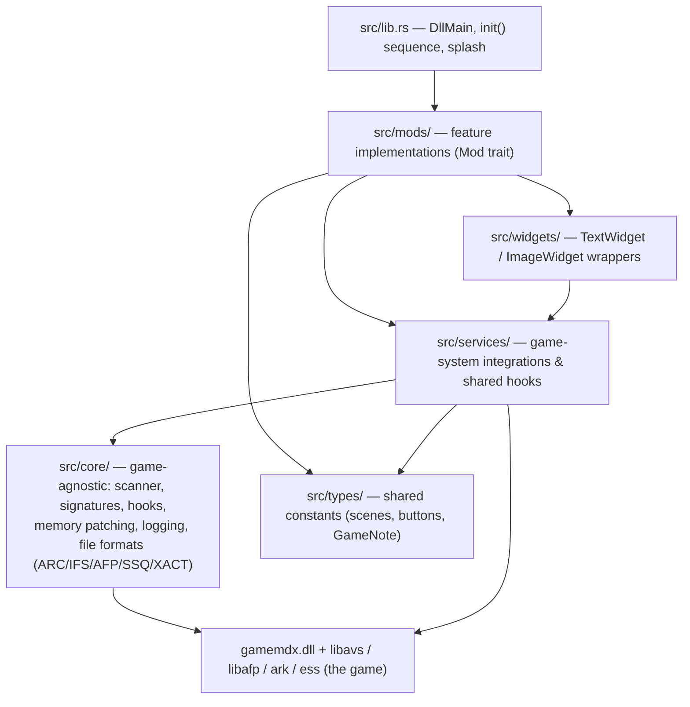
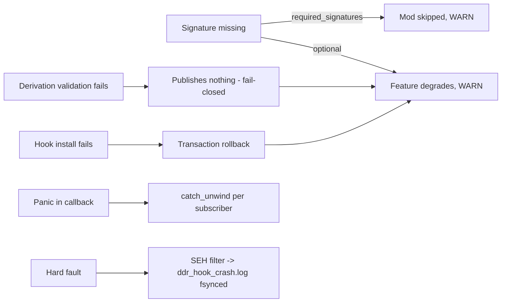

# Architecture

> Machine-generated by the codebase-summary workflow. Do not hand-edit; regenerate instead.

## The One-Paragraph Version

Everything interesting about this codebase follows from one fact: it runs **inside someone else's process**. The DLL is injected into DDR World via spice2x, finds all its addresses at runtime (AOB scans, RTTI walks, RIP-relative derivations — never hardcoded offsets), installs inline detours and byte patches, and renders its UI through the game's own pipeline. The layering exists to separate what is game-agnostic (`core/`), what integrates with one game subsystem (`services/`), and what a player actually experiences (`mods/`).

## Layer Model



Placement rules (enforced by convention, documented in `AGENTS.md`):

- `core/` never depends on game-specific logic. When format code gains a second consumer, it moves here (`core/ssq/` was promoted from a mod).
- `services/` own game hooks and expose `init()` / `is_available()` singletons. One detour per target function — when several features need the same hook, a **shared dispatcher service** owns it (`judge_hook`, `render_notes_hook`, `analyze_hook`, `movie_policy`).
- `mods/` implement the `Mod` trait, register with `ModRegistry`, and consume services. A mod that outgrows one file becomes a subdirectory.
- Pure decision/format logic is split into dedicated files so it can be host-tested (e.g. `mods/mod_menu/model.rs`, `mods/timing_offsets/compute.rs`, `services/song_rate/lifecycle.rs`).

## Initialization Sequence

`DllMain` spawns `init()` on its own thread (loader-lock safety). The ordering below is **load-bearing** — several phases exist to win races against the game's own boot (e.g. the musicdb buffer patch must land before the game's first XML parse).

```mermaid
sequenceDiagram
    participant D as DllMain thread
    participant G as Game boot
    D->>D: panic hook + SEH crash handler
    D->>D: load mod-config.json
    D->>G: wait for libavs, install LayeredFS fs hooks (BEFORE the gamemdx wait — shader.arc/musicdb race)
    D->>G: wait for gamemdx.dll (poll)
    D->>D: resolve all AOB signatures (batch scan)
    D->>D: construct mods, run early_apply() (race-critical patches)
    D->>D: resolve derived addresses (RIP/vtable/xref walks)
    D->>D: init services (rendering → options → persistence → scene/input/judge/audio…)
    D->>D: register mods (init each; skip on missing required signatures)
    D->>D: enable mods per config (late-binding mods last)
    D->>D: register + enable mod-menu, flush label atlas
    D->>G: splash widgets (10 s), init complete
```

Key ordering constraints (why the phases exist):

| Constraint | Reason |
|---|---|
| LayeredFS before the gamemdx wait + AOB scan | `Application::onBoot` drains `shader.arc` (the session's only shader read — theme/AA synthesis rides it) and `musicdb.xml` within a few hundred ms of gamemdx loading, concurrently with our init; the ~127-signature scan is long enough for a fast cabinet to win the race (Win7 report 2026-09-03) |
| `early_apply` before derived signatures/services | Byte patches that must precede the game's first use of a code path (XML buffer size, FPS target) |
| `stage_records` before `custom_options_persistence` | The logout-save sanitiser consumes record layout |
| `judge_hook` / `analyze_hook` before mod enables | Shared dispatchers must exist before subscribers register |
| `mod_menu` registered last | It renders the registry's entries and needs every row registered |
| Label-atlas flush after all option registrations | Exactly-once texture rebuild |

## Thread Model

| Thread | Runs | Rules |
|---|---|---|
| Game render thread | Widget creation/mutation, texture resolution, AFP-layer ops, hooked render callbacks | Mutations only here; use `widget_renderer::run_on_render_thread()`; never hold a mod's mutex across a scheduled closure |
| Game logic/audio threads | Judge callbacks, XACT IO callbacks, scene transitions | Hook bodies tight (<~1 ms), panic-free, allocation-averse on hot paths |
| DLL init thread | The entire `init()` sequence | May block/poll; ends after splash setup |
| Mod worker threads | Chart-length parsing, song-rate generation, tick-track synthesis, cache writers, CSV writer | Pure CPU work; hand results to game threads via atomics/queues/deferred closures |

## Hook Discipline

- **`retour::GenericDetour`** for function hooks; installed via `core::hooks::install_enabled` (store-then-enable — the handle is stored before enabling so a thread landing in the callback on the same instant can find it).
- **Byte patches** go through `core::memory_patch` transactions: verify expected bytes → write → flush icache → read back, with rollback. Patch sites are byte-verified against the scanned signature before writing.
- **Multi-hook installs** that must be atomic use `core::hook_transaction::install_all_or_rollback` (e.g. song-rate's IO-callback pair, LayeredFS's five AVS hooks).
- **Shared dispatchers** multiplex one detour to many subscribers with priority ordering and per-subscriber `catch_unwind`.

## Resilience Model



Two deliberate exceptions to fail-open:

- **Score integrity is fail-closed**: if the save-sanitising machinery can't initialize, tainted saves are fully suppressed rather than forwarded (`services/score_guard.rs` + `services/custom_options_persistence.rs`).
- **Derivations are fail-closed**: a derivation that can't validate removes every name it could publish, so downstream consumers see a clean "absent" rather than a wrong address.

## Cross-Cutting Systems

| System | Home | Role |
|---|---|---|
| LayeredFS | `src/services/avs_layeredfs/` | Transparent file replacement under `data_mods/`; PNG→game-texture conversion; the substrate almost every asset-injecting feature builds on |
| Option-row framework | `src/services/custom_options/` | Declarative per-player option rows in the game's native options menu + the overlay menu, with persistence (network/JSON) and conditional visibility |
| Overlay mod menu | `src/mods/mod_menu/` + `src/services/overlay_draw/` | In-game modal (pinpad 0-0-0) for toggles and cabinet-wide settings; animated shader backgrounds drawn through the game's command list |
| Score-submission policy | `src/services/score_guard.rs` (state) + `src/services/custom_options_persistence.rs` (enforcement) | Taint tracking (autoplay/quick-fail/assist-tick/training/rate) → per-stage suppression + sanitised logout saves |
| Song-rate engine | `src/services/song_rate/` | Streamed time-stretch/resample audio, scaled gameplay clock, score containment, previews — the largest single subsystem |
| Scene/input/judge plumbing | `scene_manager`, `input_manager`, `judge_hook` | The three event backbones nearly every mod subscribes to |
