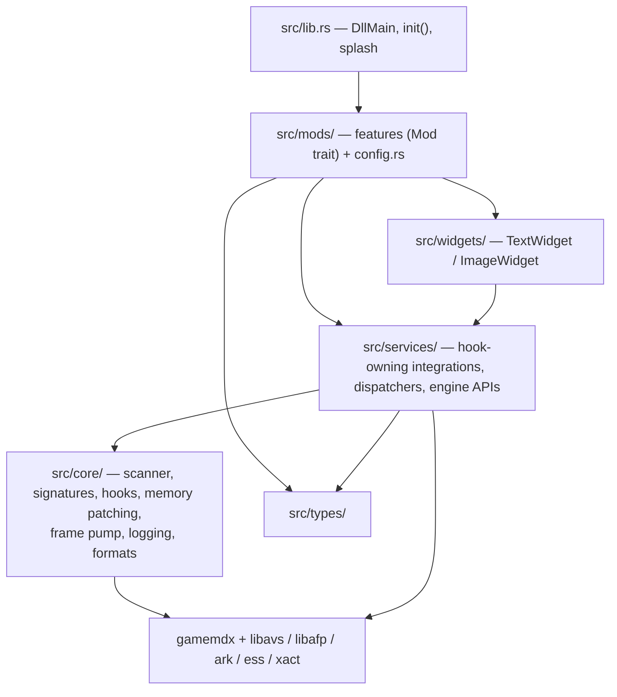
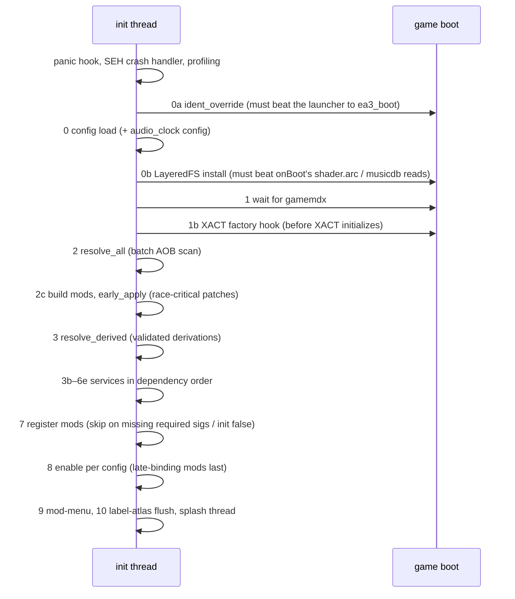
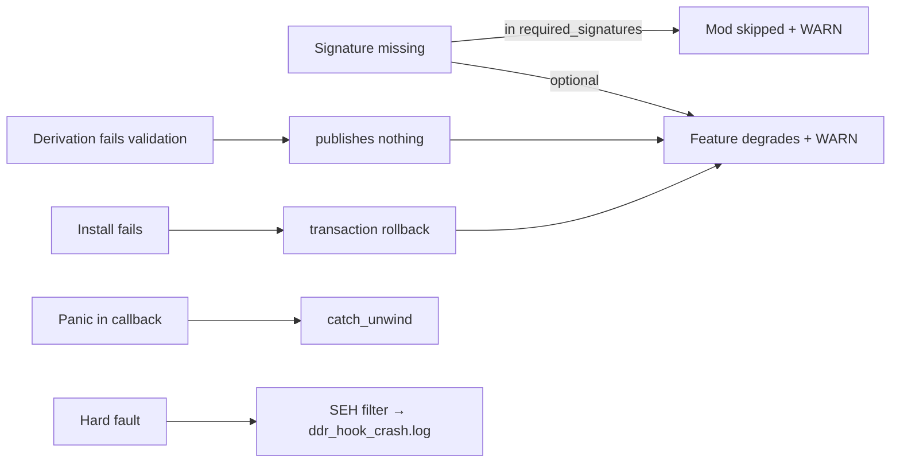

# Architecture

> Machine-generated by the codebase-summary workflow. Do not hand-edit; regenerate instead.

## The Short Version

The DLL runs **inside someone else's process**, and almost every design decision follows from that. It finds all addresses at runtime, installs detours and checked patches, and drives the game's own engine objects. The layers separate game-agnostic mechanics (`core/`), single-subsystem integrations that own hooks (`services/`), and player-facing features (`mods/`).

## Layer Model

Placement rules:

- `core/` holds nothing game-policy-specific. Format code moves here once it has a second consumer (`core/ssq/` was promoted from a mod).
- A `services/` module owns each hooked game function. When several features need the same function, the service is a **dispatcher** (subscribe/acquire API), and features never install a second detour. See the ownership table in `interfaces.md`.
- `mods/` implement `Mod`, consume services, and grow into a subdirectory once multi-file.
- Pure decision and format logic sits in dedicated files with no `crate::` imports, so the harnesses can mount it (for example `lifecycle.rs`, `section_math.rs`, `logic.rs`, `model.rs`).

## Initialization Sequence

`DllMain` spawns `init()` on its own thread. The order is **load-bearing**, and the reasons are commented in `src/lib.rs`.

Ordering constraints worth knowing:

| Constraint | Reason |
|---|---|
| `ident_override` first | It must detour `ea3_boot` before the launcher calls it. It needs neither config nor gamemdx. |
| LayeredFS before the gamemdx wait and the scan | `Application::onBoot` reads `shader.arc` (its only shader read) and `musicdb.xml` within a few hundred ms of gamemdx loading. |
| XACT factory hook before `resolve_all` | XACT audio threads are live after Initialize. |
| `early_apply` before derivations/services | Patches must land before the game's first use (XML buffer size, FPS target). |
| `stage_records` before persistence | The logout-save sanitiser uses the record layout. |
| `judge_hook` → `foot_panel_swap` → `analyze_hook` / `render_notes_hook` before mod init | Dispatchers must exist before subscribers register. |
| `mod-menu` last, then one label-atlas flush | It lists every registered mod and row, and the atlas is rebuilt exactly once. |

## Thread Model

| Thread | Runs | Rules |
|---|---|---|
| Game frame seam | The one frame pump driven by `overlay_draw`'s layer-dispatcher detour. Per frame: `input_manager::poll` (all `on_frame` callbacks first, then input events), then the `run_on_render_thread` batch, then the original render | Engine mutation happens here. Never hold a state mutex across a scheduled closure. Each phase is panic-contained. |
| Game logic / judge / scene hooks | `judgeNotes` dispatch, scene callbacks, save/load trampolines | Tight, panic-free, allocation-averse |
| XACT / audio render thread | audio_clock observers, song-rate IO serve | Lock- and allocation-free on the serve path |
| Engine job-graph worker | scene3d node `visit`/dtor (background dancers) | No engine API, locks, allocation or logging |
| libafp display pass | ddr_selection sound route | Lock-free, no logging |
| DLL init thread | `init()` | May block/poll; ends after splash setup |
| Mod workers | song-rate generator, chart-length, SMX transport, tick synthesis, arc parse, cache writers, CSV writer, etc. | Pure CPU/IO. Results are handed back through atomics, seqlocks or queued closures. |

Primitives:

- `widget_renderer::run_on_render_thread` (enqueues onto `core::frame_pump::FramePump`)
- `input_manager::on_frame`
- `core::deferred_work::{PendingPump, Deadline}`

## Hook Discipline

- Detours are `retour::GenericDetour`, installed with `core::hooks::install_enabled` (store-then-enable).
- Multi-hook installs that must be atomic use `core::hook_transaction::install_all_or_rollback`.
- Byte patches go through `core::memory_patch` transactions: verify expected bytes, write, flush, read back, roll back on failure.
- Some mods clone vtables into mod-owned memory instead of patching code (option rows, foot panels, the BPL battle frame).
- Dispatcher callbacks are plain `fn` pointers, run in priority order, each wrapped in `catch_unwind`.

## Resilience Model

Deliberate fail-closed exceptions:

- **Score integrity.** Tainted saves are fully suppressed when sanitisation is unavailable (`score_guard` + `custom_options_persistence`).
- **Derivations.** A bad derivation publishes nothing, never a guessed address.
- **Pointer reads from game objects whose layout no AOB pins** are guarded with `memory::is_readable` before dereference. An identity check like `*p == vtable` does not protect a pointer read from an unpinned offset.

## Cross-Cutting Systems

| System | Home | Role |
|---|---|---|
| LayeredFS | `src/services/avs_layeredfs/` | Transparent file replacement from `data_mods/`: PNG→game texture, ARC overlay/repack, XML merge, atlas cloning, runtime shader synthesis |
| Option-row framework | `src/services/custom_options/` | Declarative per-player rows in the native options menu and the overlay menu, with persistence and conditional visibility |
| Overlay mod menu | `src/mods/mod_menu/` + `src/services/overlay_draw/` | Pinpad 0-0-0 modal: mod toggles, cabinet-wide rows, themes with shader backgrounds |
| Persistence + score policy | `custom_options_persistence.rs`, `score_guard.rs`, `stage_records.rs` | `mod_*` wire fields, JSON cache, `/data` node producers; taint → suppression/sanitisation |
| Song-rate engine | `src/services/song_rate/` + `src/core/xact/` | Streamed WSOLA/resample audio, scaled clock, score containment, previews |
| Audio clock | `src/services/audio_clock/` + `audio_sync_diag::xact` | DAC-locked gameplay clock for gameplay-timing-fixes |
| In-place song reset | `src/services/song_reset/` | Restart/seek without actor teardown (quick restart, training) |
| 3D scene | `src/services/scene3d/` | Render items, nodes, camera, viewport passes for background dancers |
| Event backbones | `scene_manager`, `input_manager`, `judge_hook` | Scene/frame/input/judge dispatch that most mods subscribe to |
