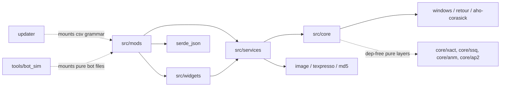

# Dependencies

> Machine-generated by the codebase-summary workflow. Do not hand-edit; regenerate instead.

## DLL crate (`Cargo.toml`)

| Crate | Version | Why |
|---|---|---|
| `windows` | 0.58 | Win32 surface. The feature list is curated: foundation, memory, threading, loader, diagnostics, registry, SetupAPI/HID + file IO (SMX), window messaging/touch/GDI (SMX overlay), console. A new API usually needs a new feature flag. |
| `retour` | 0.4.0-alpha.4 (`static-detour`) | Inline detours. This crate is why the toolchain is nightly, and it has no aarch64 backend, which is why the DLL can't be host-tested on ARM. |
| `once_cell` | 1 | Lazy statics |
| `log` | 0.4 | Facade; the backend is `core/logger.rs` |
| `serde` / `serde_json` | 1 | `mod-config.json` |
| `image` | 0.25 | PNG decode for LayeredFS textures and asset generation |
| `texpresso` | 2 | DXT5 compression |
| `md5` | 0.7 | Cache fingerprints. The pure layer has its own dependency-free MD5 in `core/xact/digest.rs`. |
| `aho-corasick` | 1 | Batch AOB prefilter |

`cargo-features = ["trim-paths"]` together with `trim-paths = "all"` strips builder paths from the release binary. The release profile uses `lto = true` and `opt-level = 2`. `Cargo.lock` is committed.

## Toolchain

- **Rust nightly** is pinned in `rust-toolchain.toml` with the `x86_64-pc-windows-msvc` and `x86_64-win7-windows-msvc` targets plus the `rust-src` and `rust-analyzer` components. Do not switch to stable.
- **`cargo-xwin`** cross-compiles from macOS/Linux.
- **Win7 builds** use `-Z build-std=std,panic_abort`, because std on the default msvc target imports `bcryptprimitives!ProcessPrng`, which Windows 7 lacks.

## Other crates in the repo

| Crate | Notable deps | Notes |
|---|---|---|
| `updater/` | `ureq` (rustls + webpki roots, never OS TLS), `serde_json` (`preserve_order`), `sha2`, `zip`, `dunce`, `windows-sys` (console) | Not a workspace member. Release builds use the Win7 recipe only. |
| `tools/bot_sim/` | std only | Mounts the DLL's pure bot files with `#[path]` |

## Runtime game modules

These are resolved at runtime; the DLL degrades if one is missing.

- `gamemdx.dll`
- `libavs-win64(-ea3).dll`
- `libafp-win64.dll` / `libafputils-win64.dll`
- `arkmdxbio2.dll` (or `arkmdxp3` / `arkmdxp4`)
- `ess.dll`
- `xactengine2_10.dll`
- `mfplat.dll` (Wine only)

## External tools

| Tool | Where | Purpose |
|---|---|---|
| spice2x | external | Loader; the Wine flags matter (`-icmphook`, `-audiohookdisable`) |
| fxc 9.29 + D3DCompiler_43 | `tools/fxc/` | HLSL → D3D9 bytecode under CrossOver. Fallback: `shaders/Dockerfile` (vkd3d). |
| `arctool` | `scripts/arctool` (arm64 binary) | Fast ARC packing |
| spice2x-cli | `spice2x-cli/` (arm64 binary) | SpiceAPI client for `scripts/game_nav/` |
| capstone (Python) | pip | `scripts/sig_harness/shape_diff.py` |
| Pillow / fonttools | pip | Asset generators |
| ifstools | pip | `unpack_all.py`, `build_ddr_package` |
| ffmpeg / ffprobe | external | `convert_movies.sh` |
| Blender 4.2+ | external | Blender add-on and its validation |
| sibling `ddr-chart-tools` / `bemaniutils` | external checkouts | Reference implementations for some harness legs |

## Dependency Direction

## Upgrade Considerations

- `retour` is pinned to an alpha. Upgrading it means auditing `core/hooks.rs` and every `GenericDetour` site.
- New game builds are handled by signature tolerance rather than code changes. Add the build to the sweep directory and run `scripts/validate_signatures.sh`.
