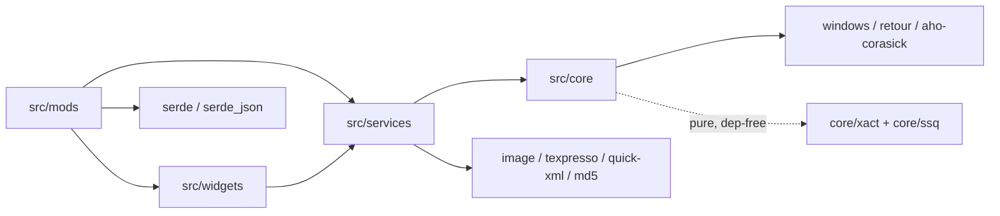

# Dependencies

> Machine-generated by the codebase-summary workflow. Do not hand-edit; regenerate instead.

## Rust Crates (`Cargo.toml`)

| Crate | Version | Features | Why |
|---|---|---|---|
| `windows` | 0.58 | Foundation, SystemServices, LibraryLoader, Memory, Threading, ProcessStatus, Diagnostics_Debug, Environment, Registry | Win32 API surface (module enumeration, VirtualAlloc/Protect, threads, OutputDebugString, SEH-adjacent) |
| `retour` | 0.4.0-alpha.4 | `static-detour` | Inline function hooking — the reason the toolchain is nightly |
| `once_cell` | 1 | — | Lazy statics for config/service singletons |
| `log` | 0.4 | — | Log facade (backend is `core/logger.rs`) |
| `serde` / `serde_json` | 1 / 1 | `derive` | `mod-config.json` |
| `image` | 0.25 | — | PNG decode for the LayeredFS texture pipeline and asset generation |
| `texpresso` | 2 | — | DXT5 compression for game texture formats |
| `md5` | 0.7 | — | Cache-invalidation sidecars (a separate dependency-free MD5 lives in `core/xact/digest.rs` for the pure layer) |
| `quick-xml` | 0.36 | — | texturelist/musicdb XML handling |
| `aho-corasick` | 1 | — | Multi-pattern prefilter for the batch AOB scanner |

Notable: `cargo-features = ["trim-paths"]` + `trim-paths = "all"` in the release profile strips builder-machine paths from the binary. `Cargo.lock` is committed.

## Toolchain

- **Nightly Rust**, pinned by `rust-toolchain.toml` — required by `retour`'s static-detour feature and `trim-paths`; do not switch to stable.
- Targets: `x86_64-pc-windows-msvc` (primary) and `x86_64-win7-windows-msvc` (tier-3; `build_win7.sh` uses `-Z build-std=std,panic_abort` because the default target imports `ProcessPrng`, absent on Windows 7). Component `rust-src` required for the Win7 build.
- Cross-compilation from macOS/Linux via `cargo-xwin` (`build.sh`).
- Host caveat: `retour` does not compile on ARM hosts — host tests for pure modules run via the `scripts/validate_*.sh` temp-crate harnesses.

## Runtime Game-Module Dependencies

Loaded by the game itself; the DLL resolves them at runtime and degrades if absent:

| Module | Used for |
|---|---|
| `gamemdx.dll` | Primary target — signatures, detours, patches |
| `libavs-win64-ea3.dll` | Filesystem hooks, property ordinals, compression |
| `libafp-win64.dll` / `libafputils-win64.dll` | AFP/BM2D named exports, one detour |
| `arkmdxbio2.dll` (or `arkmdxp3`/`arkmdxp4`) | Input polling exports |
| `ess.dll` | Save/load senders (persistence + score policy) |
| `mfplat.dll` | Wine-only VC-1 subtype fix |

## External Tools & Assets

| Tool | Where | Purpose |
|---|---|---|
| spice2x | external | Loader (`-k`); `-icmphook` / `-audiohookdisable` flags matter under Wine |
| fxc 9.29 + D3DCompiler_43 | `tools/fxc/` (committed) | HLSL→D3D9 bytecode (golden path, run under CrossOver); Docker/vkd3d fallback in `shaders/Dockerfile` |
| `arctool` | `scripts/arctool` (committed arm64 binary) | ARC unpack/repack companion for `arc_tool.py` |
| spice2x CLI | `spice2x-cli/` (committed) | SpiceAPI cabinet control for `scripts/game_nav/` automation |
| Python 3 (+ Pillow/fonttools per script) | `scripts/*.py` | Asset generation, validation, unpacking |
| ffmpeg/ffprobe | external | `scripts/convert_movies.sh` |
| sibling `ddr-chart-tools` checkout | external repo | Reference implementation for the se_bank_synth / song-rate validation harnesses |
| Fonts | `scripts/fonts/` | Game-derived TTF conversions + OFL-licensed fallbacks for label generation |

## Dependency Direction

The pure layers (`core/xact`, `core/ssq`, most `*_tests.rs`-covered modules) deliberately avoid crate dependencies so the host harnesses can mount them standalone.

## Upgrade Considerations

- `retour` is an alpha pin; upgrading changes the static-detour macro surface — audit `core/hooks.rs` and every `GenericDetour` site.
- `windows` feature list is curated; adding an API means adding its feature flag.
- Game updates (new `gamemdx.dll` datecodes) are handled by signature tolerance, not code changes — run `scripts/aob_check.py` against the new build and fix any signature that no longer matches exactly once.
