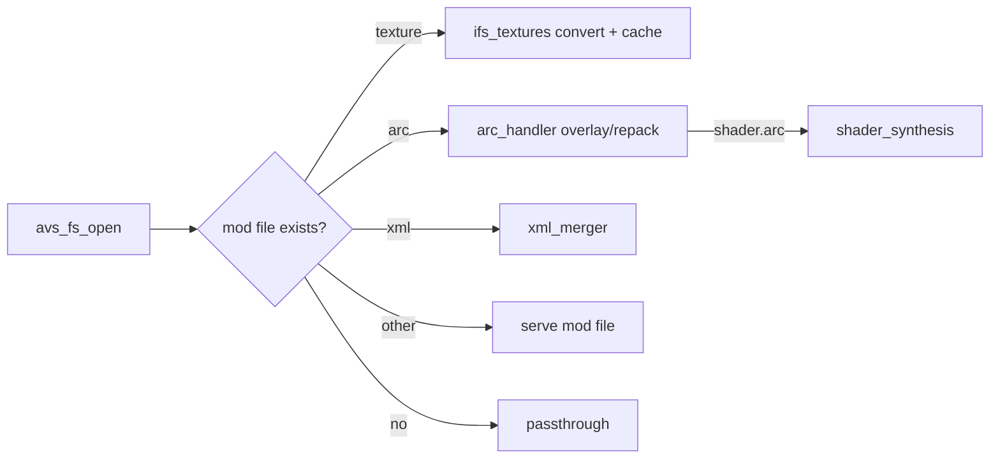

# Workflows

> Machine-generated by the codebase-summary workflow. Do not hand-edit; regenerate instead.

## Development

### Build and checks

| Command | Purpose |
|---|---|
| `cargo check --target x86_64-pc-windows-msvc` | Fast type check. Works on any host. |
| `./build.sh` | Release DLL (`cargo xwin`, msvc target) → `target/x86_64-pc-windows-msvc/release/ddr_world_hook.dll` |
| `./build_win7.sh` | Windows 7 build (`-Z build-std`; avoids the `ProcessPrng` import) |
| `./scripts/deploy.sh` | Build and `scp` to the cabinet. Reads `/tmp/sshhost`, `/tmp/sshuser`, `/tmp/sshpass`. |
| `./scripts/build_release_archive.sh` | Win7 DLL + updater into `release/`: a zip, a bare updater exe, and a tester `install-update-YYYYMMDD.bat`. It fails if either binary imports `ProcessPrng`. |
| `cargo fmt` | Run on the whole crate only. `cargo fmt -- <file>` still formats everything. |

**Host tests.** The DLL crate **cannot** be built by `cargo test` on an ARM host, because `retour` has no aarch64 backend. Pure modules are tested by the `scripts/validate_*.sh` harnesses instead. Each harness writes a throwaway crate that `#[path]`-mounts dependency-free source files and runs `cargo test` in it. This is why pure files must not use `crate::` imports.

- Some harness legs need extra inputs:
  - `$DDR_WORLD_INSTALL` for real game data
  - a sibling `ddr-chart-tools` checkout, for se_bank_synth and song_playback_speed
  - a sibling `bemaniutils` checkout, for s_marvelous dev legs (Leg H's art-size check also needs `kbinxml`, which ships with `ifstools`)
- `updater/` and `tools/bot_sim/` are standalone crates that test natively:
  - `cargo test --manifest-path updater/Cargo.toml`
  - `scripts/validate_multiplayer_bot.sh`

**Signature sweep** (run whenever `signatures.rs` or a consumer-side fixed offset changes):

1. `scripts/validate_signatures.sh <dir-of-gamemdx-builds>` mounts the real scanner + signatures into a host crate. It maps each `gamemdx*.dll` the way the loader does (sections, relocations, libafp IAT emulation from one `libafp-win64*.dll` in the same dir), then runs `resolve_all` + `resolve_derived`.
2. `scripts/sig_harness/report.py` maps misses to per-mod hard/soft losses. Version alternates are declared as `_vN` stems or in `ALT_GROUPS`. Exit 0 means every miss is covered.
3. `scripts/sig_harness/shape_diff.py --json … --dir …` disassembles a window after every match on every build and reports the first divergence. A pattern that matches on every build proves nothing about bytes read at `match+N`.
4. `scripts/aob_check.py` is a quick single-pattern uniqueness check.

**Engine-facing validation** is done by deploying to a cabinet and reading the spice2x log plus `ddr_hook_crash.log`. `scripts/game_nav/` automates a CrossOver cabinet over SpiceAPI: launch, card-in, song select, options, start a song, screenshot. When a runtime bug is unclear, ship a diagnostic build with one-shot logs on every fallback branch before rewriting anything.

### Adding things

- **A mod:**
  1. Implement `Mod` in `src/mods/<name>.rs` (or a subdirectory).
  2. Add signatures to `src/core/signatures.rs` and run the sweep.
  3. List hard requirements in `required_signatures()`.
  4. Construct and register it in `src/lib.rs`.
  5. If it should default OFF, add it to `DEFAULT_OFF_MODS`.
  6. Split pure logic into a harness-mountable file.
- **A hook consumer:** subscribe to the owning service (see `interfaces.md`). If the target is currently owned privately by one mod, promote it to a service dispatcher. Never add a second detour.
- **Option rows:**
  - Per-player rows use `custom_options::register_option`.
  - Cabinet-wide overlay rows use `mod_menu::register_*_row`.
  - Labels are generated textures: edit `scripts/option_strings.py` (en/ja/ko), run `scripts/gen_option_labels.py`, and regression-check with `scripts/check_option_takeover.py`. Never hand-edit a generated PNG.
- **Shaders:** edit `shaders/src/*.hlsl`, then run `scripts/build_shaders.sh`. fxc 9.29 under the CrossOver bottle is the golden path; `--vkd3d`/Docker is a fallback only. Commit the `.d3dbc` blobs in `data_mods/shader_fixes/blobs/`. Containers are synthesized at runtime, and blob changes re-trigger synthesis through the fingerprint.
- **Deploying assets:** a DLL-only deploy does not carry `data_mods/`. Features with shipped labels, blobs or art need the matching `data_mods/` files on the install.

### Other tooling

- `tools/blender_ddr_addon/` — validate with `scripts/validate_blender_addon.sh <unpacked-data-root>` (headless Blender); package with `scripts/build_blender_addon.sh`.
- `scripts/bot_sim.sh <ssq-dir>` — offline bot-quality simulation report.
- `scripts/convert_movies.sh` — VC-1 → H.264 for Wine (idempotent, `--restore`).
- `scripts/ddr_selection/import_a3_assets.{sh,bat}` — operator-side import of A3-only assets into `data_mods/ddr_selection_a3/`.
- `scripts/gen_ddr_selection_smarv_art.py` — regenerates the legacy skins' S-Marvelous art in `data_mods/ddr_selection/s_marvelous/` from the installed legacy textures (needs `ifstools`); `--check-world` proves its recipes against `data_mods/s_marvelous/`.
- Format tools: `arc_tool.py` / `arctool`, `unpack_arc.py`, `unpack_all.py`, `ktmdl_dump.py`, `anm_dump.py`, `split_camanm.py`, `gsp_pack.py`, `kbf_to_font.py`.

### Planning convention (PDD)

- Features in flight live in `.agents/planning/<date>-<name>/`. That directory holds research, design, the implementation plan, and `progress.md`, which is the cross-session resume point.
- `_archive/` holds completed features.
- `.agents/tasks/` holds generated task files; `.agents/scratchpad/` holds working notes.

## Runtime

### Boot

See `architecture.md` for the ordered sequence. It ends with a 10 s splash. The splash adds a red REBOOT warning when texture atlases were rebuilt during that boot.

### Per-frame

The `overlay_draw` layer-dispatcher detour drives the frame pump in this order:

1. `input_manager::poll`: every `on_frame` callback, then button events. The exclusive consumer (the mod menu) wins while it is open.
2. The queued `run_on_render_thread` batch.
3. The original render.

### Scene change

1. The `createNextSequence` detour records the new 0-indexed scene and applies redirects.
2. It snapshots the callbacks and releases the lock.
3. It fires the callbacks, each under `catch_unwind`.

Scene callbacks run **before** the original builds the next sequence. Lifecycles key off GAMEPLAY (28), the SONG_SELECT family (25/26), and results.

### Judge

`judgeNotes` runs pre-callbacks in ascending priority, then the original, then post-callbacks. The foot-panel swap wraps the original (pre Late / post Early).

### LayeredFS request

### Song rate (largest runtime flow)

1. The scene-26 arm checks eligibility.
2. The dance-bank create binds a virtual XWB.
3. The generator thread streams stretched or resampled audio into a ring, which the XACT IO detours serve.
4. An exactly-once commit runs in the order: score policy → movie → snapshot → Q31 clock (last).
5. Teardown retires the binding.

Every failure falls back to stock 100 %.

### Score save policy

- Per-stage saves from tainted sides are suppressed.
- The logout save is sanitised, or suppressed if sanitising isn't available.

### Auto-updater (`updater/`)

It runs from `gamestart.bat` before spice2x. The steps are:

1. Game-dir gate.
2. Stale self-update cleanup.
3. Journal recovery.
4. GitHub release lookup.
5. `needs_update`: the tag **or** the asset sha256 differs. It compares for equality and never orders versions, so deleting a release rolls cabinets back and dev builds get downgraded.
6. Download with digest check.
7. Two-pass validated extraction.
8. Merges of user-owned files: additive JSON, header-scoped `option_menu_settings`, cell-level CSV fill using the DLL's own CSV grammar.
9. Pure plan (`Write` / `Prune` only when the file is unchanged / `KeepModified` / `WriteMerged` / `SelfUpdate`).
10. Journaled apply with backup + reverse rollback; the manifest is written last.

Exit codes: 0 means the game is startable, 1 means the rollback itself failed, 3 means `--check` found an update. `--from-zip <zip> [--tag]` runs the same pipeline on a local archive. The release script's `install-update-*.bat` uses it for testers.

### Crash diagnostics

- A panic goes through the panic hook into the fsynced `ddr_hook_crash.log`.
- A hard fault goes through the SEH filter, which classifies it as ours or the game's and continues the search.
- To decode crash offsets, use the cabinet's own build (the `shape_diff.py` `Image` helper).
