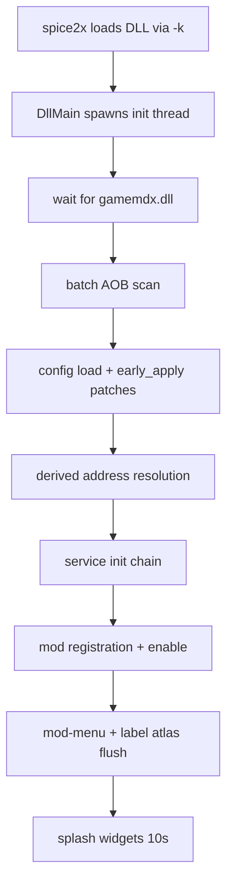
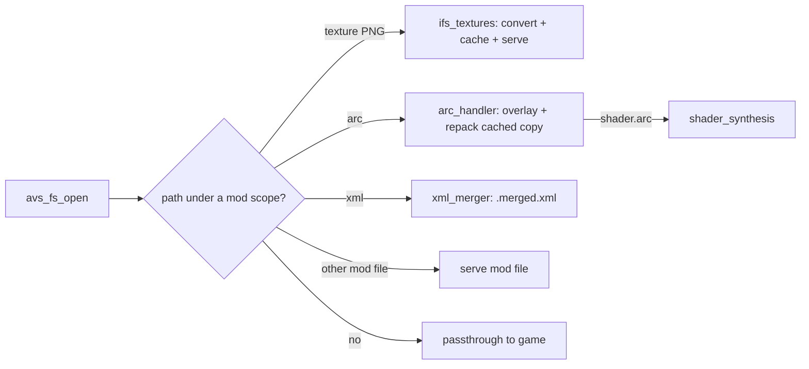

# Workflows

> Machine-generated by the codebase-summary workflow. Do not hand-edit; regenerate instead.

## Development

### Build / check / test

```bash
cargo check --target x86_64-pc-windows-msvc   # fast type check
cargo test                                     # host tests (pure layers only)
cargo fmt                                      # whole crate — never pass file args
./build.sh                                     # release DLL via cargo-xwin
./build_win7.sh                                # Windows 7 build (tier-3 target, -Z build-std)
./scripts/deploy.sh                            # build + SCP to cabinet (/tmp/ssh{host,user,pass})
```

Readiness gate before handing off a build: `cargo check` clean → `cargo fmt` → `./build.sh` clean.

Note: plain `cargo test` cannot compile `retour` on ARM hosts — the pure modules that matter are either `#[cfg]`-clean or mounted by the `scripts/validate_*.sh` temp-crate harnesses (auto_calibration, custom_options, fast_bootup, judgement_offsets, mod_menu, movie_sync, overlay_draw, se_bank_synth, song_playback_speed).

### Validation model

Engine-facing code has no test harness by design — validation is a cabinet deploy plus log observation (spice2x log + `ddr_hook_crash.log`). `scripts/game_nav/` + `spice2x-cli/` automate a CrossOver cabinet over SpiceAPI (boot, card-in, navigate to song select/options/gameplay, screenshot) for headless checks. When chasing an apparent runtime bug, ship a diagnostic build with one-shot WARN/INFO logs on every fallback branch before rewriting.

### Adding a mod

1. Implement `Mod` in `src/mods/<name>.rs` (or a subdirectory once multi-file).
2. Add needed AOB signatures to `src/core/signatures.rs`; verify uniqueness across builds with `scripts/aob_check.py`; list hard requirements in `required_signatures()`.
3. Construct + register in `src/lib.rs` (order matters only if you need `early_apply` or late binding).
4. Register option rows (per-player: `custom_options::register_option`; cabinet-wide: `mod_menu::rows`).
5. Split pure decision logic into its own file and give it host tests.

### Adding a shared hook consumer

Never install a second detour on an already-hooked function — subscribe to the owning dispatcher (`judge_hook`, `render_notes_hook`, `analyze_hook`, `movie_policy`) or promote the existing single-owner detour into a dispatcher.

### Asset / texture workflows

- LayeredFS drop-in: PNG under `data_mods/<mod>/..._ifs/tex/` mirroring the stock IFS path — converted + injected at runtime.
- Options-menu label textures: edit `scripts/option_strings.py` (en/ja/ko) → `scripts/gen_option_labels.py` → regression-check with `scripts/check_option_takeover.py`. Never hand-edit generated PNGs.
- Shaders: edit `shaders/src/*.hlsl` → `./scripts/build_shaders.sh` (fxc under the CrossOver bottle is the golden path) → commit the `.d3dbc` blobs under `data_mods/shader_fixes/blobs/`. Containers are synthesized at runtime, not committed.
- Movies for Wine: `scripts/convert_movies.sh` (idempotent VC-1→H.264, `--restore`).

### Feature planning (PDD)

In-flight features live in `.agents/planning/<date>-<name>/` (rough-idea → research → design → implementation plan → `progress.md` as the cross-session resume point). Completed sets move to `.agents/planning/_archive/`. Task files generated per step land in `.agents/tasks/`.

## Runtime

### Boot flow



### Scene-change dispatch

`createNextSequence` detour → record new scene (0-indexed) → apply any registered redirect → snapshot callbacks → **release lock** → fire callbacks (each `catch_unwind`). Mods key lifecycle off entry/exit of `GAMEPLAY` (28) and `SONG_SELECT` (25).

### Judge dispatch

`judgeNotes` detour → pre-callbacks ascending priority (per-song-offsets writes at Early; assist-tick reads at Normal) → original → post-callbacks (PUS data feed → calibration tap, real-speed first-judge recompute).

### Per-frame drivers

`input_manager::poll()` dispatches frame callbacks first (movie-sync seek drain, preview restart executor, wheel polling, song-reset driver), then button events, honoring the exclusive consumer (mod menu) and suppression flags.

### LayeredFS request flow



### Song-rate lifecycle (largest runtime flow)

Scene 26 arm (eligibility: ordinary solo/doubles, supported rate) → dance-bank create qualifies + binds a virtual XWB → generator thread streams stretched/resampled audio into the ring → XACT IO detours serve it → exactly-once commit (score policy → movie suppression/sync → snapshot → Q31 clock last) → gameplay runs at rate → teardown retires the binding. Failures at any point fail open to stock 100 %.

### Score save policy

Per-stage save of a tainted side (autoplay / quick-fail / assist-tick / training-altered / rate-played) is suppressed; the card-out logout save is forwarded but sanitised (records virginised, league stripped) so profile/customize changes persist without tainted scores. Sanitisation unavailable ⇒ full suppression (fail-closed).

### Crash diagnostics

Panic → panic hook → durable `ddr_hook_crash.log`; hard fault → SEH filter logs code/address/module classification then continues the search (never swallows). Both survive spice2x's buffered logging.
