# DDR World Universal Modpack

A free, open-source mod pack for **DanceDanceRevolution World**. It adds an in-game mod menu, practice tools, per-song timing correction, playback speed control, visual customization, quality-of-life fixes, and much more — all rendered through the game's own UI, with no changes to your game files.

Everything ships as a single hook DLL loaded by [spice2x](https://spice2x.github.io/). Install it, press **0** three times on a pinpad, and start toggling.

This modpack is also **datecode-agnostic**! Through memory scanning and pattern matching techniques, we dynamically find every patch site during runtime. No need to hex edit your data, just drop into any stock installation.

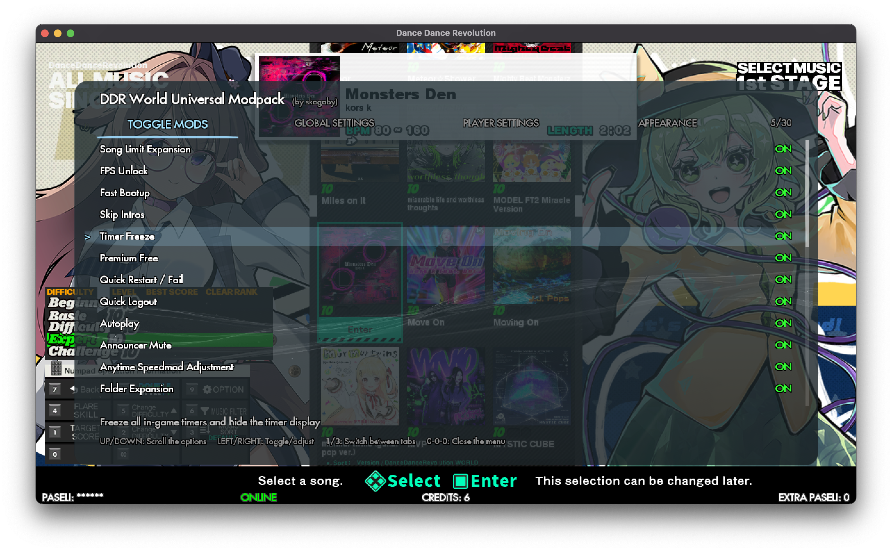
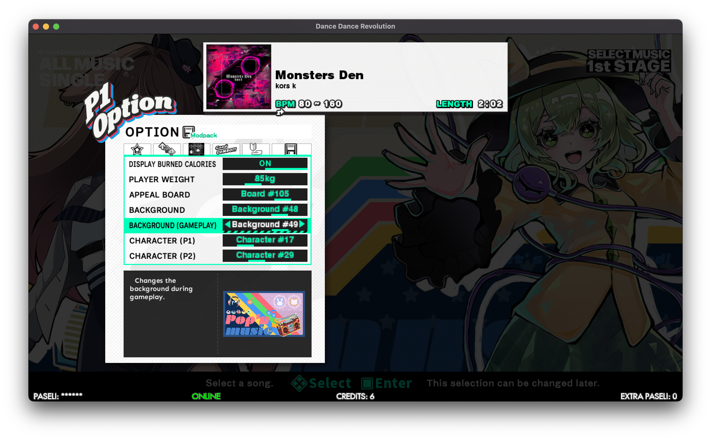
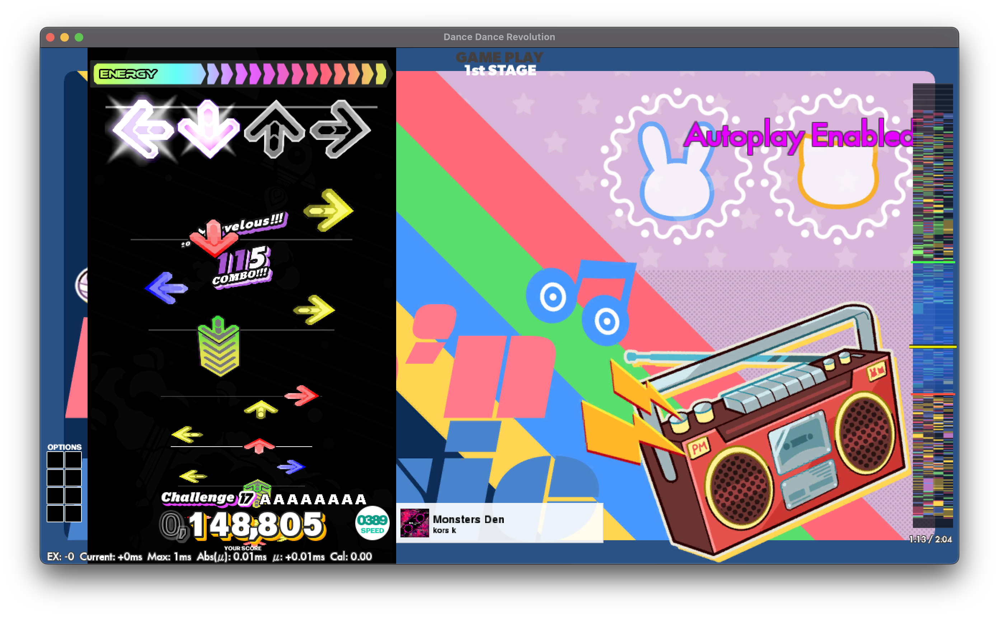

## Compatibility — Read This First

- **This modpack is for DDR World 64-bit (MDX-003) data only.** 32-bit builds of DDR are **not** supported, and there are no plans in place to support 32-bit builds.
- **2026 game builds are thoroughly tested.** 2025 builds may have instabilities and have not been fully tested across every feature (though plenty have been tested on older builds) — if you hit a problem, please file a bug report and **attach your `log.txt`** so we can triage it.
- Runs on Windows and on macOS/Linux under CrossOver/Wine (see [Playing on macOS / Linux](#playing-on-macos--linux-crossoverwine)).

## Installation

1. Download the latest release (or [build from source](#for-developers)).
2. Copy these into your game folder (the folder containing `spice64.exe`):
   - `ddr_world_hook.dll`
   - the `data_mods/` folder (textures and assets many mods need)
   - `mod-config.json` (a ready-to-go default configuration)
   - `judgement_offsets.csv` (optional but recommended — a community-sourced sync list for ~1,440 songs)
3. Add the hook to your spice2x launch options: `-K ddr_world_hook.dll` (in `gamestart.bat` as a new parameter to `spice2x.exe`).
4. Launch the game. You'll see a splash message in the top-left confirming the modpack loaded.
5. **First boot only:** if a red warning appears telling you to reboot, restart the game once — the modpack builds its menu textures on first launch.

That's it. Everything is enabled with sensible defaults out of the box.

### The Mod Menu

Press **0 three times** on either pinpad to open the in-game mod menu. Navigate with the cabinet menu buttons, and use **1**/**3** to switch tabs:

- **MODS** — Turn any mod on or off, live during runtime (for the most part; a handful will require reboots)
- **GLOBAL SETTINGS** — Cabinet-wide settings that affect all players on the machine (timing offsets, FPS target, restart delay, things like that)
- **PLAYER SETTINGS** — Per-player settings that can be configured on each cabinet side individually. **This is a mirror of the injected in-game custom options, though this can be configured in `mod-config.json`**.
- **APPEARANCE** — 12 menu themes with animated backgrounds
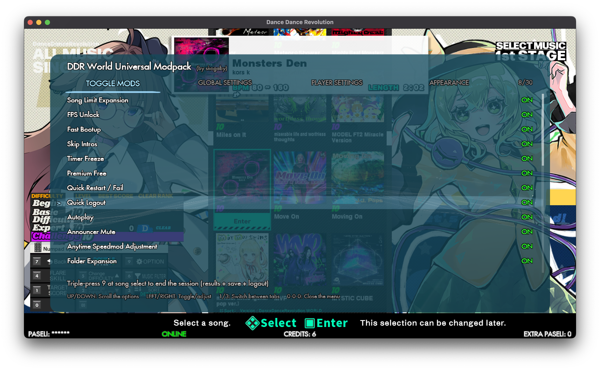
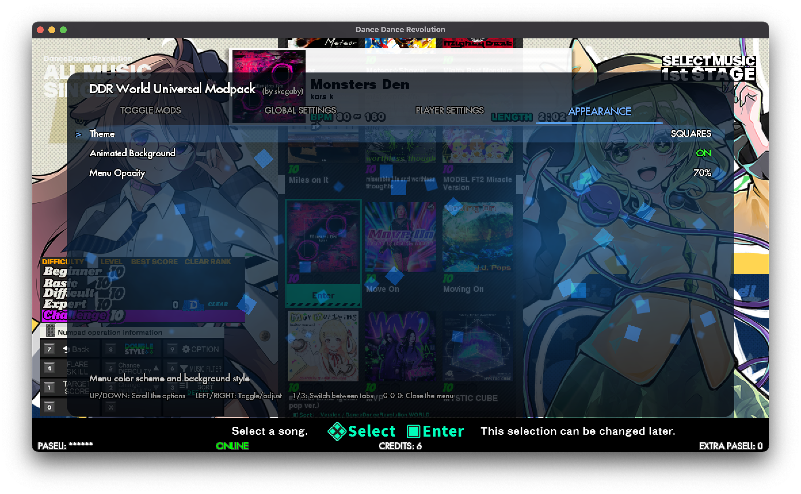
Per-player options (autoplay, assist tick, song speed, styling, cosmetics, etc.) also live in the game's **own options menu** on a new **MODPACK** tab, right alongside the stock options — and they follow your player profile.
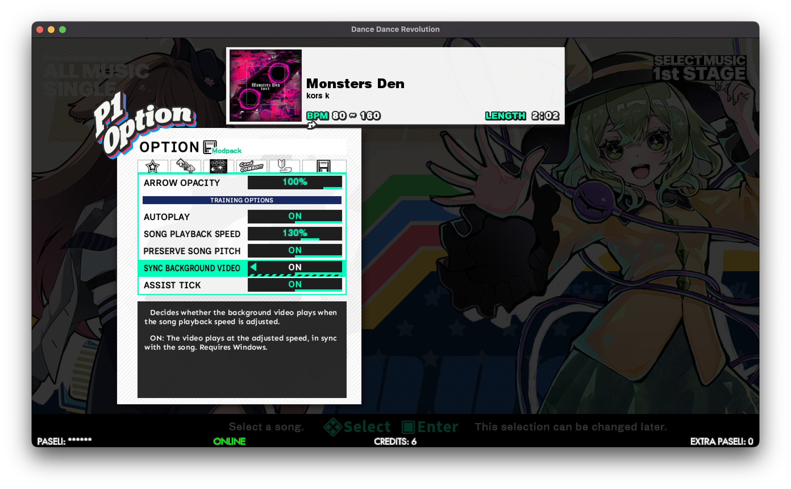

### Pinpad Hotkeys

With the full suite enabled, the cabinet pinpads double as a hotkey panel — no extra hardware needed:

<p align="center">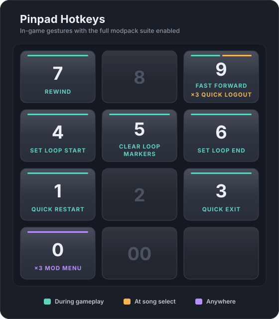</p>

## Highlights

### Song Playback Speed
Play any song at **25%–175%** speed, with everything in sync — audio (pitch-preserved, or classic vinyl-style if you prefer), arrows, judging, even the background video if you opt in. Song-select previews follow your speed setting too, so you can dial it in by ear. Practice hard charts slow; push past 100% for a challenge. Scores at non-100% speeds are never submitted, so your records stay honest.

### Training Mode
Now you can grind and practice songs on a real cabinet, without resorting to StepMania conversions! Set a start and end point, loop the section, and scrub backward/forward mid-song with pinpad gestures — with a chart timeline HUD showing exactly where you are.

### Timing Offsets + Auto-Calibration
Adjust the game's global sound/input/render timing live from the mod menu. Better yet, turn on **"Calibrate next song?"**, under the global mod settings, play one song, and the modpack measures your timing and sets the sound offset for you — StepMania AutoSync style.

### Per-Song Judgement Offsets
Not every song is synced the same. This mod gives every song its own judgement offset that follows the song wheel — and it ships **pre-seeded with community-sourced sync values for ~1,440 songs**. Adjust any song yourself from the options menu; your values follow your profile.

### S-Marvelous Judgement
A brand-new judgement tier above Marvelous: steps landed within **±12 ms** earn a violet **S-Marvelous**, with the full native treatment — its own judgement flash, combo colors, full-combo splash, a dedicated row on the results screen, its own series on the play graph, and S-MFC emblems for an all-S-Marvelous full combo. It's pure presentation: to the game (and the network) an S-Marvelous is still a Marvelous, so your scores and records are completely untouched.
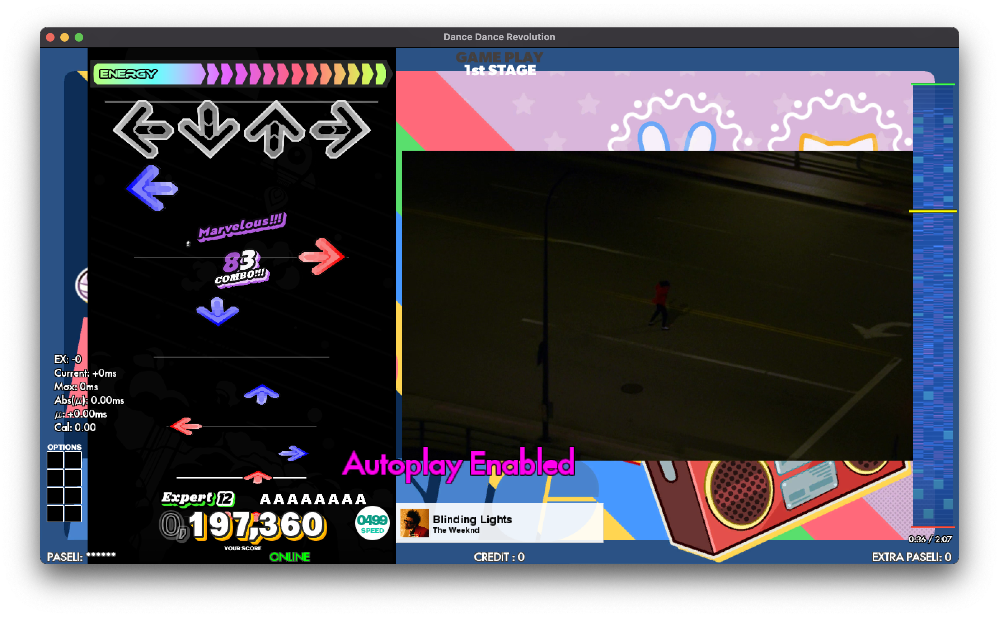
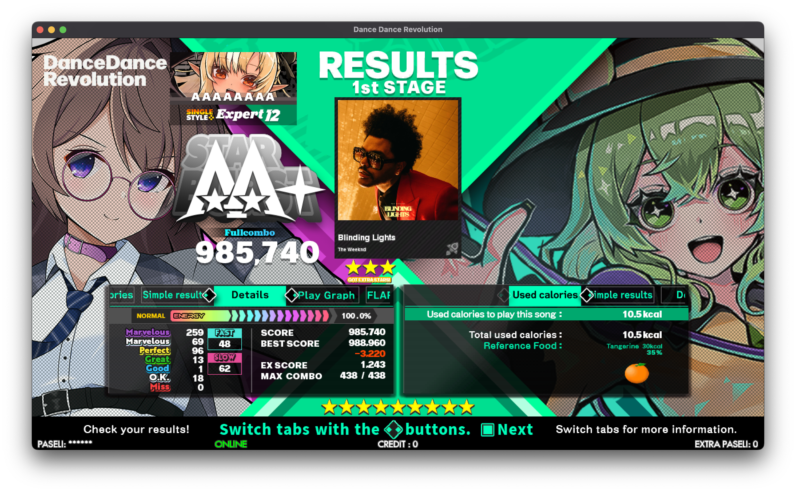
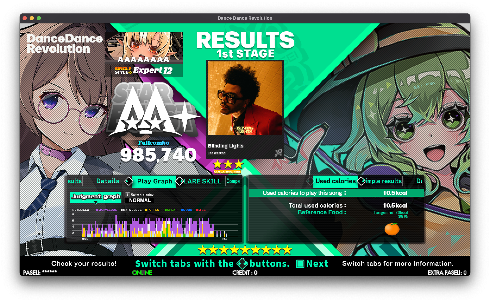
### Quick Restart, Quick Fail, Quick Logout
Press **1** mid-song to instantly restart it (optionally with a countdown), **3** to bail out to song select, and triple-press **9** at song select to end your session on the spot. Combined with **Premium Free** (unlimited stages per credit), your cabinet becomes a practice machine.

### Player Perspective + Playfield Styling
Per-player lane views: stock **OVERHEAD**, StepMania-style **HALLWAY** (true 3D perspective), or **DISTANT**. Independently scale and fade the arrows, receptors, lane dressing, combo/judgement text, and pacemaker — per player, persisted to your profile.
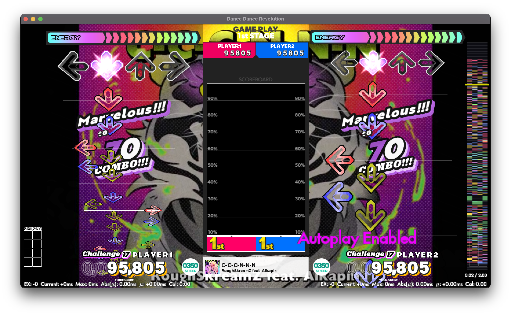
### Assist Tick
A clap sound at every arrow's exact judgement moment, mixed sample-perfectly through the game's own audio engine — the classic StepMania assist tick, with a volume control. Great for learning rhythms (scores are withheld while it's on, like autoplay).

### Power User Statistics
Live per-player stats while you play: millisecond error (current/max/mean), EX loss, calories burned — plus an option to replace the pacemaker with your latest ms-error, and per-song CSV export of your step data.

### WebUI Options, In-Game
All the cosmetic customizations normally locked behind Konami's web portal — appeal board, backgrounds, characters, lane skins, lane covers — selectable in-game with **live art previews** (the backgrounds even animate). Plus workout-profile settings (weight / calorie display).
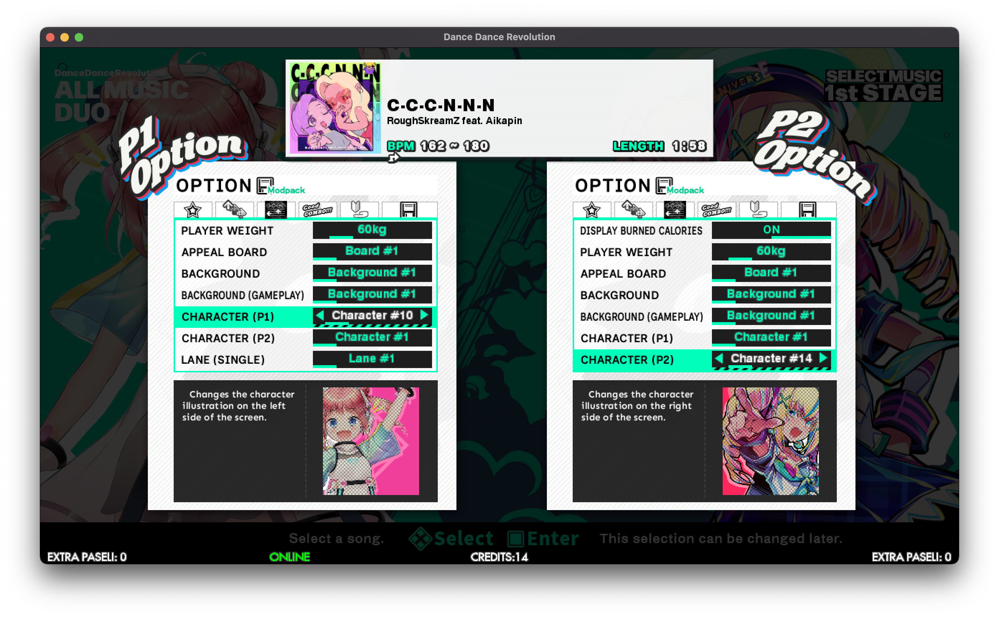

### Fast Bootup
**DDR A3-style instant bootup mod for DDR World**. This is accomplished by caching all of the data that DDR World normally analyzes from all charts during every bootup cycle. If a chart changes, the cache is updated, so the chart metadata never goes stale from an update.

### StepManiaX Cabinet Support
Native support for running on StepManiaX cabinets, with no configuration needed. Stage inputs and lights, as well as emulation of DDR Gold cabinet lights, are fully supported. There's even a touchscreen overlay to give you access to menu buttons, pinpads, and a card-in button.

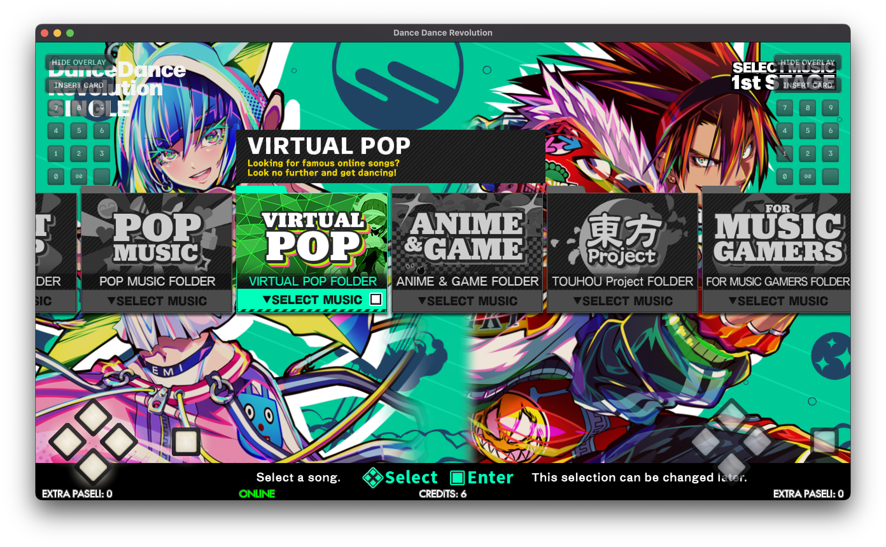

## Full Feature List

| Mod | What it does |
|-----|--------------|
| **Mod Menu** | In-game overlay for everything above — toggles, settings, themes. Always available (press 0×3). |
| **Song Playback Speed** | Per-player 25–175% song speed, pitch-preserved or resampled, synced previews, optional synced video. |
| **Training Mode** | Section practice: start/end bounds, looping, FF/RW scrubbing, chart timeline HUD. |
| **Timing Offsets** | Cabinet-wide sound/input/render/bomb offsets, live-editable, with one-song auto-calibration. |
| **Per-Song Judgement Offsets** | Per-song, per-player judgement offsets that follow the song wheel; community pre-seed included. |
| **Quick Restart / Fail** | Pinpad 1 = instant in-place restart (optional countdown); 3 = instant fail to song select. |
| **Quick Logout** | Triple-9 at song select ends the session through the game's normal logout flow. |
| **Classic Difficulty Adjustment** | Double-tap pad UP/DOWN at song select to raise/lower difficulty, like every DDR before World. |
| **Premium Free** | Unlimited stages per credit (per-player toggle). |
| **Autoplay** | Perfect auto-play with an on-screen watermark; scores never submitted. |
| **S-Marvelous Judgement** | A display-only judgement tier above Marvelous for steps within ±12 ms: violet judgement flash, combo digits, S-MFC splash, its own results row/graph series, and S-MFC emblems. Scores are untouched — to the game (and the network) an S-Marvelous IS a Marvelous. |
| **Assist Tick** | Sample-exact clap at each arrow's judgement moment, with volume control. |
| **Player Perspective** | OVERHEAD / HALLWAY / DISTANT lane views, per player. |
| **Playfield Styling** | Arrow/receptor/lane scale and opacity, per player. |
| **Overlay Element Styling** | Combo/judgement/pacemaker scale and opacity, per player. |
| **Center Arrows (1P)** | Centers the playfield during solo play. |
| **Shader Fixes** | Anti-aliased arrow rendering (and the shader programs Player Perspective uses). |
| **FPS Unlock** | Raise the display target from 60 up to 360 FPS (next-launch). |
| **Fast Bootup** | Dramatically faster boots via a chart-analysis cache. |
| **Skip Intros** | Jump straight to the title screen at boot, skipping the various license splashes. |
| **Timer Freeze** | Freezes and hides all selection countdown timers. |
| **Anytime Speedmod Adjustment** | Change your speed mod at any point during a song, not just the first ~10 seconds. |
| **Announcer Mute** | Silences the announcer's combo callouts and cheers (per-player option). |
| **Real Speed Fix** | Real Speed scroll uses Core BPM instead of Max BPM — sane scroll on variable-BPM songs. |
| **Power User Statistics** | Live ms-error/EX/calorie stats, pacemaker→ms-error swap, CSV step export. |
| **Music Wheel Song Length** | Shows each song's real play length (M:SS) next to the BPM at song select. |
| **Movie Size Customization** | The web-portal VIDEO SIZE setting (fullscreen/on/off), in-game. |
| **WebUI Options** | Web-portal cosmetics in-game with live previews, plus weight/calorie profile settings. |
| **Split SSQ Auto-Discovery** | Finds split chart files (`<song>_N.ssq`) on disk instead of trusting the game's hardcoded per-version list — newer chart data loads correctly on older game builds. |
| **Note Types Expansion** | New note types for custom charts — ITG-style **mines** are fully supported. |
| **Series Expansion** | Custom VERSION filter categories for custom song packs (config-driven). |
| **Folder Expansion** | Custom genre folders in the song wheel (config-driven). |
| **Song Limit Expansion** | Raises the loadable song cap by ~8× for large custom libraries. |
| **Background Movie Sync** | Keeps music videos in sync across restarts, scrubs, and loops (always on; can only improve on stock). |
| **Non-Native OS Support** | Keeps the game stable under CrossOver/Wine (background-movie handling). |
| **SMX Hardware and Touchscreen Overlay** | Native StepManiaX Dedicated Cabinet support: pads as input, DDR lights on the pads and cabinet, and a touchscreen overlay (menu buttons, pinpad, card-in). See below. |

## Your Scores Are Safe

The modpack takes score integrity seriously. Anything that would make a score dishonest — Autoplay, Assist Tick, a quick-fail, an altered Training Mode run, a non-100% song speed — marks that song, and marked scores are **never submitted to the server**. Your profile, settings, and cosmetics still save normally. Autoplay additionally renders a visible watermark so videos of autoplayed runs are identifiable. If the safety machinery ever can't initialize, the modpack errs on the side of submitting nothing.

## Settings & Configuration

Almost everything is adjustable in-game (mod menu for cabinet-wide settings, the options-menu tab for per-player settings). Per-player settings follow your card — with a supporting server they roam with your profile; without one, they persist locally on the cabinet.

Everything else lives in the single `mod-config.json` in the game folder (included with the release; menu-driven settings are written back to it automatically). You only need to edit it by hand for operator-level knobs:

<details>
<summary>Operator config sections (click to expand)</summary>

| Section | What it controls |
|---------|------------------|
| `mods` | Master on/off per mod (also editable from the mod menu) |
| `layeredfs` | Mod-file folder location, allow/blocklists, verbose logging |
| `series_expansion` / `folder_expansion` | Custom series/folder definitions for custom song packs |
| `custom_options` | Option persistence gates, preview tuning, menu ordering/placement |
| `timing_offsets` | The four cabinet timing offsets (also editable in the mod menu) |
| `fps_unlock` | FPS preset list + selection (also editable in the mod menu) |
| `quick_restart` | Restart countdown (also editable in the mod menu) |
| `training_mode` | Scrub step sizes |
| `music_wheel_song_length` | Position/size of the length readout |
| `per_song_judgement_offsets` | `mirror_players` — sync both players' offsets (solo home setups) |
| `non_native_os_support` | Background-movie mode under Wine (`suppress` / `fallback`) |
| `player_perspective` | HALLWAY/DISTANT geometry tuning |
| `s_marvelous` | S-Marvelous window in ms (`window_ms`, 1–16, default 12), judgement word art (`judgement_color`: `purple_shadow` / `all_purple`), stock Marvelous word shimmer (`marvelous_shimmer`, default `true`) — all also editable in the mod menu |
| `shader_fixes` | Arrow anti-aliasing toggle (also editable in the mod menu) |
| `overlay_menu` | Mod-menu theme/opacity (managed by the APPEARANCE tab) |
| `smx_hardware` | SMX cabinet support: card ids, overlay opacity/scale, light toggles, pad style (most also editable in the mod menu) |

All keys are optional; missing keys use sensible defaults.

</details>

Custom songs, textures, and assets are served from the `data_mods/` folder — drop-in PNGs are converted automatically, no repacking tools needed.

## StepManiaX Cabinet and Touchscreen Support

If your DDR World rig is built on a **StepManiaX Dedicated Cabinet**, the
`smx-hardware` mod drives the whole cabinet natively over USB.

- **Pads as input** — stage panels play the game, with the same latency-first
  design as the SMX SDK (dedicated reader threads).
- **Lights** — DDR's per-arrow stage lighting, corner lamps, marquee, monitor
  strips, and spotlights all mirror onto the SMX hardware.
- **Touchscreen overlay** — cabinet-style menu buttons, a pinpad, and an
  Insert Card button rendered on top of the game. Pinpad gestures (0-0-0
  mod menu, quick restart, etc.) work from the touchscreen too.

Setup notes:

- The game must be running in Gold-Cab/BIO2 mode; the mod's default
  `force_gold_cabinet` handles the usual case automatically.
- **Card-in:** set `smx_hardware.p1card` / `p2card` in `mod-config.json` to
  your e-amusement card UID (the same 16-hex-digit value a spice2x card file
  uses). The Insert Card button only appears when a card is configured.
- Overlay opacity/scale, the light toggles, and the pad style live in the mod
  menu's **SMX HARDWARE** section (GLOBAL SETTINGS tab).
- SMX hardware is not required to enable the mod, if you simply want a touchscreen
  overlay experience. The touchscreen overlay still functions without SMX hardware.

## Playing on macOS / Linux (CrossOver/Wine)

The modpack is developed and tested under CrossOver, and includes dedicated support:

- Run spice2x with **`-icmphook`** so the game boots fully online (PASELI included).
- Background movies: the default mode safely disables them (Wine's video stack crashes on them otherwise). If you want videos, set `non_native_os_support.movie_mode` to `"fallback"`, launch with **`-audiohookdisable`**, and either convert your movies with `scripts/convert_movies.sh` or set up the native Windows Media runtime in your bottle ([full recipe](docs/native_wm_runtime_bottle_setup.md)).

## Troubleshooting & Bug Reports

- **Something's broken?** Open an issue and **attach `log.txt`** (spice2x's log from the game folder). If the game crashed hard, also attach `ddr_hook_crash.log` if present, and the mini-dump file if that's also present.
- **Menu labels missing / blank textures?** Reboot the game once — first-boot texture generation requires it.
- **Weird boot behavior after a game update?** Delete `data_mods/_cache/` — all caches rebuild automatically.
- A mod that can't find what it needs in your game build disables just itself and logs a warning; the rest keeps working.

## For Developers

The modpack is a Rust hook DLL (`cdylib`) injected into the live game process. There are no game-file modifications and no static patches — everything happens in memory at runtime.

**Architecture philosophy — binary neutrality.** No hardcoded addresses, ever. Every game function and data structure is located at runtime via wildcard AOB signature scanning, RTTI/vtable walks, and RIP-relative derivation from scanned landmarks — so the DLL survives game data updates without a rebuild. Resolution failures degrade gracefully: a signature that doesn't match disables only the mods that need it. UI is rendered through the game's own widget, sprite, and animation systems rather than an external overlay, and hooks follow strict in-process discipline (one detour per target function with shared dispatchers, transactional byte patches with rollback, no panics across FFI boundaries).

**Tech stack:** Rust (nightly, pinned), [`retour`](https://crates.io/crates/retour) for detours, `windows` crate for Win32, `serde` for config, `image`/`texpresso` for the texture pipeline. Pure layers (audio DSP, file formats, decision logic) are dependency-free and host-tested; engine-facing code is validated on a live cabinet.

**Building:**

```bash
cargo check --target x86_64-pc-windows-msvc   # fast type check
cargo test                                     # host tests (pure layers)
./build.sh                                     # release build via cargo-xwin (macOS/Linux)
./build_win7.sh                                # Windows 7-compatible build
```

Output: `target/x86_64-pc-windows-msvc/release/ddr_world_hook.dll`. On Windows, a plain `cargo build --release --target x86_64-pc-windows-msvc` works too.

**Where to start reading:**

- [`AGENTS.md`](AGENTS.md) — codebase map, per-feature entry points, and engineering rules
- [`.agents/summary/index.md`](.agents/summary/index.md) — generated architecture documentation
- [`docs/`](docs/) — the reverse-engineering research notes behind each feature