# DDR World Universal Modpack

A free, open-source mod pack for **DanceDanceRevolution World**. It adds an in-game mod menu, a computer opponent for solo versus play, the 3D background stages and dancers World removed (with optional cel shading), practice tools, a deterministic sound-card-locked music clock that removes the game's play-to-play timing jitter, per-song timing correction, playback speed control, visual customization, quality-of-life fixes, and much more — all rendered through the game's own UI, with no changes to your game files.

Everything ships as a single hook DLL loaded by [spice2x](https://spice2x.github.io/). Install it, press **0** three times on a pinpad, and start toggling.

This modpack is also **datecode-agnostic**! Through memory scanning and pattern matching techniques, we dynamically find every patch site during runtime. No need to hex edit your data, just drop into any stock installation.

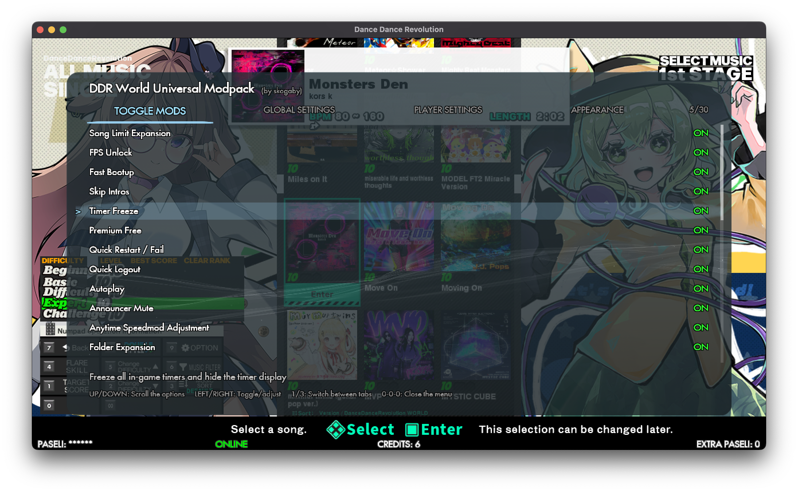
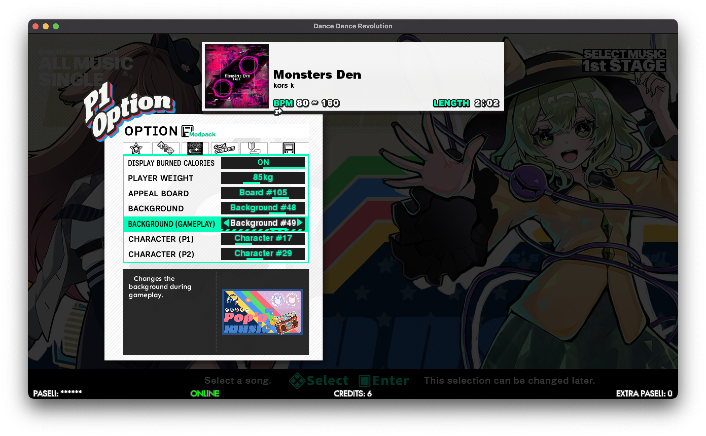
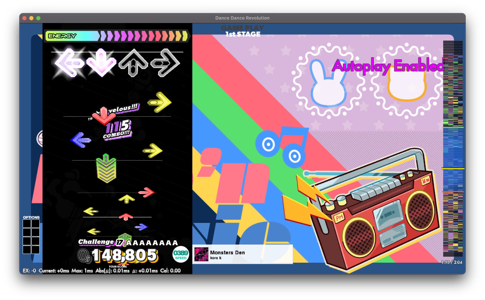
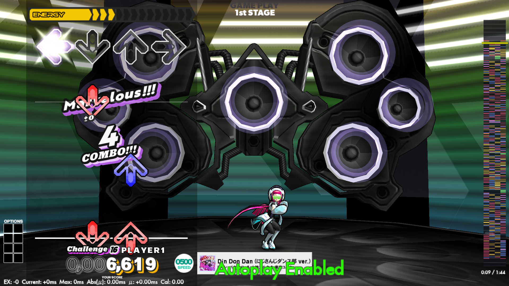

## Compatibility — Read This First

- **This modpack is for DDR World 64-bit (MDX-003) data only.** 32-bit builds of DDR are **not** supported, and there are no plans in place to support 32-bit builds.
- **2026 game builds are thoroughly tested.** 2025 builds may have instabilities and have not been fully tested across every feature (though plenty have been tested on older builds) — if you hit a problem, please file a bug report and **attach your `log.txt`** so we can triage it.
- Runs on Windows and on macOS/Linux under CrossOver/Wine (see [Playing on macOS / Linux](#playing-on-macos--linux-crossoverwine)).

## Installation

1. Download the latest release (or [build from source](#for-developers)).
2. Copy these into your game folder (the folder containing `spice64.exe`):
   - `ddr_world_hook.dll`
   - the `data_mods/` folder (textures and assets many mods need)
   - `mod-config.json` (a ready-to-go default configuration)
   - `judgement_offsets.csv` (optional but recommended — a community-sourced sync list for ~1,440 songs)
   - `ddr_world_hook_updater.exe` (optional — keeps all of the above current automatically; see [Automatic updates](#automatic-updates))
3. Add the hook to your spice2x launch options: `-z ddr_world_hook.dll` (in `gamestart.bat` as a new parameter to `spice2x.exe`).
4. Launch the game. You'll see a splash message in the top-left confirming the modpack loaded.
5. **First boot only:** if a red warning appears telling you to reboot, restart the game once — the modpack builds its menu textures on first launch.

That's it. Everything is enabled with sensible defaults out of the box.

### Automatic updates

The release zip ships a small updater, `ddr_world_hook_updater.exe`. Run it from `gamestart.bat` on the line **before** spice2x and every launch checks GitHub for a newer release and installs it before the game starts:

```bat
@echo off
cd /d %~dp0
ddr_world_hook_updater.exe
start spice64.exe -ddr -modules modules -z ddr_world_hook.dll
```

Just the bare exe name — a plain `.exe` call blocks the batch file until the updater has finished, so the game never starts mid-update. What it does:

- **Checks** the latest release on GitHub. Offline, rate-limited, or any other failure ⇒ game starts with what you have.
- **Installs** the new `ddr_world_hook.dll`, `data_mods/`, `README.md` and the updater itself. Files a newer release stopped shipping are removed **only if you never modified them**; anything you added yourself under `data_mods/` (custom song packs, texture packs) and the modpack's own caches are never touched.
- **Merges** your `mod-config.json`: every value you have set stays exactly as it is.
- **Merges** your `judgement_offsets.csv`: every offset you set is kept; blank cells are filled from the community list and songs you don't have yet are appended.
- **Backs up** everything it replaces or removes in `.ddr_world_hook_updater/backup/` (last update only) and writes `ddr_world_hook_updater.log` in the game folder. If an update fails half-way (even a power cut), the next run restores the previous state first and then tries again.

Options: `--check` reports whether an update is available without changing anything (exit code 3 when one is); `--force` reinstalls the current release; `--include-prerelease` also considers pre-releases builds, if available; `--from-zip <file>` installs a local release zip instead of downloading (`--tag <name>` labels it). Remove the line from `gamestart.bat` to stop updating. The installed release is recorded in `ddr_world_hook_updater.manifest.json` — delete it to force a reinstall on the next run.

### The Mod Menu

Press **0 three times** on either pinpad to open the in-game mod menu. Navigate with the cabinet menu buttons, and use **1**/**3** to switch tabs:

- **MODS** — Turn any mod on or off, live during runtime (for the most part; a handful will require reboots)
- **GLOBAL SETTINGS** — Cabinet-wide settings that affect all players on the machine (timing offsets, FPS target, restart delay, things like that)
- **PLAYER SETTINGS** — Per-player settings that can be configured on each cabinet side individually. **This is a mirror of the injected in-game custom options, though this can be configured in `mod-config.json`**.
- **APPEARANCE** — 12 menu themes with animated backgrounds
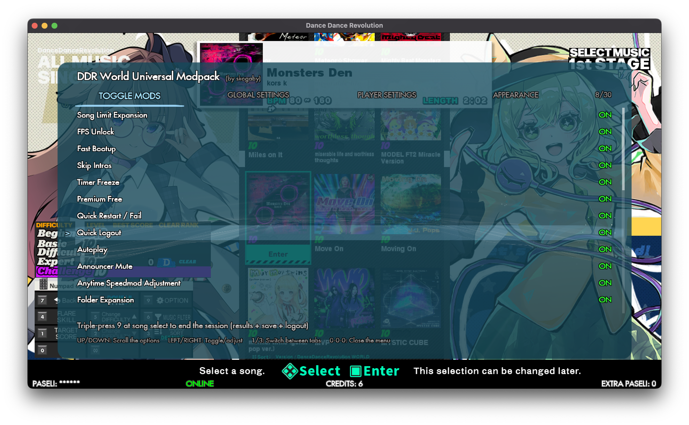
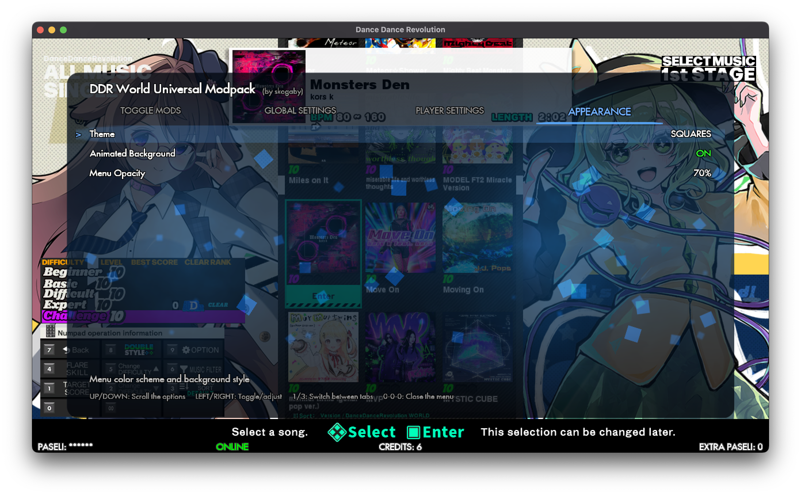
Per-player options (autoplay, the versus bot, assist tick, song speed, styling, cosmetics, etc.) also live in the game's **own options menu** on a new **MODPACK** tab, right alongside the stock options — and they follow your player profile.
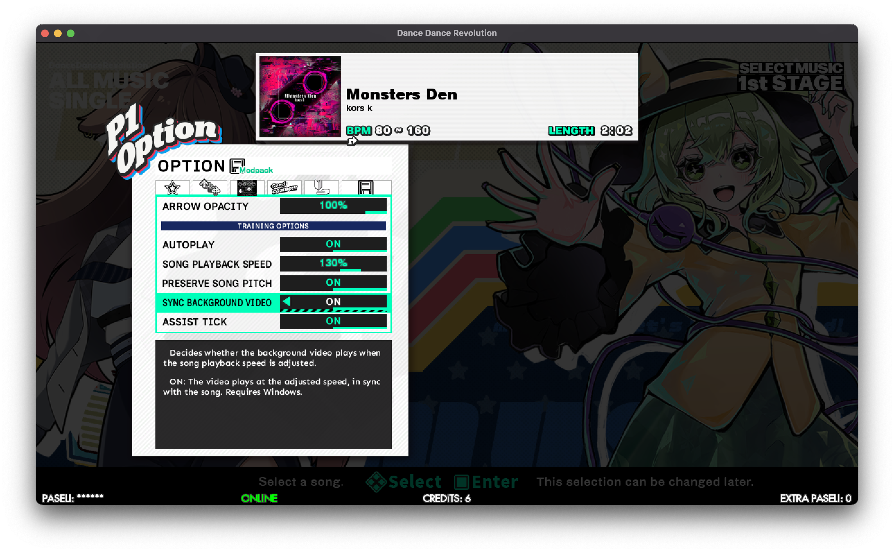

### Pinpad Hotkeys

With the full suite enabled, the cabinet pinpads double as a hotkey panel — no extra hardware needed:

<p align="center">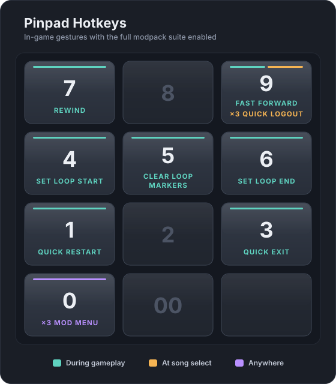</p>

## Highlights

### Versus Bot — Play 2-Player Against a CPU or Your Target Score
Playing alone? Turn on **BOT OPPONENT (1P ONLY)** in the options menu, pick a **BOT LEVEL** from `Level 1` to `Level 10`, and the next song becomes a two-player VERSUS session: a computer opponent takes the empty pad and plays your exact chart, at your speed and lane options. The level is real skill, not a score multiplier — the bot rushes and drags like a person, so its judgements and FAST/SLOW look human. A level-10 bot full-combos almost every chart and gets a Marvelous Full Combo about one song in ten; a level-1 bot scatters Greats, Goods and Misses and fails now and then. Quick restart gives it a fresh run.

One step past `Level 10` is **TARGET SCORE**: the bot replays whatever your pacemaker is pointed at — your own best, a rival, the world record — step for step, under that player's name with a **TARGET BOT** tag so a screenshot never passes for their real play. Charts without a target score fall back to a `Level 10` opponent. The bot's score is never saved or sent to the server; your own side saves exactly as usual.

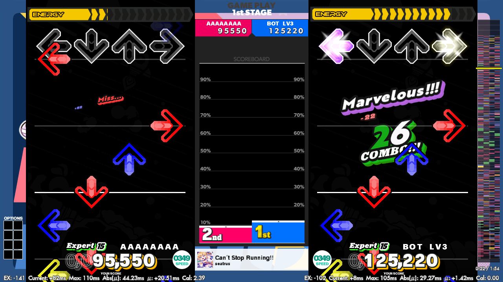

### Background Dancer Revival
DDR World removed the 3D dancers and stages every earlier DDR showed behind the arrows — this mod puts them back. On every song a random stage and random dancer(s) perform the DDR A3 choreography, filmed by the stage's own camera cuts, just as A3 sequenced them. **LIGHTING STYLE** (mod menu, `GLOBAL SETTINGS` → `BACKGROUND DANCERS`) keeps the flat stock look or adds **SMOOTH SHADING** or **CEL SHADING** — the two-band toon shading of *Dancing Stage Unleashed* / DDR ULTRAMIX (Xbox), reproduced from that game's own shaders — and **SCENE OUTLINES** draws that game's black ink outline around every dancer and prop.

Songs with a background movie get a **BACKGROUND MOVIES** choice in the same section: **STAGE SCREENS** (the default, DDR A3's look — the movie plays on the stage's own video screens; stages without screens show it as a thumbnail), **THUMBNAIL** (the movie in its small window over the stage), **FULLSCREEN (NO STAGE)** (DDR 5th Mix style — the movie fills the screen behind the dancers), **MOVIE ONLY (NO DANCERS)** (the stock World look while a movie plays) or **OFF** (no movie; the stage plays as on any other song). Your VIDEO SIZE setting still decides whether movies play at all, and is never changed.

**BIG HEAD** (the last row of the same section, off by default) draws every dancer's head at 3× its size — hair, hats and other head accessories included, in the song-select previews too. It takes effect immediately, even mid-song. Long hair grows with the head, so some dancers' hair reaches through the floor.

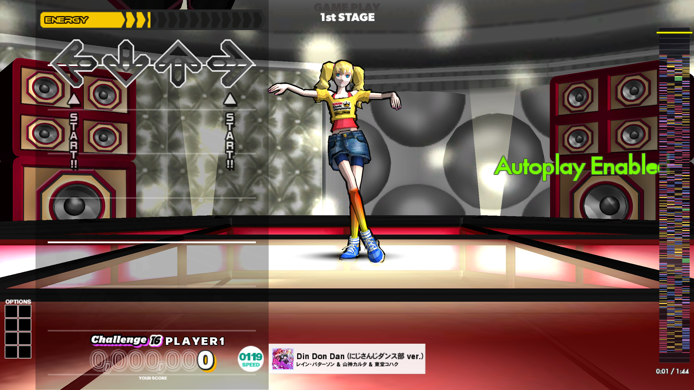

### Custom Background Dancers and Stages
The cast is not limited to Konami's. Any character or stage built with the repo's Blender add-on (`tools/blender_ddr_addon/`) — or ripped from another game and ported with its playbook — can join the rotation: drop the add-on's exported folder into `data_mods/custom_models/`, inside a folder named after the character or stage, and it is treated exactly like the stock content — random picks, its own entry in the BACKGROUND DANCER / BACKGROUND STAGE rows, and a live 3D preview.

With dozens of custom models one list gets long, so the folders can be grouped one level up into **sources**: `data_mods/custom_models/dancers/DDR STRIKE/Akira1/pl_…/` makes `DDR STRIKE` a **DANCER SOURCE** (likewise `stages/<Source>/<Stage>/mapset_…/` a **STAGE SOURCE**). Whenever at least one source exists the options menu shows a DANCER SOURCE / STAGE SOURCE row — `RANDOM`, `STOCK` (Konami's own), then every source — directly above the BACKGROUND DANCER / BACKGROUND STAGE row, which then lists only that source's models and remembers your last pick per source. Source `RANDOM` hides the model row and draws from everything, as before; a specific source with the model on `RANDOM` draws within that source (still honouring the video-screen rule for movie songs where the source allows it). Folders placed the old way — `dancers/<Character>/…` or a bare `dancers/pl_…/` — belong to the implicit source **CUSTOM** (a folder literally named `Custom/` is the same source), so nothing already installed moves or changes; the source row simply appears. A source is identified by its folder name (`DDR STRIKE` and `ddr_strike` are one source); the name `Source` is reserved. Moving a model folder into a source re-packs its cache arc once at the next launch. The modpack ships ported sources from earlier mixes this way — e.g. `HOTTSTPARTY 1-3`, the whole HOTTEST PARTY cast (137 dancers, each with the games' own choreography), `HOTTSTPARTY 4` and `HOTTSTPARTY 5` (the HOTTEST PARTY 4 / 5 casts, each with its own game's choreography), and the `HOTTEST PARTY 1` / `2` / `3` / `4` / `5` stages (the video screens of the HOTTEST PARTY 2, 4 and 5 stages play the song's movie under STAGE SCREENS).

The collection can grow as large as you like without slowing the rest of the modpack: the custom models are scanned in the background while the game boots, never on the path that the resolution and file-replacement patches race, and an unchanged collection is re-checked from directory listings alone. A model can be installed either as its folder (handy while authoring — the first launch packs it into `data_mods/_cache/custom_models/`) or as the ready `pl_<key>.arc` / `mapset_<key>.arc` that folder becomes, which is what the releases ship: no first-launch packing, no second copy of the content in the cache, and a faster scan. To convert an install's folders yourself, run `python3 scripts/pack_custom_models.py <game>/data_mods/custom_models --in-place` (or `--out <dir>` for a packed copy); the now-unused cache arcs are cleaned up at the next launch.

**Flight stages.** The HOTTEST PARTY "flying tunnel" stages (`HOTTEST PARTY 2` Stage 102 / 103, `HOTTEST PARTY 3` Stage 201 / 205 / 206, `HOTTEST PARTY 4` Stage 301) play as in the originals whatever song is on: the dancers stand on the launch platform, take off and fly through the tunnel for the rest of the song. The flyers carry the games' own flight effects — the light orb, the rainbow trail, the stars circling their hands with light trails and the burst of light at the take-off leap — run from the original effect files (each player in their own colour). Only dancers that can fly appear there — a pick that cannot is replaced by a random one that can (the log says `flight stage -- dancer N (x) cannot fly: y flies instead`); if no installed dancer can fly, the platform simply stays. Flight poses never play anywhere else, including the options-menu preview. For your own content: a stage is a flight stage when its `mapset_<key>/` folder holds a `flight.txt` (contents are ignored); its parts named `pre_*` show until the take-off ends (`pre_plat_*` dims, `pre_sky_*` fades out, `pre_hole_*` fades in and opens on the way, replaying the game's intro), parts named `fly_*` from then on (on their own clock; an `.anm` without the loop bit holds its last frame). A dancer can fly when its `pl_<key>/motion/flight/` folder holds a `takeoff*.anm` and at least one other clip; clips there play only on flight stages, take-off first and whole. The effects ship inside each flight stage's folder (`flight_fx/` + the `fx_<key>_*` pool models, written by `tools/blender_ddr_addon/examples/port_flight_fx.py` from the disc dumps); a flight stage without them flies without effects.

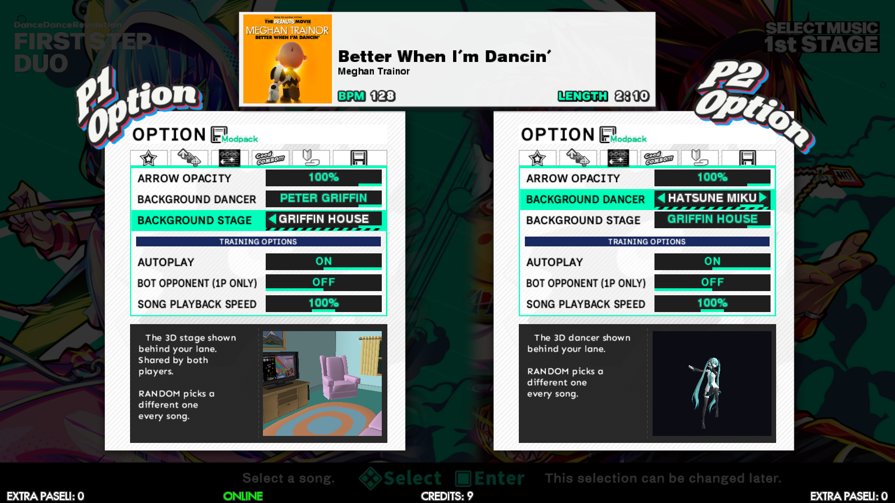
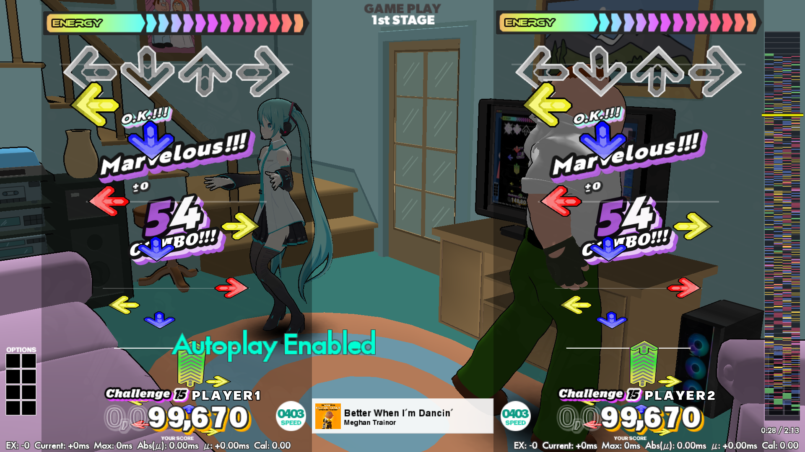

### DDR SELECTION
DDR A3's DDR SELECTION is back, and extended. Set **DDR SELECTION** in the options menu (or the mod menu's `PLAYER SETTINGS`) and every song plays with the gameplay screen of an earlier DDR — judgement words, combo, life gauge, score, READY!, the stage panel, the CLEARED / FAILED banner, even the announcer — all from files your World install already has. Choose one of A3's five eras (**1stMIX-5thMIX**, **MAX-EXTREME**, **SuperNOVA 1-2**, **X-X3 vs 2ndMIX**, **2013-2014**), **DDR A**, or DDR A3's own **DDR A3 (White)** / **DDR A3 (Gold)** — or **AUTO**, which gives each song the look of the version it first appeared in (A20 to A3 songs get DDR A3, Gold on a gold cabinet; World songs stay stock). P1's pick applies to the whole cabinet, and courses stay stock.

The DDR A and A3 screens show your dancer name during the song and your best score and target on the stage panel. On **1stMIX-5thMIX**, as in A3, everyone plays with the classic options (×1.00, no BOOST, …) and gets their own back after the song; songs that had a DDR SELECTION movie in A3 play it again; and S-Marvelous Judgement dresses every skin in its own style. Skip the era cut-in with START, or turn it off under `GLOBAL SETTINGS` → **DDR SELECTION** → **Era Cut-In**. One file the 2013-2014 combo needs is blank in World's data: if you have a DDR A3 install, run `ddr_selection_import\import_a3_assets.bat "<A3 contents folder>"` once from the game folder (`import_a3_assets.sh` on macOS/Linux) — it never touches World's own files.

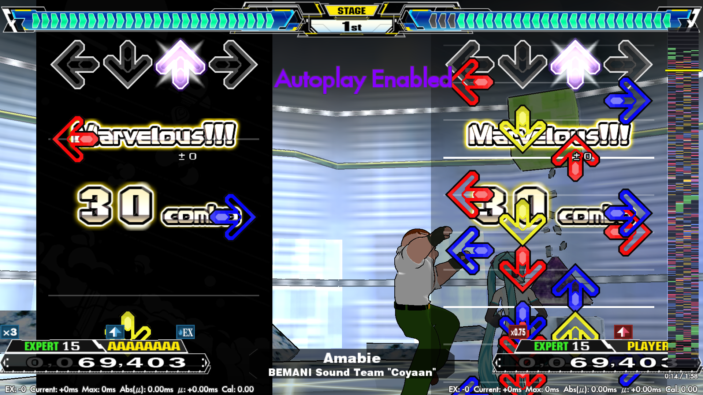
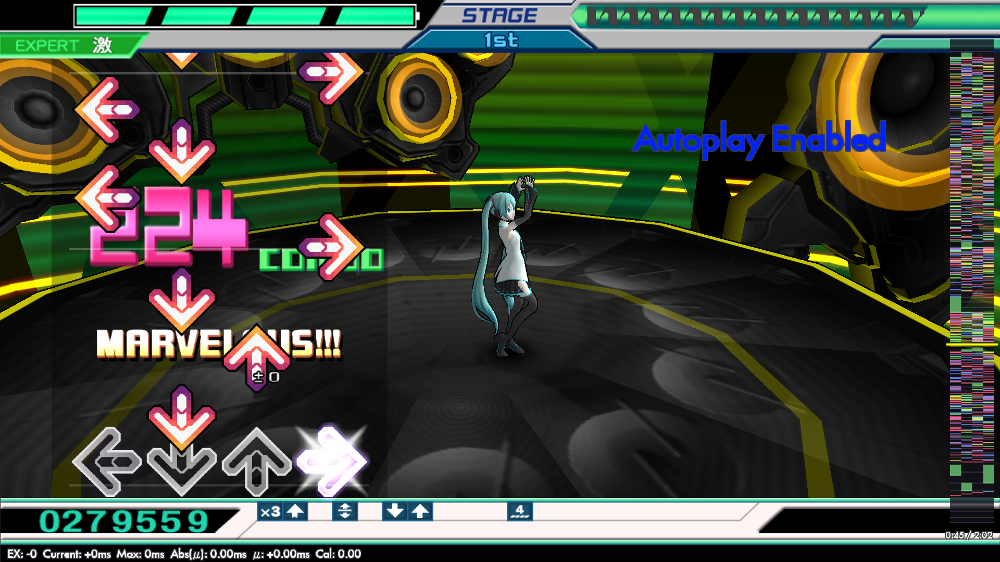

### Song Playback Speed
Play any song at **25%–175%** speed, with everything in sync — audio (pitch-preserved, or classic vinyl-style if you prefer), arrows, judging, even the background video if you opt in. Song-select previews follow your speed setting too, so you can dial it in by ear. Practice hard charts slow; push past 100% for a challenge. Scores at non-100% speeds are never submitted, so your records stay honest.

### Training Mode
Now you can grind and practice songs on a real cabinet, without resorting to StepMania conversions! Turn on **LOOP SONG**, set a start and end point (the SONG START/END TIME rows appear under it, or press **4**/**6** mid-song), and grind the section; scrub backward/forward any time with **7**/**9** — with a chart timeline HUD showing exactly where you are. Sections only exist as loops: with LOOP SONG off, the 4/5/6 marker keys are inert and the timeline shows just your position. All training hotkeys wait for the READY banner to clear.

### Gameplay Timing Fixes
Ever felt the same song judge a few milliseconds early one credit and late the next, so no offset setting ever quite sticks? That is the stock game, not you: its music clock starts at a slightly random point on every play, anywhere in a window of about 10 ms.

This mod locks the music clock to the sound card's real playback position, so every play starts at the same offset and never drifts — through quick restarts and Training Mode scrubs too. Judgement windows and scores don't change, and existing `SOUND OFFSET` calibrations stay valid. (To have the sound card fix only the start of each song, set `audio_clock.mode` to `"anchor"` — see the configuration table.)

### Timing Offsets + Auto-Calibration
Adjust the game's global sound/input/render timing live from the mod menu. Better yet, turn on **"Calibrate next song?"**, under the global mod settings, play one song, and the modpack measures your timing and sets the sound offset for you — StepMania AutoSync style.

### Per-Song Judgement Offsets
Not every song is synced the same. This mod gives every song its own judgement offset that follows the song wheel — and it ships **pre-seeded with community-sourced sync values for ~1,440 songs**. Adjust any song yourself from the options menu; your values follow your profile.

### S-Marvelous Judgement
A brand-new judgement tier above Marvelous: steps landed within **±12 ms** earn a violet **S-Marvelous**, with the full native treatment — its own judgement flash, combo colors, full-combo splash, a dedicated row on the results screen, its own series on the play graph, and S-MFC emblems for an all-S-Marvelous full combo (on every DDR SELECTION skin too, in its own style). It's pure presentation: to the game (and the network) an S-Marvelous is still a Marvelous, so your scores and records are completely untouched.
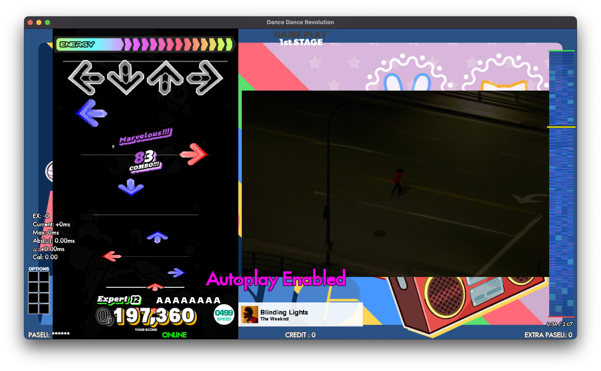
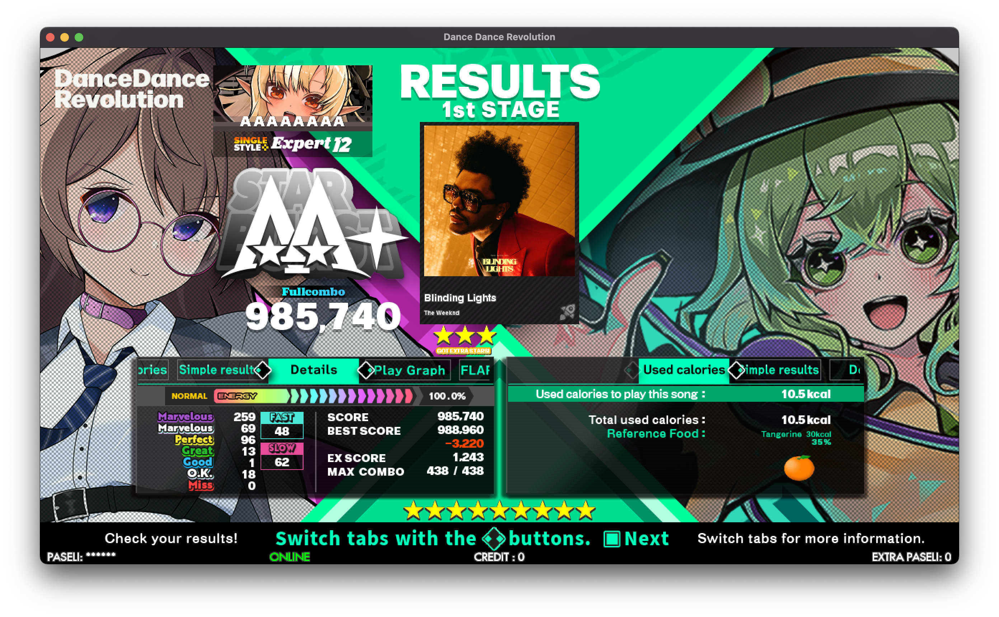
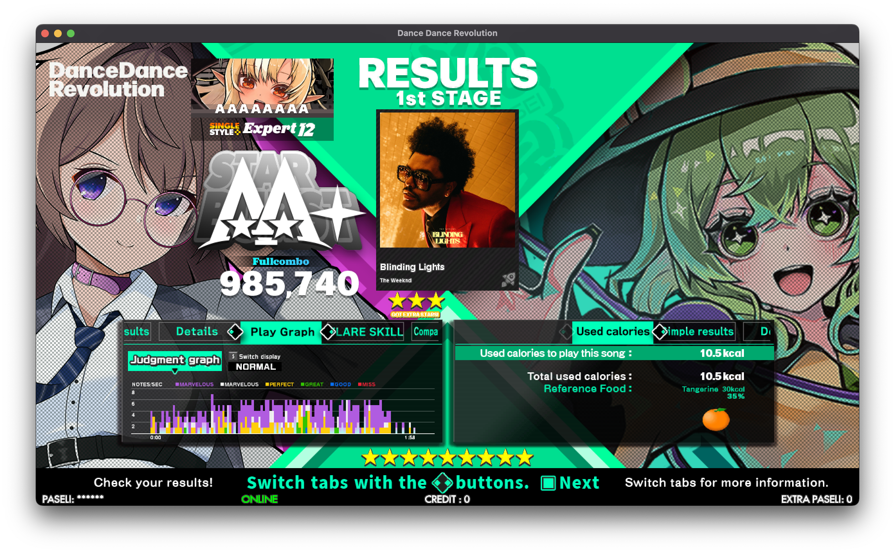
### Quick Restart, Quick Fail, Quick Logout
Press **1** mid-song to instantly restart it (optionally with a countdown), **3** to bail out to song select, and triple-press **9** at song select to end your session on the spot. Combined with **Premium Free** (unlimited stages per credit), your cabinet becomes a practice machine.

### 2-Player BPL Mode
Playing head-to-head with a friend — or against the [Versus Bot](#versus-bot--play-2-player-against-a-cpu-or-your-target-score)? Turn on **2-Player BPL Mode** and every local 2-player versus song gets the in-shop battle HUD that's normally locked behind two LAN-linked cabinets and a matching session: a score board per player, side-by-side score-ratio gauges, live **1st / 2nd** rank badges that swap the moment the lead changes, and the running point margin between you. Spectators can read who's winning at a glance without squinting at two separate scores. It's the game's own battle UI — same art, same animations — running on ordinary versus play, so it shows whichever score type your cabinet uses (money or EX) and never touches scoring or saves. Solo, doubles and course play are unaffected.

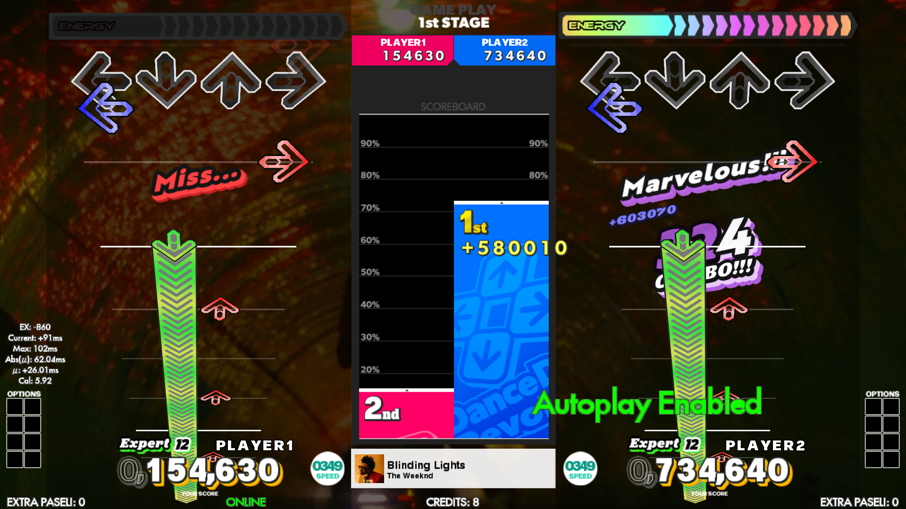
### Player Perspective + Playfield Styling
Per-player lane views: stock **OVERHEAD**, StepMania-style **HALLWAY** (true 3D perspective), or **DISTANT**. Independently scale and fade the arrows, receptors, lane dressing, combo/judgement text, and pacemaker — per player, persisted to your profile.
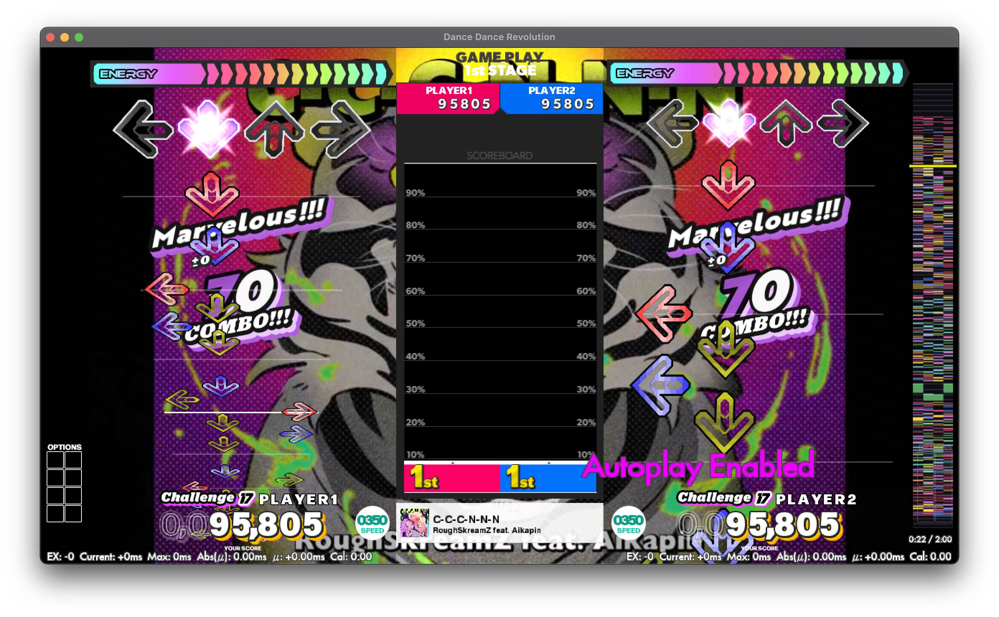
### Assist Tick
A clap sound at every arrow's exact judgement moment, mixed sample-perfectly through the game's own audio engine — the classic StepMania assist tick, with a volume control. Great for learning rhythms (scores are withheld while it's on, like autoplay). Pair it with Gameplay Timing Fixes for ticks locked to the music at sample precision.

### Power User Statistics
Live per-player stats while you play — plus an option to replace the pacemaker with your latest ms error, and a per-song CSV export of your step data. Choose **DETAILED** (current / max / mean ms error, EX loss, calories burned) or **STREAMLINED** (the last step's Δ, your largest Δ, EX loss and running judgement counts, including S-Marvelous when that mod is on), shown as a **SIDE COLUMN** beside each playfield, or as a single **BOTTOM LINE** (in place of the CREDIT / PASELI text) or **TOP LINE** along the screen edge.

Timing uses the game's own results convention: positive = FAST (early), negative = SLOW (late). The stats stay up through the results screen, and their size and position are adjustable in the mod menu's `GLOBAL SETTINGS` tab, remembered for each layout.

### WebUI Options, In-Game
All the cosmetic customizations normally locked behind Konami's web portal — appeal board, backgrounds, characters, lane skins, lane covers — selectable in-game with **live art previews** (the backgrounds even animate). Plus workout-profile settings (weight / calorie display).
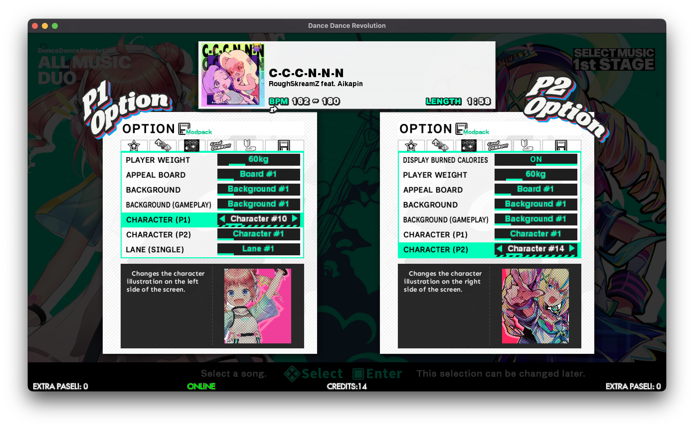

### Fast Bootup
**DDR A3-style instant bootup mod for DDR World**. This is accomplished by caching all of the data that DDR World normally analyzes from all charts during every bootup cycle. If a chart changes, the cache is updated, so the chart metadata never goes stale from an update.

### StepManiaX Cabinet Support
Native support for running on StepManiaX cabinets, with no configuration needed. Stage inputs and lights, as well as emulation of DDR Gold cabinet lights, are fully supported. There's even a touchscreen overlay to give you access to menu buttons, pinpads, and a card-in button.

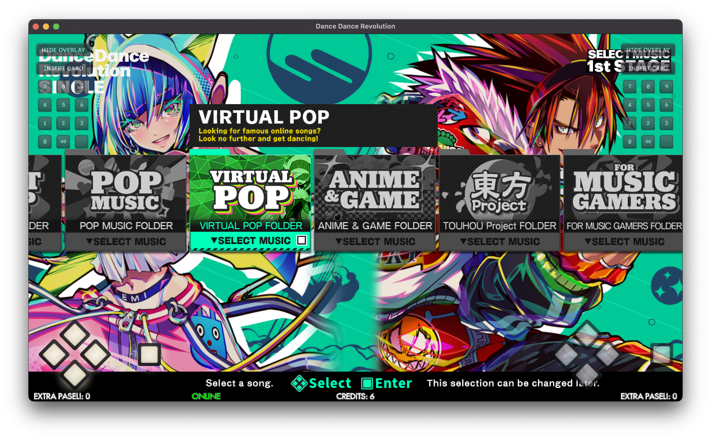

### Custom Resolution
Run the game at 1080p, 1440p, 4K or any other 16:9 size, rendered natively — or, for the CRT cabinets DDR World dropped, at 640×480 4:3 (cropped or letterboxed). Pick **RESOLUTION** in the mod menu; it applies at the next launch. Off by default.

In fullscreen the size must be one your display supports (otherwise the game stays at 720p); if you ever pick one your display cannot show, set `resolution.output` back to `1280x720` in `mod-config.json`. Don't combine it with spice2x's `-forceres` / `-windowresize` options.

## Full Feature List

| Mod | What it does |
|-----|--------------|
| **Mod Menu** | In-game overlay for everything above — toggles, settings, themes. Always available (press 0×3). |
| **Song Playback Speed** | Per-player 25–175% song speed, pitch-preserved or resampled, synced previews, optional synced video. |
| **Training Mode** | Section practice: start/end bounds, looping, FF/RW scrubbing, chart timeline HUD. |
| **Timing Offsets** | Cabinet-wide sound/input/render/bomb offsets, live-editable, with one-song auto-calibration. |
| **Per-Song Judgement Offsets** | Per-song, per-player judgement offsets that follow the song wheel; community pre-seed included. |
| **Quick Restart / Fail** | Pinpad 1 = instant in-place restart (optional countdown); 3 = instant fail to song select. |
| **Quick Logout** | Triple-9 at song select ends the session through the game's normal logout flow. |
| **2-Player BPL Mode** | The in-shop battle HUD (per-player score boards, score-ratio gauges, live 1st/2nd rank badges, point margin) in ordinary local 2-player versus play — including versus-bot sessions. Display-only. |
| **Classic Difficulty Adjustment** | Double-tap pad UP/DOWN at song select to raise/lower difficulty, like every DDR before World. |
| **Premium Free** | Unlimited stages per credit (per-player toggle). |
| **Autoplay** | Perfect auto-play with an on-screen watermark; scores never submitted. |
| **Multiplayer Bot** | Solo versus against a computer opponent: BOT OPPONENT (1P ONLY) + BOT LEVEL `Level 1`–`Level 10` or **TARGET SCORE** (a step-for-step replay of your pacemaker target's ghost) per player, remembered on the cabinet only. The empty pad becomes a real second player on your exact chart and lane options, judged by the game's own judge; two lanes, two gauges, two results panes, `BOT LV<n>` name plate (Target Score: the target's own name + a TARGET BOT tag, S-Marvelous off on the replay side). Your saves and the extra-stage rule are untouched; the bot's side is never submitted. Never engages in real 2P, doubles, course or event play. |
| **DDR SELECTION** | Earlier DDRs' gameplay screens: A3's five legacy eras (1stMIX-5thMIX … 2013-2014) plus the DDR A and DDR A3 (White / Gold) screens, or AUTO by each song's version — from the stock install's own data (plus a one-time A3 import for 2013-2014's combo). On by default; nothing changes until a player picks a skin. |
| **S-Marvelous Judgement** | A display-only judgement tier above Marvelous for steps within ±12 ms: violet judgement flash, combo digits, S-MFC splash, its own results row/graph series, and S-MFC emblems. Scores are untouched — to the game (and the network) an S-Marvelous IS a Marvelous. |
| **Assist Tick** | Sample-exact clap at each arrow's judgement moment, with volume control. |
| **Player Perspective** | OVERHEAD / HALLWAY / DISTANT lane views, per player. |
| **Playfield Styling** | Arrow/receptor/lane scale and opacity, per player. |
| **Overlay Element Styling** | Combo/judgement/pacemaker scale and opacity, per player. |
| **Center Arrows (1P)** | Centers the playfield during solo play. |
| **Shader Fixes** | Anti-aliased arrow rendering (and the shader programs Player Perspective uses), plus the lit / cel-shaded / outline shader variants Background Dancers' LIGHTING STYLE picks from. |
| **FPS Unlock** | Raise the display target from 60 up to 360 FPS, or cap the frame rate below 60 (e.g. 20/30) with a frame limiter (next-launch). |
| **Fast Bootup** | Dramatically faster boots via a chart-analysis cache. |
| **Custom Resolution** | Native 1080p/1440p/4K rendering and 4:3 SD-cabinet output (640×480). Off by default; applies at the next launch. |
| **Background Dancers** | Brings back the pre-World 3D background: a random DDR A3 stage with random A3 dancer(s) dancing behind the lane on every song, rendered by the game's own 3D engine from the files World still ships but never opens — with optional smooth or cel-shaded lighting and ink outlines over the whole scene, a BACKGROUND MOVIES choice for movie songs (off / thumbnail / on the stage's video screens — the default / DDR 5th Mix-style fullscreen movie behind the dancers / movie only, no 3D), a BIG HEAD toggle (every dancer's head at 3×), and BACKGROUND DANCER / BACKGROUND STAGE rows in the options menu with live 3D previews (plus DANCER SOURCE / STAGE SOURCE rows once custom models are grouped into source folders — see above). Off by default; see above. |
| **Gameplay Timing Fixes** | Deterministic, sound-card-locked music clock: no play-to-play onset jitter, no in-song drift, survives quick restarts and scrubs; assist tick re-laid to the sample its voice really started on. No score or judgement-window changes. On by default; applies at the next launch. |
| **Skip Intros** | Jump straight to the title screen at boot, skipping the various license splashes. |
| **Timer Freeze** | Freezes and hides all selection countdown timers. |
| **Anytime Speedmod Adjustment** | Change your speed mod at any point during a song, not just the first ~10 seconds. |
| **Announcer Mute** | Silences the announcer's combo callouts and cheers (per-player option). |
| **Hide Bottom Text** | Hides every bottom-of-screen status readout — ONLINE/CHECKING/MAINTENANCE, CREDIT/FREE PLAY/EVENT MODE, coin count, PASELI balances, and the attract-screen ID lines. Off by default (it removes operator-useful info). |
| **Real Speed Fix** | Real Speed scroll uses Core BPM instead of Max BPM — sane scroll on variable-BPM songs. |
| **Power User Statistics** | Live ms-error/EX/calorie stats or a streamlined judgement-count readout, as a side column or a bottom/top line; pacemaker→ms-error swap, CSV step export. |
| **Music Wheel Song Length** | Shows each song's real play length (M:SS) next to the BPM at song select. |
| **Movie Size Customization** | The web-portal VIDEO SIZE setting (fullscreen/on/off), in-game. |
| **WebUI Options** | Web-portal cosmetics in-game with live previews, plus weight/calorie profile settings. |
| **Split SSQ Auto-Discovery** | Finds split chart files (`<song>_N.ssq`) on disk instead of trusting the game's hardcoded per-version list — newer chart data loads correctly on older game builds. |
| **Note Types Expansion** | New note types for custom charts — ITG-style **mines** are fully supported. |
| **Series Expansion** | Custom VERSION filter categories for custom song packs (config-driven). |
| **Improved Song Title Sorting** | The song-select FILTER menu's MUSIC TITLE list gets one entry per letter — A to Z five per row, then OTHER — instead of three-letter groups, ahead of the unchanged kana lines. Pick one letter to see only the songs that start with it. On by default. |
| **Folder Expansion** | Custom genre folders in the song wheel (config-driven). |
| **Song Limit Expansion** | Raises the loadable song cap by ~8× for large custom libraries. |
| **Background Movie Sync** | Keeps music videos in sync across restarts, scrubs, and loops (always on; can only improve on stock). |
| **Non-Native OS Support** | Keeps the game stable under CrossOver/Wine (background-movie handling). |
| **SMX Hardware and Touchscreen Overlay** | Native StepManiaX Dedicated Cabinet support: pads as input, DDR lights on the pads and cabinet, and a touchscreen overlay (menu buttons, pinpad, card-in). See below. |

## Your Scores Are Safe

The modpack takes score integrity seriously. Anything that would make a score dishonest — Autoplay, Assist Tick, a quick-fail, an altered Training Mode run, a non-100% song speed — marks that song, and marked scores are **never submitted to the server**. Your profile, settings, and cosmetics still save normally. Autoplay additionally renders a visible watermark so videos of autoplayed runs are identifiable. In a Versus Bot session the bot's side carries the same mark (it never reaches the server) while your own side is saved exactly as in any stock play. If the safety machinery ever can't initialize, the modpack errs on the side of submitting nothing.

## The Game Identifies Itself as a Modded Build

With the modpack loaded, the game always reports the software revision letter **`M`** in its identity string — e.g. `MDX:J:F:M:2026082500` instead of the stock `MDX:J:F:A:…` — on the title screen, in the test menu, and in every request it sends to the server. This is unconditional (it does not depend on which mods are enabled) and requires no configuration; your `prop/ea3-ident.xml` is not modified on disk. It lets a server tell modpack cabinets apart from stock ones. (`M` was chosen over the community's `X` on purpose: bemaniutils-based servers treat a DDR rev of `X` as an "omnimix" install and file its scores under a separate version key; `M` has no special meaning to any known server and is handled like a stock revision.)

## Settings & Configuration

Almost everything is adjustable in-game (mod menu for cabinet-wide settings, the options-menu tab for per-player settings). Per-player settings follow your card — with a supporting server they roam with your profile; without one, they persist locally on the cabinet.

Everything else lives in the single `mod-config.json` in the game folder (included with the release; menu-driven settings are written back to it automatically). You only need to edit it by hand for operator-level knobs:

<details>
<summary>Operator config sections (click to expand)</summary>

| Section | What it controls |
|---------|------------------|
| `mods` | Master on/off per mod (also editable from the mod menu) |
| `layeredfs` | Mod-file folder location, allow/blocklists, verbose logging |
| `series_expansion` / `folder_expansion` | Custom series/folder definitions for custom song packs |
| `custom_options` | Option persistence gates, preview tuning, menu ordering/placement |
| `timing_offsets` | The four cabinet timing offsets (also editable in the mod menu) |
| `fps_unlock` | FPS preset list + selection (also editable in the mod menu). Values above 60 request that fullscreen refresh rate (the monitor must offer it; ignored in windowed mode); values below 60 (10–59, e.g. `20`, `30`) keep the stock 60 Hz and cap the frame rate instead |
| `gameplay_timing_fixes` | Gameplay Timing Fixes: `audio_clock.mode` (`fit` default — averages the coarse DirectSound cursor and lets it drive the in-song clock; `anchor` — reads the cursor once per song to fix the 0–10 ms startup error, then runs the song on the game's own clock (the conservative choice if you'd rather not have the sound card's reported position steer the clock mid-song); `raw` for platforms whose cursor is already smooth), `audio_clock.window_seconds` (2–60, default 10), `audio_clock.latency_bias_ms` (added to the mean-preserving latency constant; normally 0 — auto-calibration absorbs any residual), `assist_tick_alignment` (default `true`) — all boot-only (next launch) |
| `resolution` | Custom Resolution: `output` (`WxH`; 16:9 = native render at that size, 4:3 sizes = SD-cabinet mode at the stock 1280×720 render), `presets` (RESOLUTION row choices), `sd_present` (`crop` / `letterbox`, 4:3 only) — editable in the mod menu (RESOLUTION / SD PRESENT MODE); `test_menu_scale` (operator-only multiplier on TEST-menu text size); all apply at the next launch |
| `quick_restart` | Restart countdown (also editable in the mod menu) |
| `training_mode` | Scrub step sizes |
| `music_wheel_song_length` | Position/size of the length readout |
| `per_song_judgement_offsets` | `mirror_players` — sync both players' offsets (solo home setups) |
| `non_native_os_support` | Background-movie mode under Wine (`suppress` / `fallback`) |
| `background_dancers` | Background Dancers: `style` (`stock` / `lit` / `cel` — LIGHTING STYLE), `outlines` (SCENE OUTLINES), `bpm_sync` (default `true` — dancers, stage props and camera run at the song's tempo, half a second of choreography per beat, in phase with the chart's beats), `stop_slow` (default `true` — 1/12 speed through a chart STOP, as in DDR A3), `movie_mode` (`off` / `thumbnail` / `stage_screens` / `fullscreen` / `movie_only` — BACKGROUND MOVIES, default `stage_screens`, see above), `custom_content` (default `true` — also load the dancers/stages under `data_mods/custom_models/`, see above) and `big_head` (default `false` — BIG HEAD, every dancer's head at 3×). All seven are also rows under BACKGROUND DANCERS in the mod menu; the first five apply from the next song, `custom_content` at the next launch, `big_head` immediately. The former `outline_px` / `outline_px_stage` / `outline_style` / `outline_layer_colors` keys are ignored (the outline is Dancing Stage Unleashed's own) |
| `player_perspective` | HALLWAY/DISTANT geometry tuning |
| `s_marvelous` | S-Marvelous window in ms (`window_ms`, 1–16, default 12), judgement word art, and the S-Marvelous combo on DDR SELECTION skins with per-grade combo colours (`judgement_color`: `purple_shadow` / `all_purple`), receptor flash on an S-Marvelous hit (`receptor_flash`: `purple` = violet burst, default / `white` = identical to Marvelous) — all also editable in the mod menu. The stock Marvelous word's shimmer is always muted (the old `marvelous_shimmer` key is ignored) |
| `shader_fixes` | Arrow anti-aliasing toggle (`anti_aliasing`, also editable in the mod menu, next launch). The scene-shader variants Background Dancers uses are synthesized whenever both mods are on; the lighting knobs live under `background_dancers` |
| `overlay_menu` | Mod-menu theme/opacity (managed by the APPEARANCE tab) |
| `smx_hardware` | SMX cabinet support: card ids, overlay opacity/scale, light toggles, pad style (most also editable in the mod menu) |

All keys are optional; missing keys use sensible defaults.

</details>

Custom songs, textures, and assets are served from the `data_mods/` folder — drop-in PNGs are converted automatically, no repacking tools needed.

## StepManiaX Cabinet and Touchscreen Support

If your DDR World rig is built on a **StepManiaX Dedicated Cabinet**, the
`smx-hardware` mod drives the whole cabinet natively over USB.

- **Pads as input** — stage panels play the game, with the same latency-first
  design as the SMX SDK (dedicated reader threads).
- **Lights** — DDR's per-arrow stage lighting, corner lamps, marquee, monitor
  strips, and spotlights all mirror onto the SMX hardware.
- **Touchscreen overlay** — cabinet-style menu buttons, a pinpad, and an
  Insert Card button rendered on top of the game. Pinpad gestures (0-0-0
  mod menu, quick restart, etc.) work from the touchscreen too.

Setup notes:

- The game must be running in Gold-Cab/BIO2 mode; the mod's default
  `force_gold_cabinet` handles the usual case automatically.
- **Card-in:** set `smx_hardware.p1card` / `p2card` in `mod-config.json` to
  your e-amusement card UID (the same 16-hex-digit value a spice2x card file
  uses). The Insert Card button only appears when a card is configured.
- Overlay opacity/scale, the light toggles, and the pad style live in the mod
  menu's **SMX HARDWARE** section (GLOBAL SETTINGS tab).
- SMX hardware is not required to enable the mod, if you simply want a touchscreen
  overlay experience. The touchscreen overlay still functions without SMX hardware.

## Playing on macOS / Linux (CrossOver/Wine)

The modpack is developed and tested under CrossOver, and includes dedicated support:

- Run spice2x with **`-icmphook`** so the game boots fully online (PASELI included).
- Background movies: the default mode safely disables them (Wine's video stack crashes on them otherwise). If you want videos, set `non_native_os_support.movie_mode` to `"fallback"`, launch with **`-audiohookdisable`**, and either convert your movies with `scripts/convert_movies.sh` or set up the native Windows Media runtime in your bottle ([full recipe](docs/native_wm_runtime_bottle_setup.md)).

## Troubleshooting & Bug Reports

- **Something's broken?** Open an issue and **attach `log.txt`** (spice2x's log from the game folder). If the game crashed hard, also attach `ddr_hook_crash.log` if present, and the mini-dump file if that's also present.
- **Menu labels missing / blank textures?** Reboot the game once — first-boot texture generation requires it.
- **Weird boot behavior after a game update?** Delete `data_mods/_cache/` — all caches rebuild automatically.
- **Updater trouble?** Attach `ddr_world_hook_updater.log` (game folder). A failed update rolls itself back; the files it replaced last time are in `.ddr_world_hook_updater/backup/`. `ddr_world_hook_updater.exe --check` tells you what it would do.
- **Investigating timing swings?** With Gameplay Timing Fixes on, `log.txt` alone already tells the story: each song's `audio_clock: armed … delta_vs_stock=±N ms` line is that play's stock startup error, and its `disarmed … in-song drift … = ±Z ppm` line is how far the game's tick and the sound card drifted apart during the song (in `fit` mode that drift was corrected; in `anchor` mode it was left in place — a large value there is the signal to prefer `fit`). For deeper digging, the optional `diagnostics.audio_sync` recorder captures per-hit errors, frame/judge work durations, gameplay clocks and verified internal audio-start/output-cursor observations without changing timing — and one `onset` row per song. See [capture instructions and limitations](docs/audio_sync_diagnostics_v2.md); `python3 scripts/analyze_audio_sync.py <csv>` summarises a capture. Leave it off outside diagnostic runs. When reporting a timing issue, attach both `log.txt` and `audio-sync-diagnostics-v2.csv` (the CSV is replaced on every launch, so copy it before relaunching).
- A mod that can't find what it needs in your game build disables just itself and logs a warning; the rest keeps working.

## For Developers

The modpack is a Rust hook DLL (`cdylib`) injected into the live game process. There are no game-file modifications and no static patches — everything happens in memory at runtime.

**Architecture philosophy — binary neutrality.** No hardcoded addresses, ever. Every game function and data structure is located at runtime via wildcard AOB signature scanning, RTTI/vtable walks, and RIP-relative derivation from scanned landmarks — so the DLL survives game data updates without a rebuild. Resolution failures degrade gracefully: a signature that doesn't match disables only the mods that need it. UI is rendered through the game's own widget, sprite, and animation systems rather than an external overlay, and hooks follow strict in-process discipline (one detour per target function with shared dispatchers, transactional byte patches with rollback, no panics across FFI boundaries).

**Tech stack:** Rust (nightly, pinned), [`retour`](https://crates.io/crates/retour) for detours, `windows` crate for Win32, `serde` for config, `image`/`texpresso` for the texture pipeline. Pure layers (audio DSP, file formats, decision logic) are dependency-free and host-tested; engine-facing code is validated on a live cabinet.

**Building:**

```bash
cargo check --target x86_64-pc-windows-msvc   # fast type check
cargo test                                     # host tests (pure layers)
./build.sh                                     # release build via cargo-xwin (macOS/Linux)
./build_win7.sh                                # Windows 7-compatible build
cargo test --manifest-path updater/Cargo.toml  # the auto-updater's host tests
./scripts/build_release_archive.sh             # release/: zip (Win7 DLL + updater + data), bare updater exe, tester install .bat
scripts\build_release_distribution.bat         # Windows: release\ = unzipped game-folder image (Win7 DLL + updater + data)
```

Output: `target/x86_64-pc-windows-msvc/release/ddr_world_hook.dll`. On Windows, a plain `cargo build --release --target x86_64-pc-windows-msvc` works too. The auto-updater is a separate crate in `updater/` (plain Rust, no game dependencies); the release scripts build it with the same Windows 7 recipe and refuse to package any binary that would not load on Windows 7. Both release scripts ship the Background Dancers custom models pre-packed as `.arc` files (`scripts/pack_custom_models.py`); the checkout keeps them as loose folders.

**Where to start reading:**

- [`AGENTS.md`](AGENTS.md) — codebase map, per-feature entry points, and engineering rules
- [`.agents/summary/index.md`](.agents/summary/index.md) — generated architecture documentation
- [`docs/`](docs/) — the reverse-engineering research notes behind each feature
