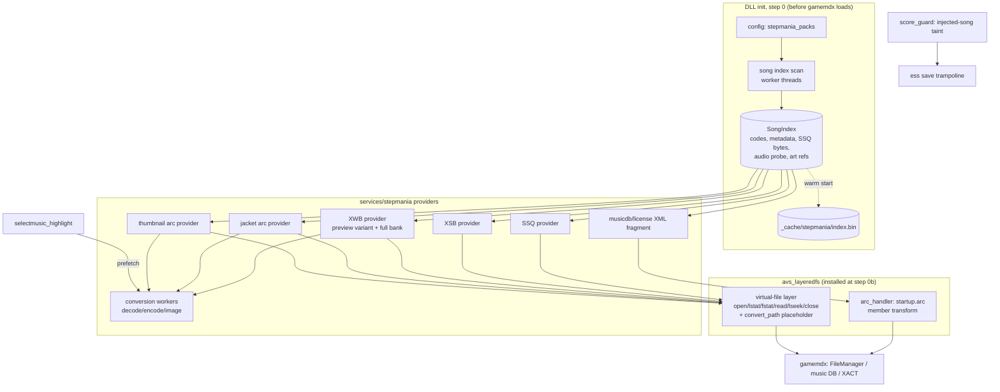
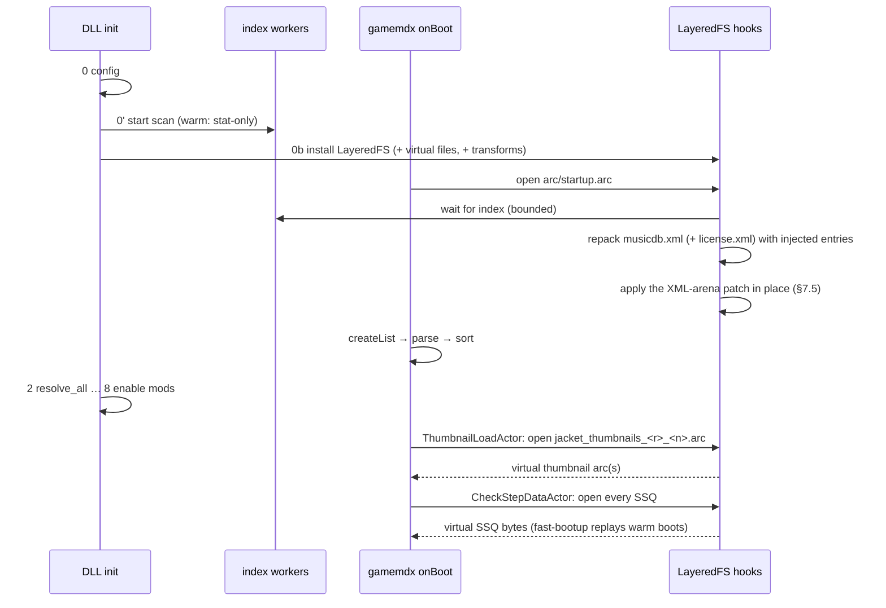

# StepMania Packs at Runtime — Feasibility Deep Dive

> Feasibility and RE record for a proposed mod that loads StepMania song packs
> (`.sm` / `.ssc` simfiles, their audio, and their art) into DDR World **natively, at
> runtime, with no ahead-of-time conversion step**. The DLL would convert SM/SSC to
> SSQ, OGG to XWB/XSB, and banner/jacket art to the game's jacket and thumbnail
> containers on the fly, then hand the game those bytes when it asks for them. Injected
> songs are **local-play only**: they never reach `musicdb.xml` on disk, never exist
> server-side, and must never produce a score save.
>
> No code is proposed here. This note inventories every game-side contract such a mod
> must satisfy, what the modpack and the sibling `ddr-chart-tools` checkout already
> provide, what new RE was needed (and was done for this note), and what is still open.
>
> All addresses are file-relative to image base `0x180000000`, program
> `gamemdx_20260721.dll`, unless tagged `[0825]` (`gamemdx_20260825.dll`) or `[0805]`
> (`gamemdx_20250805` stock). Investigated 2026-09-25.
>
> Evidence tags: **[static]** Ghidra, this pass; **[doc]** established in an existing
> note, linked; **[cabinet]** proven live in an earlier investigation; **[inferred]**
> reasoned from static evidence but not observed; **[unverified]** open.
>
> Companion notes: `omnimix_song_limit_research.md` (music DB, partly superseded by
> §4.1 here), `ultrafast_boot_research.md` (boot SSQ analysis, FileManager internals),
> `split_ssq_research.md` (`build_ssq_path`), `xact_streaming_research.md` and
> `xact_audio_research.md` (song banks), `song_preview_pipeline_research.md` (preview
> bank lifecycle), `ssq_format.md` / `ssq_mine_chunk_format.md` (chart format),
> `series_filter_internals.md` / `folder_system_research.md` (grouping),
> `.agents/learnings/learnings.md` 2026-09-03 entries (musicdb only reaches the game
> through the `startup.arc` overlay; `onBoot` races the signature scan).

---

## 1. Verdict

**Feasible.** Nothing found statically blocks it, and most of the engine-facing
pieces already exist in the modpack. What makes it tractable:

1. **The music DB is parsed from a file LayeredFS already intercepts race-free.**
   `musicdb.xml` lives inside `data/arc/startup.arc`. That arc is the game's first
   boot read, and the LayeredFS `avs_fs_open` detour is installed before `gamemdx`
   finishes loading. Injected `<music>` entries therefore go through the game's own
   parser, entry constructor and sort, with no hook on the music DB itself (§4.1, §7).
2. **Song visibility does not depend on the server.** New RE (§4.4, §4.5) shows that
   every per-chart level and availability getter falls back to the XML values when the
   server's `musicdata_load` response has no row for the mcode. An entry whose charts
   carry `limited_ary 0` and a real `diffLv` is playable online *and* offline. Stock
   entries (`limited_ary 1`, `diffLv 255`) are the ones that need the server.
3. **Every per-song asset is fetched by path.** The chart, sound bank, wave bank and
   jacket all go through the FileManager to AVS to the LayeredFS hooks. The naming rules
   are simple and now pinned: `<basename>_jk` for jackets and `<basename>_tn` for wheel
   thumbnails (§4.6).
4. **The conversion code exists.** `ddr-chart-tools` already converts SM/SSC to SSQ and
   OGG to XWB + XSB. The modpack already has a deterministic MS-ADPCM codec, a
   streaming-XWB parser/serializer, a resampler, an ARC writer, a PNG/DXT texture
   pipeline and a boot-time SSQ analysis cache.
5. **Score isolation is a solved pattern.** `score_guard` + the ess save trampoline
   already suppress per-stage saves and sanitize the logout save for tainted plays.

What is genuinely new work, most to least risky:

| # | Work item | Why it is hard | Section |
|---|---|---|---|
| a | **A virtual-file layer in LayeredFS** (memory-only bytes behind a fake AVS fd) | LayeredFS today can only redirect to a real path; it has no fd table, and `close`/`lseek`/`fstat` are not hooked | §11 |
| b | **Audio latency** | The game reads the *whole* XWB into RAM both for the 0.4 s wheel preview and at stage load; a full decode + encode is ~1–2 s per 2-minute song | §9.4–§9.6 |
| c | **Chart fidelity and boot safety** | SM timing gimmicks that SSQ cannot express; converter bugs; a declared chart whose SSQ yields no notes raises the `ME1529` FILE CORRUPTION service error at boot | §8 |
| d | **Server-facing leakage beyond score saves** | `/lastplay`, the `mod_judge_offsets` string, and unaudited `eventlog`/`pcbevent` payloads can carry injected mcodes/basenames | §12 |
| e | **DLL-side disk readers** | `fast_bootup`, `chart_length`, split-SSQ discovery and the dancers' tempo reader read host files, so they are blind to memory-only songs | §13 |

## 2. Scope

**In scope**

- `.ssc` and `.sm` simfiles; `dance-single` and `dance-double` charts.
- Charts (SSQ), gameplay audio and the song-select preview (XWB + XSB), the jacket
  (`<b>_jk.arc`) and the wheel thumbnail (`<b>_tn`).
- Song-select presence: a folder and/or VERSION filter entry for injected songs, and
  titles/artists rendered by the game's own fonts.
- Local-only play: no score, lamp, flare or ghost upload for injected songs.

**Out of scope** (possible follow-ups, noted where relevant)

- Courses (`coursedb.xml`), Dan, Extra/Encore stage selection.
- Background videos, `#BGCHANGES`, lyrics, keysounds, `#ATTACKS` modifiers.
- Link/matching play and in-shop battle across cabinets (injected songs must be
  *hidden* there, §12.7).
- Non-dance stepstypes (pump, solo, couple, lights).

## 3. What the game asks for, per song

Everything below was traced to its requesting code on 20260721. "LFS" means the read
passes through the LayeredFS hooks today.

| Asset | Game path | Requested by | When | Read mechanism | LFS |
|---|---|---|---|---|---|
| Music DB entry | member `data/gamedata/musicdb.xml` of `data/arc/startup.arc` | `music::createList` `FUN_1801b71e0` (from master loader `FUN_1801b5150`) in `Application::onBoot` | boot, within ms of `gamemdx` loading | FileManager serves the member out of the resident arc; AVS property parse + psmap import (§4.1) | the arc open only |
| Chart | `data/mdb_apx/ssq/<b>.ssq` or `<b>_<N>.ssq` (`build_ssq_path`) | `CheckStepDataActor::onInit` (every song × 5 at boot); `DancePlaySequence` / `MatchingDancePlaySequence::onSetup`; `PlayerCourseWork::prepare` | boot; every stage | FileManager → `LowStreamIo` → `avs_fs_open`/`fstat`/`read`/`close` (§4.7) | yes |
| Sound bank | `data/sound/win/dance/<b>.xsb` | preview `AudioLoader` (scene 25, 0.4 s after wheel settle); `DancePlaySequence::onSetup` | wheel settle; stage load | same | yes |
| Wave bank | `data/sound/win/dance/<b>.xwb` | same, then `wavebank_create` `0x1801ab050` | same; **the whole file** is read into a FileManager RAM row, then `CreateFileA` opens the converted path | same, plus `avs_fs_convert_path` → `CreateFileA` (§4.8) | yes |
| Jacket | `data/arc/jacket/<b>_jk.arc` (name from `music::Info` vt+0x10) | four `FileManager::register` sites (`0x180033e7e`, `0x18007ecb1`, `0x1800b7bec`, `0x1800d5d48`) — stage panel, song-select header card, results, etc. | highlight / stage | FileManager | yes |
| Wheel thumbnail | texture `<b>_tn` inside `data/arc/thumbnail/jacket_thumbnails_<ja\|ua>_<series>.arc` | `sequence::common::ThumbnailLoadActor::onInit` `FUN_18003b700` | boot | FileManager, file type `"thumbnail"`, priority −98 | yes |
| Source/licence line (optional) | member `data/gamedata/license.xml` of `startup.arc` | license parser `FUN_1801b6fa0` | boot | as the music DB | the arc open only |
| Movie (not needed) | `data/mdb_apx/movie/…` | `movie_policy` path | stage | DirectShow | — |

An injected song therefore needs **one XML entry and five byte streams** (SSQ, XSB,
XWB, jacket arc, and a slot in a thumbnail arc). Split-timing songs need up to five
SSQs instead of one (§8.4).

---

## 4. New RE findings

### 4.1 How the music DB is built

Master loader `FUN_1801b5150(db)` **[static]**:

```c
FUN_1801b6fa0(&db);                      // license.xml
FUN_1801b71e0(&db);                      // musicdb.xml  (music::createList)
if (db->music_begin != db->music_end)
    FUN_1801b7f40(begin, end, 0);        // SORT the entry vector
FUN_1801b64b0(db + 0x60, count);         // reserve the "active list" (§4.5)
FUN_1801b7380(&db);                      // coursedb.xml
FUN_1801b64b0(db + 0x80, course_count);
```

`music::createList` `FUN_1801b71e0` **[static]**:

```c
arena = alloc(DAT_180466068, 0x100000);                      // 1 MiB PROPERTY ARENA
idx   = FileManager_register(DAT_1806f2f48, "/data/gamedata/musicdb.xml");
len   = *(u32*)(rows(DAT_1806f2f48) + idx*0x40 + 0x14);      // resident row: size
buf   = *(u8**)(rows(DAT_1806f2f48) + idx*0x40 + 0x08);      //               bytes
log("music::`anonymous-namespace'::createList", "fileName=%s", ...);
prop  = XCnbrep70000b7(buf, len, 0x11, arena, /*arena size*/ 0x100000);
for (node = XCnbrep70000a1(prop, 0, "/mdb/music"); node; node = XCnbrep70000a6(node, 7))
    if (XCnbrep70000b2(prop, node, raw /*512 B*/, &psmap_DAT_18047dff0))
        FUN_1801b5210(db, raw);                             // build + push one entry
FileManager_release(DAT_1806f2f48, idx);
free(arena);
```

Three consequences, two of which correct earlier notes:

1. **No wait, no AVS open.** The loader registers the member path and reads the row's
   buffer *immediately*. The row is already complete because `startup.arc` is resident
   (the ARC alt-load provider). This confirms the 2026-09-03 learning: the only way to
   change what this function parses is to change `startup.arc` itself.
2. **The 1 MiB is the property-tree arena, not a text buffer.** The XML text comes from
   the FileManager row (its size is `row+0x14`). The 1 MiB allocation is the memory the
   AVS property parser builds the node tree in. `omnimix_song_limit_research.md` reads
   `[0x1806b5cd8]` on 20250805 as "AVS file system pointer"; `[0805]` has the identical
   shape (`FUN_1801a0ec0`, `FUN_1801e7070` = FileManager register, `Ordinal_184` = the
   property parse with arena size `0x100000`), so that pointer is the FileManager. The
   `song-limit-expansion` 8 MiB patch still lifts the real limit (the arena).
   **Headroom for extra songs has never been measured** (§7.5).
3. **Entry order in the XML does not matter.** `FUN_1801b7f40` is a merge sort
   (`FUN_1801b8810`, insertion sort `FUN_1801b8fb0` below 33 elements) keyed on
   `entry->vfunc[0]()` (the mcode) compared **unsigned**. Every later lookup is a
   `lower_bound` on mcode (`FUN_1801b7e80`, `docs/ultrafast_boot_research.md` §2), so
   **mcodes must be unique**: a duplicate makes one of the two entries unreachable by
   mcode.

### 4.2 The musicdb psmap: every tag the parser accepts

`psmap_DAT_18047dff0` (24-byte entries `{u8 type, u8 flags, u16 raw_offset, u32 size,
char* name, void* default}`, terminator type `0xFF`) maps each `<music>` child into a
0x1FC-byte raw struct **[static]**. Flag bit 0 = optional (a default applies when the
tag is absent) **[inferred from the flags pattern: exactly the tags every stock entry
carries are 0]**.

| Raw off | Tag | Type byte | Size | Req | Lands in `music::Info` (via `FUN_1801b20b0`) |
|---|---|---|---|---|---|
| `0x000` | `mcode` | `07` (u32) | 4 | **yes** | `+0x08` (vt+0x00) |
| `0x004` | `basename` | `0A` (str) | **8** | **yes** | `+0x0C` len, `+0x0D` chars, **truncated to 6** (vt+0x08) — see below |
| `0x00C` | `title` | `0A` | **0x80** | **yes** | `+0x18` `std::string` (vt+0x20) |
| `0x08C` | `title_yomi` | `0A` | 0x80 | no | `+0x40` `std::string` (vt+0x28 falls back to title) |
| `0x10C` | `artist` | `0A` | 0x80 | no | `+0x68` `std::string` (vt+0x30) |
| `0x18C` | `bpmmax` | `05` (u16) | 2 | no | `+0x90` |
| `0x18E` | `bpmmin` | `05` | 2 | no | `+0x92` |
| `0x190` | `diffLv` | `44` (array) | 10 | **yes** | `+0x110` `u8[10]` |
| `0x1A4` | `series` | `03` (u8) | 1 | **yes** | `+0x138` (vt+0xA0; vt+0xA8 indexes a name table by it, unchecked) |
| `0x1A8` | `bemaniflag` | `07` | 4 | no | `+0x13C` |
| `0x1AC` | `movie` | `03` | 1 | no | `+0x140` (5 is rewritten to 0); `+0x141` forced 5 |
| `0x1B0` | `movieoffset` | `07` | 4 | no | `+0x144` |
| `0x1B4` | `movieoverride` | `0A` | 0x10 | no | `+0x148` `std::string` |
| `0x1C4` | `genreflag` | `07` | 4 | no | `+0x170` (vt+0xB8) |
| `0x1C8` | `bgstage` | `05` | 2 | no | `+0x17C` (low byte) |
| `0x1CA` | `voice` | `03` | 1 | no | `+0x17F` |
| `0x1CB` | `region` | `03` | 1 | no | `+0x1A8` (vt+0xC0; see below) |
| `0x1CC` | `eventno` | `03` | 1 | no | `+0x1A9` |
| `0x1CD` | `eventno_2` | `03` | 1 | no | `+0x1AA` |
| `0x1D0` | `property` | `07` | 4 | no | `+0x174` (vt+0xC8 reads `+0x178`, falling back to `+0x174`) |
| `0x1D4` | `limited_ary` | `47` (array) | 10 elems | **yes** | `+0x180` `s32[10]` |

Fields the constructor initialises itself: `+0x94` = 0 (song-wide analysis BPM,
written at boot); `+0x98..+0x10F` = 0 (per-slot analysis BPMs); `+0x11A..+0x137` = 0
(shock / variable-BPM / `result[4]` flags); `+0x17D` = `0xFF`; **`+0x17E` = 0 (the
default-art flag, §4.6)**; `+0x1AC` = 0 (song flag bits); `+0x1B0` = 0 (corruption
flag); `+0x1B4..+0x1DB` = 0 (EX score per slot); **`+0x1DC`, `+0x204`, `+0x22C` = −1 ×
10 each** (server level, server state, state override, §4.4). The 10-slot index is
always `difficulty + (style == 1) * 5`.

The per-entry builder `FUN_1801b5210(db, raw)` **[static]**:

1. copies the raw struct (`0x1FC` bytes);
2. rewrites `movie == 5` to 0;
3. if all ten `diffLv` bytes are 0, substitutes `{20,20,20,20,0, 0,20,20,20,0}`;
4. applies mcode-specific tweaks for `0x931C` and `0x9525` (both keyed on a
   `(*DAT_1806f2380)` state query);
5. constructs the `music::Info` on the stack (`FUN_1801b20b0`);
6. runs the **region gate**: `mask = entry->vt[0xC0]()` (the `<region>` byte);
   `(*DAT_1806f2380)(&area)`; `bit = (area == 1 || area == 4) ? 1 : 0`; the entry is
   **dropped** if `mask & (1 << bit)`. Stock entries carrying `<region>2` are excluded
   on areas 1/4. This is the "per-song availability check" that
   `omnimix_song_limit_research.md` left open (1430 XML → 1419 loaded). An injected
   entry that omits `<region>` always passes;
7. pushes a copy into the vector (`FUN_1801b62b0`).

**Size limits that matter for injected text:**

- **`basename`: at most 6 characters.** The psmap slot is 8 bytes (7 characters), but
  the `music::Info` constructor copies it into the 7-byte inline buffer at
  `+0x0D..+0x13` with a bounded copy that stops at 6 characters
  (`0x1801b2108`: `MOV EAX,7` … `CMP RAX,1; JBE skip`), then NUL-terminates. The
  length byte at `+0x0C` still records the *untruncated* length. A 7-character
  basename would therefore come back from vt+0x08 as 6 characters, and every path and
  cue built from it would miss.
  - This corrects the "≤ 7 chars" in `split_ssq_research.md` §8.
  - Stock codes are 4–5 characters, so nothing stock ever exercised the limit.
- **`title`, `title_yomi`, `artist`: ≤ 127 UTF-8 bytes** (0x80 including the
  terminator).
- **`movieoverride`**: 0x10.

Whether AVS truncates or rejects the *node* on overflow was not traced. Because
`XCnbrep70000b2` returning false silently skips the song, the synthesizer must
pre-truncate, at a UTF-8 boundary. The longest stock title is 90 bytes.

### 4.3 `music::Info` vtable (20260721 `0x18036e858`; `[0825]` `0x18036e878`)

| Slot | Function | Returns |
|---|---|---|
| +0x00 | `FUN_1800f4460` | mcode `+0x08` |
| +0x08 | `FUN_1800fcab0` | basename `+0x0D` |
| +0x10 | `FUN_1801b24f0` | **jacket name**: `"default_jk"` if `+0x17E`, else `basename + "_jk"` (16-byte short string) |
| +0x18 | `FUN_1801b2630` | **thumbnail name**: `"default_tn"` if `+0x17E`, else `basename + "_tn"` (+ `"_dummy"` when asked and `FUN_1801b3650` is true) |
| +0x20 / +0x28 / +0x30 | | title / yomi-or-title / artist |
| +0x38 / +0x40 | | analysis BPM max `+0x94` / min `+0x96` |
| +0x48 / +0x50 | `FUN_1801b2800` / `FUN_1801b2820` | `vt[0xD8](...) − 5 < 5` (state 5..9) / its boolean |
| +0x58 / +0x60 / +0x68 | | per-slot analysis max / core / min BPM |
| **+0x70** | `FUN_1801b2840` | **level**: server `+0x1DC[slot]` if ≥ 0, else XML `diffLv +0x110[slot]` |
| +0x78 | `FUN_1801b28f0` | `vt[0x80](p, style, diff, 0)`, retried with player 1 |
| +0x80 | `FUN_1801b2870` | level (0 if the level byte is `0xFF`), gated by the chart-playable check `FUN_1801b36f0` |
| +0x88 / +0x90 / +0x98 | | shock / variable-BPM / `result[4]` flag bytes |
| +0xA0 / +0xA8 | | raw series / series-name table entry (no bounds check) |
| +0xB0 / +0xB8 / +0xC0 / +0xC8 | | bemaniflag / genreflag / region / property |
| **+0xD0** | `FUN_1801b2a20` | **chart state**: server `+0x204[slot]` unless −1, else XML `limited_ary +0x180[slot]`; normalised (0,3→0; 1,15→1; 2, 4..14, 16 identity; else −1) |
| **+0xD8** | `FUN_1801b2b00` | **effective state**: override `+0x22C` unless −1, else vt+0xD0; 15→1; any of `+0x1AC & 0x62F8` → 0; states 4..9 can be promoted to 2 by player event state |
| +0xE0 | `FUN_1801b36e0` | corruption flag `+0x1B0` |

`[0825]` decompiles identically for +0x10, +0x18, +0x70 and +0xD0. `[0805]` has a
shorter vtable: `entry_has_chart_vslot` = 0x58 there, per `signatures.rs`. Nothing in
the recommended design calls these slots directly, but any later code that does must
derive the slot numbers per build.

### 4.4 The server's per-chart data overrides the XML, and only per row

The ark network state machine `FUN_18001c1e0` (state `0x19`) **[static]**:

1. zeroes a `0x50008`-byte buffer `DAT_181237500`;
2. calls `arkBase3MusicDataLoad` (fn-ptr `DAT_1806f2728`, resolved by name from the ark
   DLL in `FUN_1800042f0`);
3. on success calls `FUN_1801b5050(1)`, which **resets `+0x1DC` and `+0x204` to −1 on
   every entry** and stamps `db+0xC8` with the load time;
4. walks records of 5 × i32 `{mcode, style, difficulty, state, level}` (capacity 0x4000
   — the `count=16384` in `EssCallAndWaitBase3MusicDataLoad::wait()` log lines);
5. for each record whose mcode exists, writes `entry+0x204[slot] = state` (0..16; 16
   also ORs `0x8000000` into `+0x1AC`) and `entry+0x1DC[slot] = level`.

On failure it calls `FUN_1801b5050(0)`, which only resets the arrays when the last
successful load is more than 6 h old (`21,600,000 ms`).

This matches bemani-buddy's server sending `music_str = "mcode,style,index,0,level"`
per chart.

**Consequence:** an mcode the server has never heard of keeps −1 in both server arrays
forever. vt+0x70 and vt+0xD0 then return the XML `diffLv` and `limited_ary`, online or
offline. No server cooperation is needed, and none is possible: nothing the server
sends can touch an injected entry.

### 4.5 Visibility: what makes a chart appear on the wheel

The wheel never lists the raw entry vector. It lists the **active list** at `db+0x60`
(16-byte records `{u32 mcode, u8 active[10], pad}`), rebuilt by `FUN_1801b53e0` →
`FUN_1801b8000` **[static]**. The rebuild is driven from
`sequence::TransitionSequence::createNextSequence` (`FUN_18002e240` → `FUN_1800fbe90` /
`FUN_1800fbff0` → `FUN_1800fbe00`) and from the demo/licence sequences' setup, so it
happens on sequence transitions, not once at boot:

```c
for each entry, style 0..1, diff 0..4:
    st = entry ? entry->vt[0xD8](style, diff) : 1;
    if (st != 1 && st != 15 && FUN_1801b56b0(entry, style, diff))   // "is chart active"
        active[slot] = 1;
// + per-<property>-bit counts at db+0xD0 (single) / +0xF8 (double), bits 0..9 only
// + an insertion-sorted push into db+0x60 when any slot is active
```

`FUN_1801b56b0` ("is chart active"):

1. returns 0 if the corruption flag is set (vt+0xE0);
2. returns 0 if the demo flag `db+0xC0` is set and the mcode is not in the 5-entry
   static table `DAT_18035a8c0`;
3. switches on the effective state (vt+0xD8):
   - **1, 9, 15** → hidden;
   - **4..8** → event / unlock / counter gates (`FUN_1801dd550`, `FUN_1801dd620`,
     `FUN_1801dd790`);
   - **0, 2, 3, 10+** → fall through to `vt[0x78](style, diff) != 0`. That requires a
     non-zero, non-`0xFF` level **and** `FUN_1801b36f0`, which for state **0** returns
     1 as soon as a player is entered.

The song-select model's full list (`FUN_180100100`, per side at `SelectMusicModel+0x1C8`)
walks `db+0x60`, re-resolves each mcode, skips basename `"lesa"`, and adds each chart
whose vt+0x78 is non-zero *and* whose `active[slot]` byte is set.

**Reading of the stock data under these rules**:

| Stock pattern | Count | Meaning |
|---|---|---|
| `limited_ary 1`, `diffLv 255` | 11,090 slots | hidden until the server supplies a state and level |
| `limited_ary −1`, `diffLv 0` | 3,715 slots | no chart |
| `limited_ary 0`, real `diffLv` | 35 slots, 5 songs (mcodes 38660/62/63/72/88, e.g. `drat`) | open locally |

So an injected chart needs **`limited_ary 0` and `diffLv` in 1..254**, and its absent
charts need `limited_ary −1` and `diffLv 0`. This is the whole visibility contract.
**[static]**; the end-to-end wheel appearance still needs a cabinet check (E1, §16).

Two side notes. Offline from boot (no successful `musicdata_load` yet), the stock game
can only list those five open songs **[inferred]**, so injected songs would make an
offline cabinet genuinely playable. And the corruption flag gives a cheap,
build-stable way to **hide** an injected song after boot: set
`+0x1B0 = 1` and let the next transition's active-list rebuild drop it (§12.6).

### 4.6 Jacket and thumbnail naming and loading

- **Jacket.** `vt+0x10` yields `<basename>_jk`, or `default_jk` when `+0x17E` is set.
  The only stores to `+0x17E` a byte-pattern search finds are in the server event
  handler `FUN_180014410` (at `0x180014e30` and `0x180017698`, next to
  `+0x1AC |= 0x10000`), so it stays 0 for injected entries. Four sites format
  `"data/arc/jacket/%s.arc"` (`0x18035df68`) and register it with the FileManager.
  - Stock jacket arcs (~1,670 of them) each hold exactly one member,
    `data/jacket/<b>_jk.png` (512×512 PNG) or `.dds` (512×512 A8R8G8B8, uncompressed).
    **[doc: LayeredFS survey of the install]**
- **Thumbnail.** `ThumbnailLoadActor::onInit` `FUN_18003b700` (vtable `0x18035ef38`)
  loops `n = 0..0x15` and registers
  `"data/arc/thumbnail/jacket_thumbnails_%s_%d.arc"` with file type `"thumbnail"` and
  priority `0xFFFFFF9E`, holding the file ids in the actor.
  - `%s` is `"ua"` when the area state is 1 or 4, otherwise `"ja"` (`0x18035eee4` /
    `0x18035eee8`).
  - The `0x15` bound is the one `series-expansion` already raises to its highest custom
    series (`series_expansion.rs`). A custom series *N* therefore makes the game request
    `jacket_thumbnails_<r>_<N>.arc` at boot.
  - Stock thumbnail members are `data/jacket/thumbnail/<b>_tn.dds`: **192×192 DXT1**,
    18,560 bytes (128-byte header + 18,432). Series 0's arc also carries
    `default_tn.dds` and `endy_tn_dummy.dds`.
  - `_tn_dummy` is only used for state-8 songs whose `<b>_tn_dummy` resource exists
    (`FUN_1801b3650`).
- **Missing art.** What the wheel card or header draws when `<b>_tn` or `<b>_jk` is
  missing was **not** traced **[unverified, E5]**. The design must not depend on a
  graceful fallback.

### 4.7 FileManager loose-file I/O primitives

Loose files (SSQ, XSB, XWB, jacket and thumbnail arcs) are read through
`me::io::storage::impl::avs::LowStreamIo`. The stream factory `FUN_1802372c0` builds a
synchronous `SStreamIo` or an `LStreamIo` over it. Its five AVS wrappers **[static]**:

| Wrapper | AVS call | Contract the caller relies on |
|---|---|---|
| open `FUN_180235410` | `avs_fs_open(path, 1 /*read*/, 0x1A4)` | fd **≥ 1** = success; ≤ 0 = error, errno in the low 16 bits (2/5/0x18 mapped) |
| fstat `FUN_180235900` | `avs_fs_fstat(fd, &st)` | returns `1` on success; size = u32 at `st+0x1C` (`AvsStat.filesize`) |
| read `FUN_180235530` | `avs_fs_read(fd, buf, n)` | issued in 1 MiB chunks with `XCnbrep7000007(0)` (a yield) between; negative = error |
| lseek `FUN_180235740` | `avs_fs_lseek(fd, off, whence)` | whence 0/1/2; returns the new position; caches it at `this+0x08` |
| close `FUN_180235500` | `avs_fs_close(fd)` | — |

`avs_layeredfs::avs_resolver` already resolves all five exports on DDR World's AVS
2.16 table (`XCnbrep700004e`/`51`/`4f`/`62`/`55`), but only open and read are hooked
today (§11).

### 4.8 The dance bank's `CreateFileA`

`wavebank_create` at `0x1801ab128`–`0x1801ab153` calls
`avs_fs_convert_path(tmp, row_path)`, then
`CreateFileA(tmp, GENERIC_READ, FILE_SHARE_READ, NULL, OPEN_EXISTING,
FILE_FLAG_OVERLAPPED | FILE_FLAG_NO_BUFFERING, NULL)` **[static]**.

Per `xact_streaming_research.md` §1, that handle is **never read** for slot-5 banks.
gamemdx's readFile callback serves every engine read from the FileManager RAM row, and
the handle is only a lookup key. So **some real file must exist at the converted
path, but its content is irrelevant**. `FILE_SHARE_READ` lets one placeholder file back
any number of concurrent virtual banks (preview and gameplay overlap briefly).

### 4.9 Cross-version spot checks

| Fact | 20260721 | `[0825]` | `[0805]` |
|---|---|---|---|
| `createList` shape (FileManager-served, 1 MiB arena, psmap import) | `FUN_1801b71e0`, psmap `DAT_18047dff0` | not re-checked (the vtable getters below are identical) | `FUN_1801a0ec0`, psmap `DAT_180445260`, FileManager `DAT_1806b5cd8` |
| `music::Info` vtable | `0x18036e858` | `0x18036e878` | `0x18034dd88` (different slot layout) |
| jacket / thumbnail getters (`+0x17E`, `_jk`, `_tn`) | `0x1801b24f0` / `0x1801b2630` | `0x1801b22a0` / `0x1801b23e0` | not checked |
| level / state getters (server-then-XML fallback) | `0x1801b2840` / `0x1801b2a20` | `0x1801b25d0` / `0x1801b2760` | not checked |

The recommended design (§7, §11) consumes none of these addresses at runtime; it only
relies on file paths and the XML schema. The optional visibility and quarantine pieces
(§12.6) need derivations that must be swept on every supported build.

---

## 5. Proposed architecture



**Placement** (following the layering rules in `AGENTS.md`):

| Piece | Home | Notes |
|---|---|---|
| Simfile parser (MSD tokenizer, SM/SSC, note grids, timing) | `core/sm/` (pure, harness-mountable) | Ported from, or depended on from, `ddr-chart-tools` (§8.1) |
| SSQ writer | `core/ssq/writer.rs` (pure) | `core/ssq/` is parse-only today |
| Song XWB writer + song-profile XSB writer | `core/xact/` (pure) | `core/xact/xwb.rs` serializes parsed stock banks; it needs a from-scratch builder. The song-profile XSB comes from `ddr-chart-tools/src/xsb/`; `se_bank_synth` only has the SE profile |
| Jacket/thumbnail compositor | `core/` or `services/stepmania/art.rs` | `image` + `texpresso` are already dependencies |
| Song index, identity allocator, providers, workers, caches | `services/stepmania/` | Must initialise at `lib.rs` step 0, beside LayeredFS (§6.2) |
| Virtual-file layer | `services/avs_layeredfs/virtual_files.rs` | New capability, owned by LayeredFS (one detour per target) |
| `startup.arc` member transform API | `services/avs_layeredfs/arc_handler.rs` | Generalises what `shader_synthesis` already does for `shader.arc` |
| SSQ path resolver service | `services/ssq_path.rs` | Promoted from `split_ssq_auto_discovery`'s private `build_ssq_path` detour (§8.4) |
| Injected-song taint and sanitisers | `score_guard.rs`, `custom_options_persistence.rs` | §12 |
| The mod itself | `mods/stepmania_packs/` | Id `stepmania-packs`; listed in `DEFAULT_OFF_MODS`; boot-only semantics (see the `Mod::is_active` rule in `AGENTS.md`) |

**Boot timeline** (what must be ready when):



---

## 6. Pack discovery and the song index

### 6.1 Where packs live

The operator points the mod at one or more StepMania-style song roots, laid out as
`<root>/<Pack>/<Song>/{*.ssc|*.sm, audio, images}`. Examples: a `stepmania/Songs/`
folder next to `data_mods/`, or an existing StepMania install's `Songs/` directory.

These must **not** live under `data_mods/`. Every `data_mods/*` folder is a LayeredFS
mod root: it is walked into the in-memory index at init, and it warns on unexpected
layouts. SM packs are host files the DLL reads with `std::fs`, never through AVS. AVS
trampolines only work from the game's own threads (`per_song_judgement_offsets.md`).
Non-ASCII pack and song folder names are fine: `std::fs` uses the wide Win32 APIs, and
the game only ever sees the generated ASCII codes.

A new operator-only config section `stepmania_packs` (the DLL never writes it) would
hold:

| Key | Purpose |
|---|---|
| `song_roots[]` | directories to scan |
| `packs{<name>: {…}}` | per-pack overrides: `sync_bias_ms`, `meter_map` (e.g. `identity`, `clamp`, `old_10_foot`), `series`, `enabled` |
| `include_edits` / `edit_policy` | drop, or fill empty slots |
| `gimmick_policy` | `hide_chart` (default), `approximate`, `ignore` (§8.3) |
| `max_song_minutes`, `max_audio_mb` | input sanity caps (decoder allocation guards) |
| `audio_cache_mb` | LRU budget for completed XWBs on disk (0 = memory only) |
| `prefer_translit` | `auto` / `always` / `never` (§6.3) |

### 6.2 When the scan must finish

The index is the first thing the game needs. The `startup.arc` open is its first boot
read and happens within milliseconds of `gamemdx` loading, **before** the signature
scan completes (learnings 2026-09-03, "onBoot races our init thread"). So:

- the index service starts at `lib.rs` step 0, right after the config load and before
  the gamemdx wait. It spawns its scan on worker threads (pure CPU + `std::fs`);
- the `startup.arc` transform (§7.2) **blocks on the index** with a bounded timeout
  (e.g. 30 s, configurable) when it runs. Blocking inside that open is legitimate: the
  game is itself blocked in `onBoot`'s drain, and `shader_synthesis` sets the precedent
  of synchronous work inside a boot-time arc open. On timeout, inject whatever
  finished and WARN once;
- a **warm-start cache** (`data_mods/_cache/stepmania/index.bin`, hash-guarded like the
  other `_cache` files) keyed by `(path, size, mtime)` of every simfile, audio and
  image file keeps warm boots to a stat walk (tens to low hundreds of ms for ~1,000
  songs). `_cache` is safe to delete; the cost is one cold scan.

### 6.3 What the scan does per song

1. Pick the simfile: `.ssc` over `.sm` (StepMania's own rule). Decode the text: try
   strict UTF-8, then Shift-JIS, then Windows-1252 (`encoding_rs`). `ddr-chart-tools`
   today does `fs::read_to_string` and then a byte-to-`char` MSD tokenizer, which
   fails on non-UTF-8 files and garbles non-ASCII (§8.2).
2. Parse the song-level tags:
   - `#TITLE` / `#TITLETRANSLIT`, `#SUBTITLE`, `#ARTIST` / `#ARTISTTRANSLIT`
   - `#MUSIC`. It is authoritative for the audio file; `ddr-chart-tools` pairs by
     basename instead, which is wrong for real packs.
   - `#OFFSET`, `#BPMS`, `#STOPS`, `#DELAYS`, `#WARPS`, `#FAKES`, `#DISPLAYBPM`
   - `#SAMPLESTART` / `#SAMPLELENGTH`, `#JACKET` / `#BANNER` / `#BACKGROUND`,
     `#SELECTABLE`
3. Parse every `#NOTEDATA` / `#NOTES`: stepstype, difficulty, `#METER`, per-chart
   timing, and note rows. Skip non-dance stepstypes **per chart**. `ddr-chart-tools`
   fails the whole `.ssc` file on one unsupported `#STEPSTYPE`.
4. Convert eligible charts to SSQ **now**. It is cheap, it is needed at boot anyway
   (§8.5), and self-checking the output (§8.6) is the only way to guarantee no
   `ME1529` later.
5. Probe the audio: container/codec, channels, rate, and exact total frames (for
   Vorbis, the last page's granule position). The XWB's size and layout follow from
   these alone (§9.3).
6. Record the art candidates. Nothing is decoded here except, optionally, the
   thumbnail (§10.4).
7. Decide eligibility. Drop the song if it has no playable chart, `#SELECTABLE:NO`,
   the audio is missing or undecodable, or it exceeds the caps. Log one line per
   dropped song with the reason.

**Title choice.** The game draws titles with its own KBF fonts (`2d_font_songtitle_*`,
about 7.6k BMP glyphs including CJK, `kbf_font_format.md`). With `prefer_translit =
auto`, the native title is used when every codepoint exists in the song-title font,
otherwise `#TITLETRANSLIT`. The glyph set can be extracted offline into a small shipped
bitmap, or read from the font file at runtime. `#SUBTITLE` is appended in the
stock style `TITLE (subtitle)` only if the result fits in 127 bytes.

### 6.4 Identity: basename and mcode

| Constraint | Source |
|---|---|
| basename ≤ **6** bytes | the `music::Info` inline copy (§4.2); the psmap would accept 7 |
| basename is ASCII alphanumeric, case-exact | the XSB/XWB internal names and cue names `<b>` / `<b>_s` are matched byte-exactly by `strcmp` (`xact_audio_research.md` §3) |
| `<b>_jk`, `<b>_tn` ≤ 15 bytes | the jacket/thumbnail getters write a 16-byte short string (§4.3) |
| basename unique vs stock and vs every other injected song | every asset path is keyed on it; `FUN_1801b3fa0` looks basenames up linearly |
| basename ≠ `lesa`; never `toho1..4` | special-cased in the list builder / the play sequences (`split_ssq_research.md` §8) |
| mcode unique (u32, sorted unsigned) | §4.1 |
| mcode < `0x8000_0000` | several consumers treat mcode as `int`; −1 is the logout sanitiser's skip key; the lamp codec rejects negatives |
| mcode ∉ {`0x931C`, `0x9525`, `0x939D`, `0x9306`, `0x94E7`, `0x9733`, `0x950C`} | special-cased in the parser, the play sequences, flare/Extra, and the chart-playable check |

**Recommendation.**

- **basename**: `z` followed by 5 base-36 characters (60 M values) of a stable hash of
  the song's normalized identity (`<pack folder>/<song folder>`, case-folded). Stock
  codes are 4–5 characters, so a 6-character code cannot collide with any current
  Konami code. The transform still checks against the base DB, in case a future
  build or an omnimix overlay uses 6. Collisions between injected songs are resolved
  by deterministic probing in sorted-key order.
- **mcode**: in a reserved 7-digit window, e.g. 9,000,000–9,999,999, far above stock
  (≤ ~39k) and inside the magnitude a field tester already booted with (888xxxx,
  `.agents/planning/20260724-fast-bootup-eol-overrun/research/investigation.md`).
  Same hash-and-probe scheme.
- **Stability matters.** `per_song_judgement_offsets` keys on basename, and the
  fast-bootup cache and the XWB cache key on code. Because both identities are pure
  functions of the folder path, deleting `_cache` does not renumber songs. Renaming a
  song folder does, and that is acceptable.
- The transform (§7.2) re-checks the final set against the *post-overlay* base
  `musicdb.xml` (an operator omnimix overlay may add entries). It drops and WARNs on
  any collision rather than renumbering on the fly.

---

## 7. Music DB injection

### 7.1 Options

| Option | Mechanism | Race with `onBoot` | Verdict |
|---|---|---|---|
| **A. `startup.arc` member transform** | While LayeredFS repacks `arc/startup.arc`, append injected `<music>` elements to the (post-overlay) `data/gamedata/musicdb.xml` member | **None.** The hook is live before `gamemdx` loads, and this machinery is proven by the `zzzt` clone test (1470 songs, 0 `ME1529`; `.agents/planning/2026-09-03-split-ssq-auto-discovery/progress.md`) | **Recommended** |
| B. `createList` post-detour | Detour `FUN_1801b71e0`; after the original, call the per-entry builder `FUN_1801b5210` with raw structs laid out from the psmap | **Loses.** The detour needs gamemdx signatures, which resolve *after* `onBoot` has usually already parsed musicdb. It would need an early targeted scan with ms margins | Rejected as primary |
| C. Push into the vector later | Construct `music::Info` objects ourselves (vtable, `std::string`s, CRT heap) and insert them sorted after load | Avoids XML, but every lookup, the active list, and the boot analysis would already have run | Rejected: fragile, and the three-heap allocator risk |

### 7.2 Option A in detail

- **A member-transform API** in `arc_handler`, e.g. register `(arc "arc/startup.arc",
  member "data/gamedata/musicdb.xml", fn(&[u8]) -> Vec<u8>)`.
  - `handle_arc` already decompresses every member of the original arc and overlays mod
    files. A transform runs **after** the overlays, so an operator's full-file
    musicdb overlay (an omnimix) keeps working underneath the injected songs.
  - Registration must happen before the `startup.arc` open, i.e. at step 0/0b, not in
    the regular mod `init()`.
- **The cache key** for the repacked `startup.arc` (today path + mtime via
  `CacheHasher`) must also include the index fingerprint. Otherwise adding a pack
  won't invalidate the repack. The explore survey also noted that the original arc is
  hashed through its AVS path, so `std::fs::metadata` probably fails and a *stock* arc
  update may not invalidate the cache either. It is worth fixing both at once by
  fingerprinting the original arc's bytes, as `shader_synthesis` does.
- **Serving.** Today's disk repack (`_cache/arc/startup.arc`) is fine. Serving it as a
  virtual file (§11) also works and avoids the write.
- **Text-level insertion** is enough: insert the fragment before the final `</mdb>`.
  Stock `musicdb.xml` is plain UTF-8 text with an XML declaration; the game's kbin
  path is not involved.
- **`license.xml`** can receive the same treatment to set the song-select header's
  "source" line to e.g. `StepMania: <Pack>`. That is a `<music><mcode/><license/></music>`
  element. **[unverified]**: that the header's source line is fed from `license.xml`.

### 7.3 Entry synthesis

| Tag | Value for an injected song |
|---|---|
| `mcode` | §6.4 |
| `basename` | §6.4 |
| `title` | per §6.3, XML-escaped, truncated to ≤ 127 UTF-8 bytes |
| `title_yomi` | stock style: lowercase ASCII alphanumerics of the transliterated title, with parentheticals wrapped in `'…'` (e.g. `putyourfaithinme'jazzygroove'`); ≤ 127 bytes. Drives title sort/filter rows **[inferred]** |
| `artist` | `#ARTISTTRANSLIT` / `#ARTIST`, same rules |
| `bpmmax` / `bpmmin` | from `#DISPLAYBPM` if numeric, else from the tempo map. The wheel's displayed BPM comes from the boot analysis (`+0x94/+0x96`) regardless (`ultrafast_boot_research.md` §3.8) |
| `series` | the pack's configured series. It must be ≤ 21 unless `series-expansion` registers the value: raw series ≥ 22 without it reads past a 22-entry table and can crash `sprintf_s` (`signatures.rs`, series-label LEA) |
| `property` | a `folder-expansion` custom bit (≥ 10) if a STEPMANIA folder is configured, else 0 |
| `diffLv` | per slot: the converted chart's level (§8.3 meter mapping, 1..19), else 0. Never 255, never all-zero (the builder would substitute 20s, §4.2) |
| `limited_ary` | per slot: **0** where a chart exists, **−1** elsewhere (§4.5) |
| omitted | `region` (so never region-gated), `movie*` (no movie), `eventno*`, `voice`, `bgstage`, `genreflag`, `bemaniflag` |

About 350–450 bytes of XML per song.

### 7.4 Grouping injected songs on the wheel

Injected songs land in ALL MUSIC and in any version/level/BPM/title view automatically.
There are two existing mechanisms for a dedicated grouping, and both need a small
refactor because their config is operator-only and read once at boot:

- **One "STEPMANIA" folder** via `folder-expansion`: a `<property>` bit ≥ 10 plus
  shipped static folder art. Only bits 10–31 are free, and the per-folder song counts
  cover only bits 0–9, which is why `folder-expansion` already detours `folder_has_songs`.
  So this is good for **one** folder, not one per pack.
- **One VERSION-filter entry per pack** via `series-expansion` (values 22–255, so up
  to 234 packs). This also excludes the songs from flare skill (series ≥ 22 → category
  0) and raises the thumbnail-arc loop bound (§4.6). Each entry needs a
  `sefi_version_<name>` label texture. There is **no runtime text rasteriser in the
  DLL today**: every label is pre-rendered offline by `scripts/gen_option_labels.py`
  and cloned into atlases. Per-pack labels therefore need either a bundled font +
  `ab_glyph`/`fontdue`, or a KBF glyph blitter over the game's own fonts.

v1 recommendation: one STEPMANIA folder plus **one** shared custom series (static art
shipped in `data_mods/`). Per-pack series labels come later, once a runtime text
renderer exists. Both mods need a programmatic registration API callable at step 0/7
(before their late-binding `enable`), next to the existing config lists.

### 7.5 The property-arena limit

The musicdb parse runs inside a fixed **1 MiB property arena** (§4.1). The stock
716 KB text (1,484 entries) parses inside it today. How much tree memory each extra
entry costs has never been measured, so the practical headroom is unknown
**[unverified, E3]**. `song-limit-expansion` patches the arena to 8 MiB, but from
`early_apply`, i.e. *after* `resolve_all`. That is the same race the learnings
describe for `shader.arc`, and on a fast cabinet the patch can land after `createList`
has already run. This latent race exists today, independent of this feature.

Race-free fix: **apply the arena patch from inside the `startup.arc` open**. By then
`gamemdx` is mapped (the open comes from its `onBoot`), and `createList` cannot have
run yet: it parses a member of the very arc being opened. The two patterns
(`45 33 C0 BA 00 00 10 00 E8` and `C7 44 24 20 00 00 10 00`, 3 hits each) are a
few-millisecond targeted scan. The SM mod should require this (share
`song_limit_expansion`'s patch routine, and let `early_apply` no-op when the in-open
patch already landed). The one remaining failure is LayeredFS itself missing the
`startup.arc` open, in which case nothing is injected either. Make that
self-diagnosing like `shader_synthesis::status()` /
`overlay_draw::check_shader_arc_race`: publish a transform-ran flag, and WARN once if
the music DB is populated (`music_db_global` vector non-empty) while the flag is
still clear.

---

## 8. Charts: SM/SSC → SSQ

### 8.1 What to reuse, and how to consume it

`ddr-chart-tools` has in-memory entry points for most of the pipeline:

- parsing: `ssc::parse(&str)`, `sm::parse(&str)`, `ssc::msd::tokenize`,
  `ssc::notes::*`;
- writing: `ssq::writer::synthesize_tempo_entries_until`, `ssq::writer::write`;
- a round-trip parser: `ssq::parse`.

The glue that turns a parsed song into a valid SSQ is **private** in `src/job/mod.rs`:
`sm5_to_ddr`, `chart_end_tick`, `synthesize_events`, `extend_tempo_pairs_to`.
`synthesize_events` owns a load-bearing invariant: FINISH must sit between two tempo
entries, or the game locks at READY (`.spec/learnings/…` in that repo).

Two ways to bring this into the DLL:

| Approach | For | Against |
|---|---|---|
| **Port** into `core/sm/` + `core/ssq/writer.rs`, with a harness leg that byte-compares the port against the sibling CLI on a fixture corpus | Matches the `se_bank_synth` precedent (`validate_se_bank_synth.sh`); pure files fit the `#[path]` harness model (no `crate::` imports); the modpack build never needs a sibling checkout; DDR-runtime-specific fixes live where they are exercised | Two copies to keep in step; fixes must be upstreamed by hand |
| Extract a lib-only `ddr-chart-core` crate (no `clap`, `env_logger` or `vorbis_rs`) and depend on it by pinned git revision | One source of truth | The repo is not published yet; a git dependency adds a network fetch to every clean build; the library would still need every change in §8.2 |

Recommendation: **port**, keeping the harness byte-identity leg, and upstream the §8.2
fixes to `ddr-chart-tools` so the offline tool and the runtime agree. The C-backed
`vorbis_rs` is only used by the tool's OGG *encoder* (DDR → SM5 direction). It is not
needed here.

### 8.2 Converter changes required before runtime use

These come from the `ddr-chart-tools` survey. Anything that errors today fails a
whole song; anything that produces a wrong chart is a gameplay bug or, worse, a boot
blocker.

| Issue | `ddr-chart-tools` today | Needed at runtime |
|---|---|---|
| **Quads** (a single-chart row whose panels OR to `0x0F`, or `0xF0`/`0x0F` on one double side) | Written as a step byte `0x0F`, which DDR reads as a **shock arrow** (`ssq_format.md` §6) | Never emit a shock byte for a note row. Split into two rows 1 tick apart (0.4 ms at 150 BPM), or reduce to a jump, per policy |
| Unsupported `#STEPSTYPE` inside `.ssc` `#NOTEDATA` | Whole-file error | Skip that chart |
| Unknown/case-variant difficulty names | Hard error | Case-insensitive; unknown → Edit |
| Text decoding | `read_to_string` + a byte→`char` tokenizer (non-UTF-8 fails, non-ASCII garbles) | Encoding detection (§6.3); a real UTF-8 tokenizer |
| Trailing commas / empty entries in `#BPMS`/`#STOPS`, scientific notation | Hard error | Tolerant parsing, as StepMania does |
| `#FAKES` segments | Ignored, so their notes become **real** | Drop notes inside fake segments |
| `F` (fake) notes | Dropped | Keep dropping |
| `L` (lift) notes | Dropped | Drop (DDR has no lifts), or tap by policy |
| `4` (roll) | Treated as a hold, silently | Hold; count in the per-song log |
| `K`, keysound `[n]`, attack `{…}` annotations | "unknown note character" hard error | Strip them and keep the note |
| `#DELAYS` | Dropped with a warning (timing becomes wrong) | Encode as a stop placed 1 tick *before* the delay beat, so notes on that beat are judged after it (§8.3) |
| `#WARPS`, negative BPMs, negative stops | Dropped / rejected / accepted unchecked | `gimmick_policy` (§8.3); never emit a zero-duration non-zero-tick tempo segment |
| Per-chart timing (SSC) | Dropped with a warning; the chart silently uses song timing | Honour it through split SSQs (§8.4) or hide the chart |
| Edit charts | All dropped | `edit_policy` |
| Duplicate difficulties (two `Hard`) | Two chunks with the same `param2`; the first silently wins | Pick one deterministically and log it |
| Double Beginner | Emitted | Drop. Slot 5 is `−1`/`0` in all 1,484 stock entries, and the builder's own default never fills it |
| Notes before measure 1; `#OFFSET` > 0 (negative `tempo_data[0]`) | Untested in-game | Lead-in normalisation (§9.1) |
| Song length | Chart-driven END (last note + 2 measures); audio length ignored | Keep; the game stops at END |
| Panic/abort surface | `unreachable!`, `expect`s, debug overflow; `lewton` allocations sized from stream headers | `catch_unwind` around every conversion; input size/duration caps before decode |

### 8.3 Feature support matrix

| SM feature | DDR representation | v1 policy |
|---|---|---|
| Taps, jumps, hands | Step rows | Supported |
| Quads | none in single (`0x0F` = shock) | Split rows (see above) |
| Holds / rolls | Freeze (type-3 freeze block) | Supported / approximated |
| Mines (partial rows) | Type-20 chunk; drawn only with `note-types-expansion` (vanilla skips unknown chunks) | Supported |
| Full-row mines (`MMMM`, or all 8 / one side on double) | Shock arrows (`0xFF`/`0x0F`/`0xF0` in the step chunk) | Supported (existing `ddr-chart-tools` rule) |
| Stops | Two tempo entries at the same tick | Supported |
| Delays | A stop 1 tick earlier (the notes land after it) | Supported via the nudge **[inferred; verify with a delay test chart]** |
| Warps / negative BPM / negative stop | No native form | `hide_chart` by default. `approximate` would collapse the warped beats into a ≥ 1 ms very-steep segment and drop the notes inside it. **[unverified: engine behaviour at extreme slopes]** |
| Per-chart timing (SSC) | Split SSQ per *level* | Supported when single and double of a level agree; otherwise keep the single chart and hide the double |
| `#SPEEDS`, `#SCROLLS` | none (visual) | Ignored, logged |
| `#TICKCOUNTS`, `#COMBOS`, `#LABELS`, `#TIMESIGNATURES`, `#ATTACKS`, keysounds | none | Ignored |
| `#METER` | `diffLv` 1..19 | `meter_map` per pack, default clamp to 1..19. **[unverified: whether 20 has level art — `muca_dif_level_%02d_%s` etc. are data-driven]** |
| `#DISPLAYBPM` | XML `bpmmax`/`bpmmin` only | Informational; the wheel shows the analysis BPM |

### 8.4 Per-chart timing needs the `build_ssq_path` choke point

DDR's own answer to "different tempo per difficulty" is the split file
`<b>_<N>.ssq` (N = 1..5 = level). Each has its own tempo chunk and holds **both** the
single and the double chart of that level (`split_ssq_research.md` §4). SSC per-chart
timing is therefore representable per level, not per style.

The file choice is made in exactly one place: `build_ssq_path`. It is already
detoured, privately, by `split-ssq-auto-discovery`, as a full-function replacement.
Under the one-detour rule it must be **promoted to a service** (`services/ssq_path`)
with an ordered resolver chain:

1. the StepMania provider, for injected basenames (answers from the index);
2. split discovery (the existing rule-A resolver);
3. the stock format `data/mdb_apx/ssq/<b>.ssq`.

The service must own the detour whenever either consumer is active. A pack with no
split songs needs no split paths at all: the provider can answer every injected
basename with the unsplit path.

### 8.5 Boot analysis: `ME1529`, fast-bootup identity, groove-radar normalisation

`CheckStepDataActor::onInit` registers five SSQ work items per song, injected ones
included. The analysis writes BPM, EX, shock and variable-BPM fields into each entry
(`ultrafast_boot_research.md` §3.8). Three things need care:

1. **`ME1529` is a boot-blocking service error.** It fires when an entry's level
   (vt+0x70) is non-zero for a slot but the analysis returns `ret == 0` or
   `steps + shocks == 0`. Every declared slot must therefore be backed by a chart with
   at least one tap/jump row or shock. Mines-only or holds-only charts are not safe to
   declare **[inferred: whether freeze heads count toward `result[0]` was not
   traced]**.
   - Defence in depth: `fast-bootup` owns the `CheckStepDataActor::onUpdate` detour.
     Give it an API so that, for injected mcodes, the corruption branch **quarantines**
     the song instead of reporting: set `+0x1B0` (which hides it, §4.5), WARN, and never
     call the `ME1529` reporter.
   - The injection decision is taken inside the `startup.arc` open, before any
     signature has resolved, so it cannot be conditioned on that detour having
     actually installed. What the mod *can* condition on:
     - the config (fast-bootup enabled);
     - a "quarantine capability resolved on this `gamemdx` build" flag recorded in the
       index cache, keyed by the PE stamp.

     Without both, the §8.6 self-check is the only guard, and it must be strict.
2. **Fast-bootup identity.** Its cache key is the registered game path; its identity is
   the host-resolved file (`identity.rs`: mod folder → stock → `Absent`). A virtual
   SSQ resolves to `Absent`, and `Absent == Absent` replays forever, so edited charts
   would keep stale BPM/EX. It needs a `Virtual { content_hash }` identity supplied by
   the provider (§11.5).
3. **Groove-radar normalisation** **[inferred]**. For every item, onUpdate folds radar
   axes 2..4 (and axes 0/1 for `sota.ssq` / `thr8.ssq` only) into per-side **maxima
   over the whole library** (`actor+0xB0..+0xB8`, `+0xC4..+0xCC`). At completion they
   are copied to `*DAT_1806F14F8 + 0x30..+0x54`. That looks like the radar
   normalisation (its consumer is still open, `ultrafast_boot_research.md` §9 Q2).
   ITG stamina or gimmick charts can exceed every stock chart on freeze/chaos/air, so
   injecting them could shrink **every stock song's** radar. Exclude injected items
   from the accumulators, which fast-bootup's owned replay/capture path can do.

Boot cost is 5 extra items per injected song. Warm boots replay from the fast-bootup
cache; the whole library takes ~42 ms today.

### 8.6 Self-check before a chart is declared

At scan time, parse the generated SSQ back with the modpack's own `core/ssq` walker
(the same walk `fast_bootup::ssq_chunk_list_walkable` mirrors) and check:

- the tempo chunk is monotonic and has no zero-Δms segment with non-zero Δticks;
- the FINISH/END events are bracketed by tempo entries;
- END ≥ the last note;
- every declared slot has ≥ 1 tap/jump/shock row;
- no note row carries a shock byte unless it was meant to be a shock.

Only slots that pass are written into `diffLv`/`limited_ary`.

Offline, a `scripts/validate_stepmania.sh` harness should mount the pure files, and a
dry-run CLI should convert a pack folder into the would-be musicdb fragment + SSQs +
banks and run `validate_musicdb.py`-style cross-checks. That lets a pack be vetted
before it ever reaches a cabinet.

---

## 9. Audio: OGG/MP3 → XWB + XSB

### 9.1 Decoding and normalisation

- **Formats in real packs**: Ogg Vorbis (most SM5/ITG-era packs), MP3 (common in
  older packs), WAV, and occasionally FLAC (OutFox-era).
  - `ddr-chart-tools` accepts only OGG at exactly 2 ch × 44.1/48 kHz.
  - `lewton` (pure Rust, what the tool uses) covers Vorbis.
  - For the rest, prefer `symphonia` with only the `mp3`/`vorbis`/`wav`/`flac`/`pcm`
    features: pure Rust, so it builds under cargo-xwin and the Win7 `-Z build-std`
    build. Avoid C decoders (`minimp3`, libvorbis): they need a `cc` toolchain under
    xwin.
- **MP3 sync trap.** StepMania's MP3 path (libmad) does not honour LAME gapless
  delay/padding. MP3-synced packs are therefore authored against the *untrimmed*
  decode. A decoder that trims the ~25 ms encoder delay shifts every MP3 song early.
  Match StepMania: do not trim. The same care applies to a Vorbis stream whose first
  granule is non-zero; `lewton` vs `libvorbisfile` behaviour there is
  **[unverified]**.
- **Channels**: mono → duplicated to stereo; more than 2 → downmixed. Dance banks
  are stereo throughout.
- **Rate**: 44.1 and 48 kHz pass through. The XWB entry carries the rate and XACT
  resamples per entry (`ddr-chart-tools` README; the tool originally stamped 44.1 kHz
  on everything and 48 kHz packs played ~9 % slow). Other rates are resampled to
  44.1 kHz with the in-tree `core/xact/resample.rs`.
- **Lead-in normalisation.** Stock charts keep `tempo_data[0]` within ±22 ms, and
  their first note sits well after the chart-start event at tick 4096
  (`ssq_format.md`). SM files routinely have a positive `#OFFSET` (a negative
  `tempo_data[0]`) and a first note inside the first measure. Pick the smallest N
  (whole ADPCM blocks) that makes `tempo_data[0] ≥ 0`, puts the first note at tick
  ≥ 4096, and leaves at least ~2 s of audio before the first note. Then prepend N ms of
  silence to the PCM and add N to `tempo_data[0]`. The chart and the audio move
  together, so sync is unchanged.
- **Sync bias.** `tempo_data[0] = −#OFFSET·1000 + N + sync_bias_ms`.
  - Per-pack `sync_bias_ms` covers ITG-synced packs (the common +9 ms convention)
    versus null-synced ones.
  - Per-song fine-tuning already exists: `per-song-judgement-offsets` is keyed by
    basename, so it works for injected songs once they have stable codes (§6.4).

### 9.2 Encoding

- MS-ADPCM (codec 2), stereo, 128 samples per block, 140-byte blocks. Both
  implementations are deterministic:
  - `core/xact/adpcm.rs` is in-tree; `song_rate` already re-encodes gameplay audio
    through it.
  - `ddr-chart-tools/src/xwb/adpcm/encode.rs` does an exhaustive 7-predictor search
    per block with a truncating quantizer. Its byte-identical port measured about
    **55 ns/sample** under CrossOver (`learnings.md`, assist-tick synthesis), i.e.
    ~0.6 s for a 2-minute stereo song.
- Prefer one codec in the DLL (the in-tree one), with a harness leg that checks it
  against the tool's decoder.
- **Stream it.** The tool decodes the whole song into PCM, then de-interleaves a
  second copy, then encodes; peak ~60–80 MB for a 2-minute song. A block-by-block
  decode → encode loop needs only the output buffer plus a few KB.
- **Parallelise it.** ADPCM blocks are self-contained, so encoding splits across
  threads trivially. Vorbis decode is sequential per stream, but can be split at page
  boundaries with `lewton`'s page-granular seek (one pre-roll packet per split).

### 9.3 Bank shapes

**XWB** (must pass `core/xact/xwb.rs`'s strict parser, so `song-playback-speed` can
bind it):

- v43 / header 42; streaming; flags `0x0009_0001` (streaming + entry names + seek
  tables); alignment 2048; wave data at `0x800`.
- Two named entries, `<b>` (main) and `<b>_s` (preview), 64-byte names; bank name
  `<b>`.
- Most stock banks order main = 0, preview = 1, though both physical orders occur
  (`xact_streaming_research.md` §7). `ddr-chart-tools` writes preview first. Either is
  self-consistent with its XSB, but use the common stock order so that no
  index-assuming consumer is surprised. The parser's identity rule (exactly one `<b>`
  and one `<b>_s`) accepts both.
- **The whole layout is known at scan time** from the audio probe (frames →
  blocks → bytes). The header, the XSB and the file size can be emitted before a
  single sample is decoded (§9.5 v2 depends on this).
- `core/xact/xwb.rs`'s serializer re-emits *parsed* stock banks. A from-scratch song
  bank builder needs porting from `ddr-chart-tools/src/xwb/container.rs` /
  `job/mod.rs::build_xwb_bank`.
- Size: 44.1 kHz stereo ≈ **2.9 MB/min** (≈ 386 kbit/s); 48 kHz ≈ 3.15 MB/min; plus
  the preview (~0.5 MB for 10 s).

**XSB**: the song profile from `ddr-chart-tools/src/xsb/mod.rs::write(code)`.

- 318 + 2·len bytes; one wave bank; 16-bucket cue hash.
- Cue `<b>_s` → a complex looping sound (category 3); cue `<b>` → a simple sound
  (category 4, runtime-parameter curve `0xF8`). Complex-first ordering is required.
- A **CRC-16 the engine validates and silently rejects on mismatch**. A malformed
  bank just plays silence, because gamemdx ignores the HRESULT
  (`xact_audio_research.md` §4). Port it with a golden-byte test.
- Tiny and deterministic: synthesize it on demand.

### 9.4 When the game reads the banks

| Moment | What the game does | Consequence |
|---|---|---|
| Wheel settles on a song (scene 25) | After the 0.4 s debounce, the `AudioLoader` ctor acquires `.xwb` and `.xsb` rows. The FileManager reads **both whole files**, the load-completion router creates the banks (slot 5), and the loader tick plays `<b>_s` once the rows are resident (`song_preview_pipeline_research.md` §1) | Preview bytes needed within ~0.4 s of the settle |
| Song decide | The preview banks unregister ~2.5 s before the gameplay create; their rows go to release state, invisible to path lookup (same note, §4) | The next request for the path gets a fresh row, so fresh bytes |
| `DancePlaySequence::onSetup` | Registers `.xsb` / `.xwb` again (`0x180057a81` / `0x180057b0a`); whole-file read; ~3 s later `wavebank_create`, cue Prepare, Play | Full bank needed by the read |
| During play | XACT's streaming reads are served from the RAM row by gamemdx's readFile callback | Nothing further to provide |

Cost to produce a full 2-minute bank: roughly 0.3–1.5 s Vorbis decode (estimate) plus
~0.6 s encode single-threaded; ~1–2 s total, less with the parallelism above, and 2–3×
more under CrossOver. That is comfortably inside decide → `onSetup` → read, which
spans the shutter and the stage panel (several seconds). It is far outside the 0.4 s
preview budget.

### 9.5 Delivery tiers

**v1: complete bytes, two variants.** Recommended first.

- **Preview variant.** Served for a bank request made in scene 25: the real `<b>_s`
  entry plus a 1-block silent `<b>` main.
  - Producing it means seeking to `#SAMPLESTART` and encoding ~10–15 s, about 50–200 ms.
  - Start it on **highlight** (`services/selectmusic_highlight.rs`), not on the open;
    the game's own 0.4 s debounce is the budget.
  - Keep a small LRU so scrolling back and forth is free.
- **Full variant.** Served for requests outside scene 25.
  - Start it speculatively on highlight (low priority, cancelled if the highlight
    moves on after a grace period), and unconditionally on decide.
  - Completed banks go into a bounded LRU: memory, plus optional disk
    (`audio_cache_mb`). Repeat plays, restarts and training seeks are then free.
- **Variant safety.** The variant is chosen by request context. That is safe because
  the preview rows are released before the gameplay row exists (§9.4). Guard it
  anyway: never serve the preview variant for an open issued outside scene 25, and
  WARN if a preview-variant row is still referenced when scene 25 is left.
- **Not ready at open time.**
  - Block that open with a bounded wait **only if it runs on a FileManager worker
    thread**. Which thread performs FileManager opens is not pinned: the read loop
    yields between 1 MiB chunks, which suggests a worker, but it is unproven
    (**E2**). Never block the game thread.
  - Preview fallback: serve a silent preview variant.
  - Gameplay fallback: hold the stage start until the bank is ready. The stage
    shutter/panel state machine is already mapped
    (`quick_restart_fail_speedup_research.md` §4a), and `services/shutter.rs`
    snapshots and drives it; holding it is new, but on mapped ground. Alternatively
    refuse the decide. Serving a silent bank is not an option.

**v2: progressive synthesis.** Only if v1 latency proves insufficient in measurement.

- Because the layout is known up front (§9.3), serve the FileManager a correctly
  sized header followed by **zero-filled data**: a virtual file whose reads memset,
  with no allocation.
- Then bind the created bank's file id in the XACT IO callbacks and serve real ADPCM
  from a producer ring, with `ERROR_IO_PENDING` back-pressure. This is exactly
  `song_rate`'s streaming architecture (`xact_streaming_research.md` §3–§5, §8).
- Inherited constraints:
  - bank prepare primes the first 64 KiB of **every** entry, so the producer must emit
    the first packet of both the preview and the main early (both are independent
    seeks into the source, so this is easy);
  - the preview `se_play` can land before its first packet exists, so reuse the
    preview play watchdog (`song_preview_pipeline_research.md` §3.1).
- Structural cost: `song_rate` owns `wavebank_create`/unregister and the readFile /
  getOverlappedResult pair. A second binder means promoting them to a binding service
  with a source abstraction (stock RAM bank vs synthesized PCM). That is also how
  song-rate over an SM song would compose: stretch decoded Vorbis instead of decoded
  ADPCM.

### 9.6 The preview entry

- **Window.** `#SAMPLESTART`/`#SAMPLELENGTH`. When absent, use the tool's 30 s / 10 s
  defaults, or better the ~⅓ point of the song. Clamp the length to 5–20 s (stock
  previews are ~15 s).
- **Fades.** ~0.25 s in, ~1.5 s out. Stock previews are mastered clips, while the tool
  hard-cuts both ends, and the XSB's preview sound loops, so the cut would repeat.
- **Never empty.** The tool emits a **0-byte** entry when `#SAMPLESTART` is past the
  end. Clamp the window inside the audio.

### 9.7 Interplay with the audio features

| Feature | Effect |
|---|---|
| `song-playback-speed` (`services/song_rate`) | v1 banks are stock-shaped RAM banks, so its strict parse + bind work unchanged. The rate taint is moot: injected songs are already tainted |
| `training-mode`, `song_reset` (in-place restart/seek) | v1: fine. v2: must retain every produced byte, or regenerate on seek |
| `assist-tick` | Its tick track is synthesized from the chart; independent of the bank's origin |
| `gameplay-timing-fixes` (`audio_clock`) | Source-agnostic |
| movies | `movie` omitted → `+0x141 = 5` (none); `movie_policy` is never engaged |

---

## 10. Jackets and wheel thumbnails

### 10.1 Choosing a source image

In priority order:

1. `#JACKET` (square; the ideal case).
2. `#BANNER`: typically 418×164 or 256×80, often an animated GIF. Place it on a square
   canvas built from a blurred, scaled copy of itself, or of the background.
3. `#BACKGROUND` (4:3): centre-crop to a square.
4. StepMania's own fallback heuristics when tags are empty (`*jacket*`, `*bn*`,
   `*bg*` filenames; banner vs background by aspect ratio).
5. The pack's banner image (a common SM convention).
6. A generated placeholder. A text placeholder needs a runtime text renderer (§7.4),
   so v1 ships a static per-mod placeholder instead.

### 10.2 Processing

`image` (already a dependency; its default features decode PNG, JPEG, GIF, BMP, TGA
and WebP) + `texpresso` (already a dependency, BC1/BC3):

- use the first frame of an animated GIF;
- composite any alpha onto an opaque canvas;
- resize with a Lanczos/Catmull-Rom filter.

### 10.3 Containers

| Target | Container | Built with |
|---|---|---|
| Jacket | `data/arc/jacket/<b>_jk.arc`, ARC v1, one member `data/jacket/<b>_jk.png`, 512×512 PNG | `core/arc.rs` (`ArcArchive::empty` → `add_or_replace` → `to_bytes`, uncompressed, 64-byte aligned). Uncompressed arcs are proven for `shader.arc`/`startup.arc` **[cabinet]**; for jackets it is the same loader **[inferred]**. The engine's PNG callback registers the member under its bare stem (`services/asset_loader.rs`) |
| Thumbnail | `data/arc/thumbnail/jacket_thumbnails_<ja\|ua>_<series>.arc`, members `data/jacket/thumbnail/<b>_tn.dds`, 192×192 DXT1 DDS (18,560 B) | `texpresso` BC1 + a 128-byte DDS header + `core/arc.rs`. Use DDS as stock does; PNG in thumbnail arcs is **[unverified]** |

**Getting thumbnails loaded.** There are two routes:

- **Own series (preferred).** With a custom series *N* registered in
  `series-expansion`, the game itself requests `jacket_thumbnails_<r>_<N>.arc` at boot
  (§4.6). Serve that arc virtually with every injected song of series *N*. Answer both
  `ja` and `ua` names; which one is requested depends on the cabinet area.
- **Stock series.** When injected songs use a stock series (≤ 21), register a member
  transform on that series' stock arc that appends the `<b>_tn.dds` members.

### 10.4 Timing and caching

- **Thumbnails are needed at boot.** `ThumbnailLoadActor` runs in the common boot
  graph. Generate them during the index scan (≈ 5–15 ms each: decode, resize, BC1).
  Cache them on disk under `_cache/stepmania/tn/`, ~18 MB per 1,000 songs,
  invalidated by source-image identity. A cold first boot with 1,000 new songs is
  therefore seconds of extra work in parallel threads; warm boots cost nothing.
- **Jackets are needed on highlight.**
  - Generate them lazily on a worker, triggered by the highlight service, and prefetch
    the neighbouring cards.
  - Keep them in a memory LRU (~150–500 KB of PNG each), with an optional disk cache.
  - An open that arrives first either waits briefly (worker thread, E2) or gets the
    placeholder jacket.

### 10.5 Unknowns

- What the header card and wheel card draw when `<b>_jk` or `<b>_tn` is missing
  (**E5**).
- Whether a thumbnail arc loaded **after** boot is picked up. The ResourceManager
  resolves textures by name hash at use (`asset_loader.rs`), so a late FileManager load
  of an extra thumbnail arc is plausible. It would let brand-new songs gain thumbnails
  without a reboot **[unverified]**.
- `startup.arc` also carries `data/data/texture.db`: 1,604 sorted 12-byte records
  `{u32 hash, u32, u32 flags}`. No FNV-1/1a variant of any jacket name matches its
  hashes, so it is probably unrelated to per-song art **[inferred]**. Keep it in mind
  if jackets misbehave.

---

## 11. Delivering the bytes: a virtual-file layer

### 11.1 What LayeredFS can and cannot do today

Every LayeredFS hook rewrites a *path* and then calls the original AVS function
(`services/avs_layeredfs/file_hooks.rs`). Each synthesized artefact is written to
`data_mods/_cache/` first and then served from disk: repacked arcs, shader containers,
merged XML, converted textures. There is no fd table. `avs_fs_close`, `avs_fs_lseek`
and `avs_fs_fstat` are resolved in `avs_resolver.rs` but not hooked.

A shelved design already sketched the missing piece: preload `_cache` files into RAM
and serve reads from a handle table, with a new close hook
(`.agents/planning/2026-08-11-loading-screen-speedup/design/detailed-design.md`,
"Phase 2"). That design rejected a *fully synthetic* handle as the riskiest option. It
is exactly what this feature needs, so §11.3 spells out how to make it safe.

### 11.2 Options

| Option | How | For | Against |
|---|---|---|---|
| **Materialise to `_cache`** | Write each artefact to `data_mods/_cache/stepmania/…`; `find_mod_replacement`, `lstat` and `convert_path` return that path | No new hooks; persistent; the DLL's own disk readers just work; `CreateFileA` has a real file | Disk writes; XWBs at ~3 MB/min are ~6 GB for 1,000 two-minute songs unless LRU-bounded; the artefact must be *fully written* before the open (the same latency problem, plus disk I/O); `_cache` paths are outside the mod index, so every consumer needs special-casing anyway |
| **Virtual fds** | Serve `Arc<[u8]>`, or a generator, behind a fake AVS fd | No disk; in-memory artefacts are instant; exactly "the right bytes when asked"; also unlocks v2 audio (zero-filled bodies) | Three new hooks + an fd table + concurrency care; `CreateFileA` still needs a placeholder file |

Recommendation: **virtual fds as the primary mechanism.** Keep materialisation as the
backing store for the XWB LRU, and as a whole-feature fallback mode behind a config
switch.

### 11.3 Design

- **Registry**: normalised game path (the `normalise_path` form, e.g.
  `mdb_apx/ssq/zab12c.ssq`) → `VirtualSource`.
  - Kinds: `Bytes(Arc<[u8]>)`, `ZeroFilled { header: Arc<[u8]>, len }` (v2),
    `Pending(ticket)`.
  - Providers populate it from the index. The set of paths is known at boot, while
    content can be lazy.
- **`avs_fs_lstat(path)`**: synthesize `AvsStat` (regular file, `filesize`/
  `hi_filesize`, the source's mtime). Some callers probe with lstat before opening,
  e.g. the `data/arc/%s/%s.arc` helpers `FUN_1801ac710` / `FUN_1801ac9a0`; the
  `bg_preview` work saw lstat-then-open for arcs.
- **`avs_fs_open(path, mode 1, …)`**:
  - a virtual path gets a fake fd from a reserved, **positive** range disjoint from
    AVS's own fds (`LowStreamIo` treats ≤ 0 as failure, §4.7). AVS's real fd range
    must be observed first (**E4**);
  - the table entry is `{source, cursor}`;
  - the existing post-open observers still run (the `per_song_judgement_offsets` SSQ
    observer); the ramfs demangler is skipped.
- **`avs_fs_fstat(fd)`**: the size (u32 at `+0x1C`, §4.7).
- **`avs_fs_read(fd, buf, n)`**: copy from the cursor, short at EOF, 0 at EOF.
  Allocation-free and lock-light.
  - Real fds are recognised by a range test **before** any lock, so the stock hot path
    (the demangler read tracking already costs a lock per read) gains nothing.
- **`avs_fs_lseek` / `avs_fs_close`**: the obvious operations; close drops the entry.
- **`avs_fs_convert_path(dest, path)`**: for virtual XWBs, return a short real
  placeholder path, e.g. `data_mods/_cache/stepmania/ph.xwb`, created at init with any
  content. `CreateFileA` with `OPEN_EXISTING` + `FILE_SHARE_READ` then succeeds, and
  the handle is only a key (§4.8). Keep the placeholder path short: it passes through
  AVS's 128-byte `GetLongPathNameA` buffer quirk.
- **Installation**: all hooks resolve by **export name** (no AOB), so they join the
  existing all-or-nothing `install_all_or_rollback` set at `lib.rs` step 0b. That
  gives them the same race-freedom as today's open/read hooks.

### 11.4 Threads and blocking

- FileManager opens and reads happen either in the game-thread pump or on the
  manager's I/O worker (`ultrafast_boot_research.md` §6). The read loop yields between
  1 MiB chunks, which is suggestive of a worker, but it is not proven. **E2**: a
  diagnostic build logs the thread id on every virtual open and read.
- Policy:
  - never block the game (render) thread;
  - bounded waits only on proven worker threads;
  - all real work (decode, encode, image, SSQ) runs on the mod's own threads;
  - host `std::fs` only, never AVS, from those threads.

### 11.5 One resolver API for the DLL's own readers

Several services read game assets from host paths and would be blind to virtual songs:

| Consumer | Today | Needs |
|---|---|---|
| `chart_length.rs` | `std::fs::read` of the mod-folder or stock `mdb_apx/ssq/<code>.ssq` | the virtual SSQ bytes (it drives the wheel's LENGTH readout) |
| `fast_bootup` identity | host file identity, `Absent` for virtual | `Virtual { content_hash }` (§8.5) |
| `split_ssq_auto_discovery` | disk discovery | skip injected basenames (they are answered by the resolver chain, §8.4) |
| `background_dancers::tempo_source` | reads `mdb_apx/ssq/<b>[_n].ssq` | the virtual SSQ |
| `per_song_judgement_offsets::bootstrap` | crawls stock `startup.arc`, the operator override and the fragments | union in the injected basenames, so they get CSV rows |

A single `stepmania::resolve(normalised_path) -> Option<AssetBytes>` (plus
`identity(path)`) serves all of these. Better still, a generic "resolved asset" helper
(stock → mod folder → virtual) lets no consumer re-implement resolution.
`split_ssq_research.md` already asks for `chart_length` to share the split resolver.

---

## 12. Local-only guarantees and score integrity

### 12.1 Principle

A stage whose song is injected is tainted. The session it belongs to is tainted.
Every failure mode closes: no save rather than a wrong save, and a hidden song rather
than an unprotected one.

### 12.2 A new taint source

- Add `score_guard::set_injected_song_taint()` and include it in
  `is_stage_suppressed`.
- Make it **global**, like `QUICK_FAIL_TAINT`, not per side. In versus both sides play
  the same mcode, and the trampoline's undecodable-side default (side 0) would miss a
  P2-only flag.
- **Latch at commit**, at the same scene-26 commit point `song_rate` uses, when the
  selected mcode is in the injected set. Call `mark_session_tainted(side)` for every
  entered, non-bot side (`multiplayer_bot::is_bot_side`) at that moment, not at save
  time. The logout sanitiser must run even if the stage save never fires.
- Clear it in `reset_session`, like the others.

### 12.3 Stage save (savekind 2)

The existing trampoline returns success without forwarding for a suppressed side. No
`/result`, no `mod_*` fields and no `/data/s_marv` reach the wire
(`custom_options_persistence.rs`). Nothing new is needed.

### 12.4 Logout save (savekind 3)

Today the EAM_EXIT callback writes `mcode = −1` into **all five** stage records and the
course record of a tainted side, and the trampoline strips `<data><league>` (libavs
Ordinal 164). That wipes legitimate stock-song plays from the same credit out of the
logout re-send too.

They were already saved at their own stage saves, so nothing is lost. Still, a
**targeted** sanitiser is a better default here: wipe only the records whose mcode is
in the injected set (the record layout is already decoded fail-closed in
`stage_records.rs`). Keep the whole-side wipe as the fallback when the targeted pass
cannot run.

### 12.5 Other leak paths

| Path | Risk | Action |
|---|---|---|
| `/lastplay` (forwarded on a sanitised logout; contents not RE'd) | May carry the last injected mcode. The server then stores an unknown mcode, and the next card-in restores wheel focus from it (`GameWork+0x18`), possibly on a cabinet where it does not exist | RE the node (**E6**, capture on the dev server); rewrite or strip it in the trampoline |
| `mod_judge_offsets` string field (basename → offset, ≤ 2,000 entries) | Emitted on every forwarded save; injected basenames would reach the server | Filter injected basenames out of the wire copy; keep them in the local store |
| `eventlog_3.write`, `pcbevent.put` | Payloads unknown | Capture before shipping (**E6**) |
| Ghosts / rivals | Ghost ids come from the server's score data, so an unknown mcode has none; no fetch happens | None |
| Flare | `CalcFlareSkill` walks every DB song. Series ≥ 22 with `series-expansion` → category 0 (excluded); otherwise injected songs have no score and contribute 0. Per-stage flare gain rides the suppressed save | Prefer a custom series |
| S-Marvelous lamps | Local `(mcode, chart)` set; the upload rides a suppressed save | None; local lamps for injected songs are harmless |
| Soft-id revision | Stays `M` (`soft_id_rev_override_research.md`); nothing about injected songs is sent | None |

### 12.6 Fail closed when protection is unavailable

Injection happens at boot, before `score_guard::is_full_sanitization_available()` can
be known (the ess detour, stage records and scene manager come later). If it reports
false, or the injected-taint path fails to register, **hide every injected song**:

- set `+0x1B0` on each through `find_music_by_mcode`. The offset is stable on both
  sweep builds; fast-bootup's anchor is the unique `MOV byte [RAX+0x1B0],1`;
- the next active-list rebuild, on the next sequence transition through
  `createNextSequence`, then drops them (§4.5).

As a belt-and-braces rule, if an injected mcode is ever committed while the taint is
unavailable, suppress every save for that session.

A stronger, optional control is a **visibility service** owning `FUN_1801b56b0` (the
"is chart active" predicate), to hide injected charts per mode. No signature exists
yet. Anchor candidates are the `vt+0xE0` call followed by the `db+0xC0` test and the
`LEA` of the 5-mcode demo table `DAT_18035a8c0`.

### 12.7 Link, matching and in-shop battle

`MatchingDancePlaySequence`, BPL / in-shop battle and LibComm link play involve a
second cabinet, which will not have the injected mcode. Injected songs must be hidden,
or refused at commit, whenever such a mode is active (§12.6's visibility control). This
was not analysed beyond identifying the entry points.

### 12.8 Courses, Dan, Extra/Encore

Injected songs have no `+0x1AC` event bits and are not in `coursedb.xml`, so they are
never course, Dan, Extra or Encore candidates.

---

## 13. Interactions with existing modpack features

| Feature | Interaction | Required change |
|---|---|---|
| LayeredFS (`avs_layeredfs`) | Hosts the virtual-file layer and the `startup.arc` member transform | New hooks (close/lseek/fstat); transform API; cache-key fix (§7.2) |
| `song-limit-expansion` | The arena patch is needed for large libraries, and it is racy today | In-open patch (§7.5) |
| `split-ssq-auto-discovery` | Owns the `build_ssq_path` detour privately | Promote to `services/ssq_path` with a resolver chain (§8.4) |
| `fast-bootup` | Boot analysis of injected SSQs; identity; `ME1529`; radar accumulators | Virtual identity; injected quarantine; accumulator exclusion (§8.5) |
| `note-types-expansion` | Draws type-20 mines from converted SM `M` notes | None (it reads the SSQ through the normal Analyze path) |
| `series-expansion`, `folder-expansion` | Grouping; flare exclusion; thumbnail-arc bound | Programmatic registration APIs (§7.4) |
| `song-playback-speed` / `song_rate` | Binds v1 banks unchanged; v2 needs the binding promoted to a service | v2 only (§9.5) |
| `per-song-judgement-offsets` | Works by basename through the live observers | Bootstrap union (§11.5); wire filter (§12.5) |
| `music-wheel-song-length` / `chart_length` | Reads SSQs from disk | Resolver API (§11.5) |
| `background-dancers` | Tempo source reads SSQs from disk | Resolver API |
| `ddr-selection` | Legacy skin 3 wants `banner_sn2_<b>.arc` | None; degrades to no banner (could be served virtually later) |
| `multiplayer-bot` | Ghost replay needs a server ghost; levels still work | None (bot side excluded from taint marking, §12.2) |
| `premium-free`, `quick-restart-or-fail`, `training-mode` | Song-agnostic | None (training/quick-fail taints are redundant with the injected taint) |
| `autoplay` | Song-agnostic | None |
| `s-marvelous` | Local lamps; upload suppressed with the stage save | None |
| `power-user-statistics` | Local | None |

---

## 14. Hook and signature inventory

| Target | Owner | New? | Resolution |
|---|---|---|---|
| `avs_fs_open`, `avs_fs_read`, `avs_fs_lstat`, `avs_fs_convert_path` | `avs_layeredfs::file_hooks` | existing (behaviour extended) | export name |
| `avs_fs_close`, `avs_fs_lseek`, `avs_fs_fstat` | `avs_layeredfs::file_hooks` | **new detours** | export name (already resolved) |
| `startup.arc` member transform, thumbnail-arc transform | `arc_handler` | **new API**, no hook | — |
| XML arena patch sites | shared with `song_limit_expansion` | existing patterns, **new timing** (inside the `startup.arc` open) | targeted scan of 2 patterns |
| `build_ssq_path` | `services/ssq_path` (promoted) | ownership change | existing sig + derived alternate (`split_ssq_research.md` §7) |
| `CheckStepDataActor::onUpdate` | `fast_bootup` | API extension | existing |
| `find_music_by_mcode`, `music_db_global` | signatures | existing derivations | existing |
| `selectmusic_highlight` | service | existing | existing |
| `wavebank_create` / unregister, XACT IO callbacks | `song_rate` → binding service | v2 only | existing |
| ess save sender | `custom_options_persistence` | extended policy | existing |
| `FUN_1801b56b0` "is chart active" | new visibility service | **optional** | new signature + sweep |

v1 needs **no new AOB signature** if the optional visibility service is deferred. That
matters: every new pattern costs a sweep, and a miss costs a full-module scan at boot
(learnings, "11 `_v1` misses").

---

## 15. Performance and resource budget

These are estimates unless marked measured. The CrossOver figures come from existing
modpack measurements.

| Work | When | Cost | Output |
|---|---|---|---|
| Index scan, cold | boot, parallel | ~1–5 ms/simfile parse + ~1 ms audio probe; ~1–3 s for 1,000 songs on 4 threads | ~1 KB metadata per song |
| Index scan, warm | boot | stat walk; tens to ~200 ms per 1,000 songs | — |
| SSQ conversion + self-check | cold scan | < 5 ms per song | 5–60 KB per song (≈ 30 MB per 1,000 songs if all kept resident; could be kept on disk) |
| `startup.arc` transform | boot, inside the open | parse + append: ~10–50 ms for 1,000 songs | ~0.4 MB extra XML per 1,000 songs |
| Boot analysis (5 items/song) | boot | stock-speed on a cache miss; replayed on warm boots (fast-bootup: whole library in ~42 ms, **measured**) | — |
| Thumbnail | cold scan | 5–15 ms per song | 18,560 B per song |
| Jacket | on highlight | 20–80 ms (decode + resize + PNG encode) | 150–500 KB |
| XSB | on demand | µs | 326 B (4-char code) / 330 B (6-char) |
| Preview bank | on highlight | 50–200 ms | ~0.5–0.8 MB |
| Full bank | on highlight/decide | ~1–2 s per 2-minute song single-threaded (encode ~55 ns/sample, **measured** under CrossOver for the ported encoder); lower in parallel | ~2.9 MB/min |
| Memory, steady state | — | index + SSQs (~30 MB) + jacket LRU (~50 MB) + bank LRU (configurable, e.g. 3 × 6 MB) + the game's own RAM row per loaded bank (stock behaviour) | — |

---

## 16. Risks, open questions, and the experiments that settle them

| # | Question | Why it matters | Experiment |
|---|---|---|---|
| **E1** | Does a hand-built injected entry (`limited_ary 0`, real `diffLv`, 7-digit mcode, 6-char basename) appear on the wheel, preview, play and reach results, **both online and offline**? | Validates §4.5 end to end; the `zzzt` clone was never checked past boot | Revive the clone-a-song fixture (the `setup_split_ssq_test.sh` script described in learnings is no longer in the repo). Convert one song offline with `ddr-chart-tools`, overlay `startup.arc`, and check on a cabinet |
| E2 | Which thread performs FileManager AVS opens and reads (SSQ, XWB, jacket, thumbnail)? | Decides whether a provider may block (§11.4, §9.5) | Diagnostic build: log `GetCurrentThreadId` in the open hook for those paths |
| E3 | Property-arena headroom per added entry | Decides whether the in-open arena patch is mandatory at small N | Inject N = 100/500/1,000 synthetic entries with the stock 1 MiB arena and count loaded songs |
| E4 | AVS's real fd range | The fake-fd range must be disjoint | Log fds returned by the original `avs_fs_open` during a boot |
| E5 | Missing `<b>_jk` / `<b>_tn` behaviour; a late-loaded thumbnail arc | Fallback design; post-boot additions | Omit art for one injected song; then load an extra thumbnail arc after boot |
| E6 | `/lastplay`, `eventlog`, `pcbevent` payloads after playing an injected song | Server leakage (§12.5) | Play with the targeted sanitiser on, and inspect the dev server's request log |
| E7 | Delay-as-early-stop fidelity; engine behaviour on very steep tempo segments | §8.3 gimmick policy | Test charts: a delay and a warp approximation; compare judgement timing with StepMania |
| E8 | Groove-radar global maxima consumer | §8.5 item 3 | RE the readers of `*DAT_1806F14F8 + 0x30..+0x54`, or inject an extreme chart and compare stock radars |
| E9 | Level art above 19 | `meter_map` clamp | Check the select-music IFS texturelists for `*_level_20*` |
| E10 | MP3 / Vorbis start alignment vs StepMania | Sync | Null-sync test tracks decoded by both |
| E11 | Wheel/UI scalability with thousands of songs | UX, stability | A synthetic 5,000-song injection (a field tester booted ~900 custom songs, `investigation.md`) |

Other risks:

- **Maintenance surface.** The converter now runs unattended on arbitrary community
  content. Every parse path must be panic-free and bounded, and every rejection
  logged and non-fatal.
- **Boot-time blocking.** A cold first scan of a huge library inside the `startup.arc`
  open lengthens that boot. Bounded by the timeout; later boots are warm.
- **Operator confusion.** Songs appear or disappear only across reboots, because the
  music DB is built once. The mod menu toggle is boot-only (`Mod::is_active` rule in
  `AGENTS.md`), and the splash could report "N StepMania songs indexed, M rejected".

---

## 17. Suggested phasing

| Phase | Content | Exit criterion |
|---|---|---|
| **0 — Spikes** | E1 (manually converted song via overlay), E2, E3, E4, E6 | The visibility contract and the threading facts are confirmed on a cabinet |
| **1 — Infrastructure** | Virtual-file layer (§11); `startup.arc` member transform + cache-key fix (§7.2); in-open arena patch (§7.5); `ssq_path` service (§8.4); fast-bootup virtual identity + injected quarantine + radar exclusion (§8.5); injected taint, targeted sanitiser, wire filters (§12) | A stub provider serving one hard-coded converted song behaves exactly like the E1 overlay, with zero disk writes |
| **2 — Core feature** | Index + caches (§6); SM/SSC port with the §8.2 fixes + self-check (§8.6); XSB + v1 XWB variants with LRU (§9); jackets + thumbnails (§10); one STEPMANIA folder/series (§7.4); resolver API for `chart_length` and friends (§11.5) | A real pack (hundreds of songs) boots with 0 `ME1529`; songs preview, play and reach results offline and online; no save is forwarded |
| **3 — Polish** | Per-pack series labels (runtime text rendering); source line via `license.xml`; fades; operator splash summary; the `validate_stepmania.sh` harness + dry-run CLI | Operator-grade UX |
| **4 — Extensions** | MP3/FLAC; `approximate` gimmick policy; v2 progressive audio if measurements demand it; visibility service for link modes; late thumbnail registration | As needed |

---

## 18. Addresses quick reference (20260721)

| Symbol | Address | Notes |
|---|---|---|
| `Application::onBoot` | `0x1800020b0` | `ultrafast_boot_research.md` |
| music DB master loader | `0x1801b5150` | license → musicdb → sort → reserve active list → coursedb |
| `music::createList` | `0x1801b71e0` | `[0805]` `0x1801a0ec0` |
| license parser / coursedb parser | `0x1801b6fa0` / `0x1801b7380` | |
| musicdb psmap | `0x18047dff0` | `[0805]` `0x180445260` |
| per-entry builder | `0x1801b5210` | region gate, special mcodes |
| `music::Info` from raw | `0x1801b20b0` | field map in §4.2 |
| push / sort | `0x1801b62b0` / `0x1801b7f40` (`0x1801b8810`, `0x1801b8fb0`) | key vt+0x00, unsigned |
| area/region query fn-ptr | `DAT_1806f2380` | |
| `music::Info` vftable | `0x18036e858` | `[0825]` `0x18036e878`; `[0805]` `0x18034dd88` |
| level getter vt+0x70 / state vt+0xD0 / effective state vt+0xD8 | `0x1801b2840` / `0x1801b2a20` / `0x1801b2b00` | |
| jacket / thumbnail name getters | `0x1801b24f0` / `0x1801b2630` | `[0825]` `0x1801b22a0` / `0x1801b23e0` |
| chart playable check | `0x1801b36f0` | |
| "is chart active" | `0x1801b56b0` | demo table `DAT_18035a8c0` (5 mcodes) |
| active-list build / rebuild / post-measurement refresh | `0x1801b8000` / `0x1801b53e0` / `0x1801b54b0` | list at `db+0x60`, 16-byte records |
| active-list rebuild trigger | `0x1800fbe00` (from `createNextSequence` `0x18002e240` via `0x1800fbe90` / `0x1800fbff0`) | also `DemoPlaySequence` / `LicenseSequence` setup |
| song-select full list | `0x180100100` | skips `"lesa"` |
| server music-data state machine | `0x18001c1e0` | state `0x19`; buffer `DAT_181237500`; fn-ptr `DAT_1806f2728` |
| server-array reset + stamp | `0x1801b5050` | 6 h staleness |
| server event handler (sets `+0x17E`) | `0x180014410` | writes at `0x180014e30`, `0x180017698` |
| `"data/arc/jacket/%s.arc"` | `0x18035df68` | xrefs `0x180033e7e`, `0x18007ecb1`, `0x1800b7bec`, `0x1800d5d48` |
| `ThumbnailLoadActor::onInit` | `0x18003b700` | vtable `0x18035ef38`; format `0x18035eef0`; `"ja"` `0x18035eee8`, `"ua"` `0x18035eee4` |
| `LowStreamIo` open / close / read / lseek / fstat | `0x180235410` / `0x180235500` / `0x180235530` / `0x180235740` / `0x180235900` | factory `0x1802372c0` |
| `DancePlaySequence::onSetup` bank registration | `0x180057a81`, `0x180057b0a` (in `0x180057480`) | `"data/sound/win/dance/"` `0x180360860` |
| `wavebank_create` `CreateFileA` | `0x1801ab153` (in `0x1801ab050`) | flags §4.8 |
| FileManager singleton | `DAT_1806f2f48` | = `step_data_global_table` |
| music DB global | `DAT_1806f2d78` | = `music_db_global` |

---

## 19. Gotchas

- **Don't touch the vector, touch the XML.** Every music-DB invariant (sort order,
  active list, boot analysis, the region gate) is maintained by the game as long as
  entries arrive through `createList`. Constructing `music::Info` objects by hand
  would mean re-implementing all of it, with three heaps to get wrong.
- **`diffLv 255` means "ask the server".** A 255 level is rendered unplayable
  (vt+0x80 treats `0xFF` as no level). Injected charts need real levels and
  `limited_ary 0`. An all-zero `diffLv` gets the builder's `20` placeholders.
- **Truncate before the game does.** A basename longer than 6 characters is silently
  cut to 6 by the `music::Info` constructor, so every asset path and cue name
  misses. Over-long `title` / `artist` values risk the psmap import failing the whole
  node, which silently drops the song. Limits: 6 / 127 / 127 bytes.
- **The corruption flag is both a hazard and a tool.** A declared chart with no notes
  raises `ME1529` at boot. `+0x1B0` set after boot is also the cleanest way to hide a
  song.
- **Basenames are cue names.** The XSB/XWB internal names and cues must equal the
  basename byte for byte, or the chart plays silently. That is a README-level
  warning in `ddr-chart-tools`, and it applies doubly to generated codes.
- **The CRC-16 in the XSB is enforced silently.** A malformed bank means silence and
  no error. Generate it only through a golden-tested writer.
- **Previews read the whole XWB.** This is the latency driver. Budget against the
  0.4 s debounce, not against the gameplay load.
- **One placeholder file backs every virtual XWB.** Its content is never read, but it
  must exist and open with `FILE_SHARE_READ`.
- **The musicdb transform runs inside the game's first boot read.** Anything it needs
  (the index, the arena patch) must be ready or waited for there. Nothing that depends
  on `resolve_all` may be on that path, except the targeted scan it runs itself.
- **Radar maxima are global** **[inferred]**. One extreme chart can rescale every
  stock song's radar; exclude injected songs from the accumulators.
- **MP3 sync follows StepMania, not correctness.** Do not trim encoder delay.
- **Area-dependent names.** Thumbnail arcs are `…_ja_<n>` or `…_ua_<n>` depending on
  the cabinet area; serve both.
